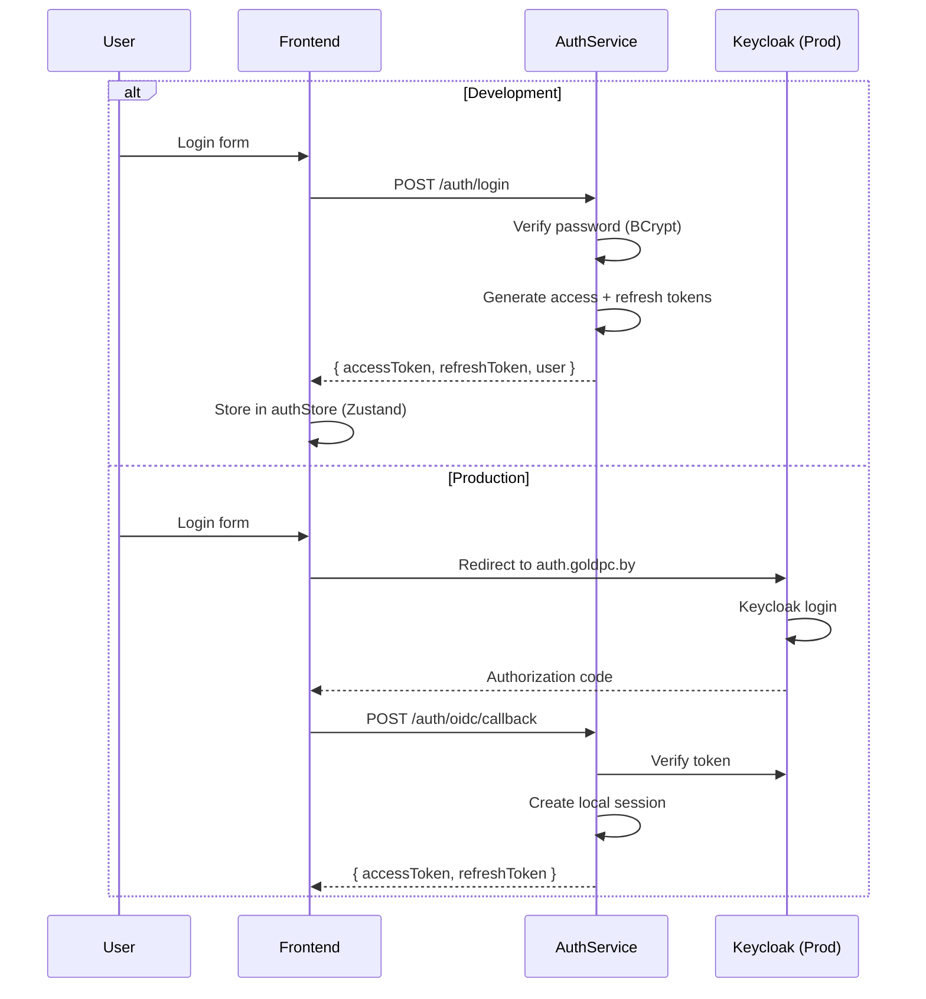
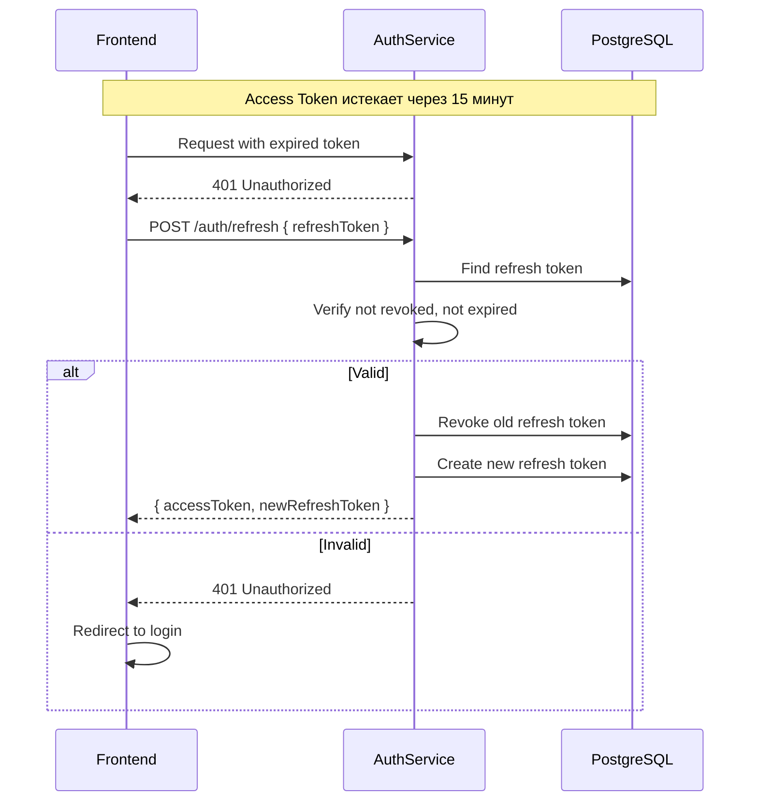

# JWT Аутентификация

> **Раздел**: 08_Security
> **Версия**: 1.0 | **Последнее обновление**: 2026-05-24

---

## 📋 Обзор

GoldPC использует **JWT (JSON Web Token)** для аутентификации с **Refresh Token ротацией**. В development — симметричный ключ, в production — OIDC через Keycloak.



---

## 🪙 Токен

### Структура Access Token

```json
{
  "sub": "550e8400-e29b-41d4-a716-446655440000",
  "email": "user@example.com",
  "name": "Иван Иванов",
  "role": "Client",
  "permissions": ["ProductsRead", "OrdersWrite"],
  "jti": "unique-token-id",
  "iat": 1700000000,
  "exp": 1700000900,
  "iss": "goldpc",
  "aud": "goldpc-users"
}
```

| Claim | Описание |
|---|---|
| `sub` | UUID пользователя |
| `email` | Email пользователя |
| `name` | Полное имя |
| `role` | Основная роль (single) |
| `permissions` | Массив разрешений |
| `jti` | Уникальный ID токена (защита от replay) |
| `iat` | Время выпуска |
| `exp` | Время истечения |

---

## ⏱️ Времена жизни

| Токен | TTL | Хранилище |
|---|---|---|
| **Access Token** | 15 минут (dev/prod) | Frontend (memory/Zustand) |
| **Refresh Token** | 7 дней | PostgreSQL (refresh_tokens) |
| **Email Verification** | 24 часа | PostgreSQL (email_verification_tokens) |
| **Password Reset** | 1 час | Redis + PostgreSQL |
| **2FA Setup** | 5 минут | In-memory |

---

## 🔄 Refresh Token Rotation



### Безопасность ротации

```csharp
// При каждом refresh:
// 1. Отзываем старый токен
oldToken.RevokedAt = DateTime.UtcNow;
oldToken.RevokedByIp = ipAddress;
oldToken.RevokedReason = "Token rotated";

// 2. Создаём новый токен
var newToken = new RefreshToken { ... };

// 3. Если старый уже был отозван → возможная кража токена
if (oldToken.RevokedAt != null)
{
    // Аннулируем ВСЕ refresh токены пользователя
    await RevokeAllUserTokens(userId);
}
```

---

## ⚙️ Конфигурация

### Development (симметричный ключ)

```json
{
  "JwtSettings": {
    "Secret": "GoldPC_SuperSecretKey_ForDevelopment_Only_2024!",
    "Issuer": "goldpc",
    "Audience": "goldpc-users",
    "AccessTokenExpirationMinutes": 15,
    "RefreshTokenExpirationDays": 7
  }
}
```

### Production (OIDC/Keycloak)

```json
{
  "JwtSettings": {
    "Authority": "https://auth.goldpc.by/realms/goldpc",
    "Audience": "goldpc-users",
    "RequireHttpsMetadata": true,
    "AccessTokenExpirationMinutes": 15,
    "RefreshTokenExpirationDays": 7
  }
}
```

### Настройка в Program.cs

```csharp
// Development
builder.Services.AddAuthentication(JwtBearerDefaults.AuthenticationScheme)
    .AddJwtBearer(options =>
    {
        options.TokenValidationParameters = new TokenValidationParameters
        {
            ValidateIssuerSigningKey = true,
            IssuerSigningKey = new SymmetricSecurityKey(
                Encoding.UTF8.GetBytes(jwtSettings.Secret)),
            ValidateIssuer = true,
            ValidateAudience = true,
            ValidateLifetime = true,
            ClockSkew = TimeSpan.FromMinutes(1)
        };
    });

// Production (OIDC)
builder.Services.AddAuthentication(JwtBearerDefaults.AuthenticationScheme)
    .AddJwtBearer(options =>
    {
        options.Authority = jwtSettings.Authority;
        options.Audience = jwtSettings.Audience;
        options.TokenValidationParameters = new TokenValidationParameters
        {
            ValidateIssuerSigningKey = true,
            ValidateIssuer = true,
            ValidateAudience = true,
            ValidateLifetime = true
        };
    });
```

---

## 📤 Frontend: Хранение и отправка

```typescript
// Zustand store
interface AuthState {
  accessToken: string | null;
  refreshToken: string | null;
  user: User | null;
}

// Axios interceptor для автоматической отправки токена
axios.interceptors.request.use((config) => {
  const token = useAuthStore.getState().accessToken;
  if (token) {
    config.headers.Authorization = `Bearer ${token}`;
  }
  return config;
});

// Axios interceptor для автоматического refresh
axios.interceptors.response.use(
  (response) => response,
  async (error) => {
    if (error.response?.status === 401 && !error.config._retry) {
      error.config._retry = true;
      const { refreshToken } = useAuthStore.getState();
      const response = await authApi.refresh(refreshToken!);
      useAuthStore.getState().setTokens(response.accessToken, response.refreshToken);
      return axios(error.config);
    }
    return Promise.reject(error);
  }
);
```

---

## 🔗 Связанные страницы

- [[08_Security/Обзор_безопасности]] — обзор безопасности
- [[09_Auth/Обзор_аутентификации]] — auth flows
- [[09_Auth/Поток_регистрации_и_логина]] — регистрация/логин
- [[09_Auth/2FA_TOTP]] — двухфакторная аутентификация
