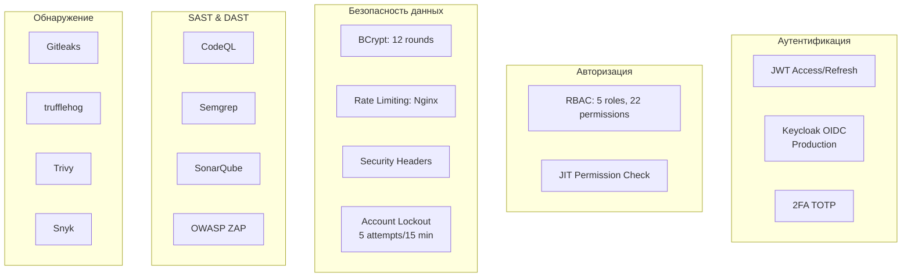

# Обзор безопасности GoldPC

> **Раздел**: 08_Security
> **Версия**: 1.0 | **Последнее обновление**: 2026-05-24

---

## 🏗️ Модель безопасности



---

## 🔐 JWT Аутентификация

| Параметр | Development | Production |
|---|---|---|
| Механизм | Симметричный HMAC-SHA256 | OIDC Keycloak |
| Secret | `appsettings.Development.json` | Keycloak `auth.goldpc.by` |
| Access Token TTL | 15 минут | 15 минут |
| Refresh Token TTL | 7 дней | 7 дней |
| Token rotation | Да | Да |

Подробнее: [[08_Security/JWT_аутентификация]]

---

## 👮 RBAC

### Роли

| Роль | Описание | Периметр |
|---|---|---|
| **Guest** | Неавторизованный пользователь | Каталог, конструктор (read-only) |
| **Client** | Зарегистрированный покупатель | Заказы, заявки, гарантии |
| **Manager** | Менеджер магазина | Товары, заказы |
| **Master** | Мастер сервисного центра | Заявки, ремонты |
| **Admin** | Администратор | Всё |
| **Accountant** | Бухгалтер | Отчёты |

### Разрешения (22 total)

```csharp
public enum Permission
{
    // Catalog
    ProductsRead, ProductsWrite, ProductsDelete,
    CategoriesRead, CategoriesWrite,
    ManufacturersRead, ManufacturersWrite,
    ReviewsModerate,

    // Orders
    OrdersRead, OrdersWrite, OrdersDelete,
    OrdersProcess, OrdersCancel,

    // Services
    ServicesRead, ServicesWrite, ServicesAssign,
    ServicesComplete,

    // Warranty
    WarrantyRead, WarrantyWrite,
    WarrantyProcess,

    // Admin
    UsersManage, ReportsRead
}
```

Таблица ролей-разрешений:

| Роль | Разрешения |
|---|---|
| Guest | `ProductsRead`, `CategoriesRead`, `ManufacturersRead` |
| Client | Guest + `OrdersWrite`, `OrdersRead`, `ServicesWrite`, `WarrantyWrite` |
| Manager | Client + `ProductsWrite`, `OrdersProcess`, `ReviewsModerate` |
| Master | `ServicesRead`, `ServicesWrite`, `ServicesAssign`, `ServicesComplete`, `WarrantyProcess` |
| Admin | ALL |
| Accountant | `OrdersRead`, `ReportsRead` |

---

## 📱 2FA (TOTP)

| Параметр | Значение |
|---|---|
| Алгоритм | HMAC-SHA1 |
| Шаг | 30 секунд |
| Длина кода | 6 цифр |
| Кодировка | Base32 |
| Recovery codes | 10 кодов, 8 символов |
| Формат URI | `otpauth://totp/GoldPC:{email}?secret={secret}&issuer=GoldPC` |

Подробнее: [[09_Auth/2FA_TOTP]]

---

## 🔒 Account Lockout

После **5 неудачных попыток** входа подряд:

```csharp
if (user.FailedLoginAttempts >= 5)
{
    user.LockedUntil = DateTime.UtcNow.AddMinutes(15);
    // Логирование в LoginHistory
}
```

Защита от перечисления email: `forgot-password` возвращает **200 OK** независимо от существования email.

---

## 🔤 Password Validation

```csharp
// Минимальные требования
MinimumLength = 8
RequireUppercase = true
RequireLowercase = true
RequireDigit = true
RequireSpecialCharacter = true

// Levenshtein distance для common passwords
if (LevenshteinDistance(password, commonPassword) < 3)
    throw new WeakPasswordException();
```

---

## 🚦 Rate Limiting (Nginx)

```nginx
# API: 50 запросов/сек
limit_req_zone $binary_remote_addr zone=api:10m rate=50r/s;

# Login: 5 запросов/мин
limit_req_zone $binary_remote_addr zone=login:10m rate=5r/m;

# Регистрация: 2 запроса/мин
limit_req_zone $binary_remote_addr zone=register:10m rate=2r/m;
```

---

## 🛡️ Security Headers

```nginx
X-Frame-Options: SAMEORIGIN
X-Content-Type-Options: nosniff
X-XSS-Protection: 1; mode=block
Referrer-Policy: strict-origin-when-cross-origin
Strict-Transport-Security: max-age=31536000; includeSubDomains
Permissions-Policy: camera=(), microphone=(), geolocation=()
Content-Security-Policy: default-src 'self'; ...
```

---

## 🔍 SAST Инструменты

| Инструмент | Частота | Описание |
|---|---|---|
| **CodeQL** | Каждый PR/Push | GitHub-native, C# + JS/TS |
| **Semgrep** | Каждый PR/Push | OWASP Top 10 + C# rules |
| **SonarQube** | Каждый PR/Push | Quality Gate, Code Smells |

### CodeQL Config

```yaml
- name: Initialize CodeQL
  uses: github/codeql-action/init@v3
  with:
    languages: csharp, javascript-typescript
    queries: security-extended,security-and-quality
    config: |
      paths-ignore:
        - '**/test/**'
        - '**/tests/**'
```

---

## 🕵️ Secret Detection

| Инструмент | Описание |
|---|---|
| **Gitleaks** | Сканирование коммитов на секреты |
| **trufflehog** | Детектирование credentials |
| **Custom grep** | Проверка hardcoded secrets в PR |

Gitleaks запускается с `--redact` для маскировки найденных секретов.

---

## 🌐 DAST

**OWASP ZAP Baseline Scan** — еженедельное динамическое тестирование:
```yaml
- uses: zaproxy/action-baseline@v0.12.0
  with:
    target: 'https://goldpc.by'
    rules_file_name: '.zap/rules.tsv'
    cmd_options: '-a'
```

---

## 🐳 Container Scanning

**Trivy** — сканирование Docker образов:
```yaml
- uses: aquasecurity/trivy-action@master
  with:
    image-ref: 'goldpc-backend:${{ github.sha }}'
    severity: 'CRITICAL,HIGH'
    ignore-unfixed: true
```

---

## 📦 Dependency Scanning

| Инструмент | Scope | Порог |
|---|---|---|
| **Snyk** | .NET + npm | Severity ≥ HIGH, fail on upgradable |
| **npm audit** | Frontend | ≥ HIGH |
| **Dependency Review** | PR | ≥ HIGH, лицензии |

**Snyk Monitor** отправляет данные в Snyk Dashboard для постоянного мониторинга.

---

## 🔗 Связанные страницы

- [[08_Security/JWT_аутентификация]] — JWT flow
- [[09_Auth/Обзор_аутентификации]] — auth система
- [[09_Auth/2FA_TOTP]] — 2FA детали
- [[07_Infra_DevOps/GitHub_Actions]] — security workflows
- [[07_Infra_DevOps/Docker_окружение]] — Nginx security
