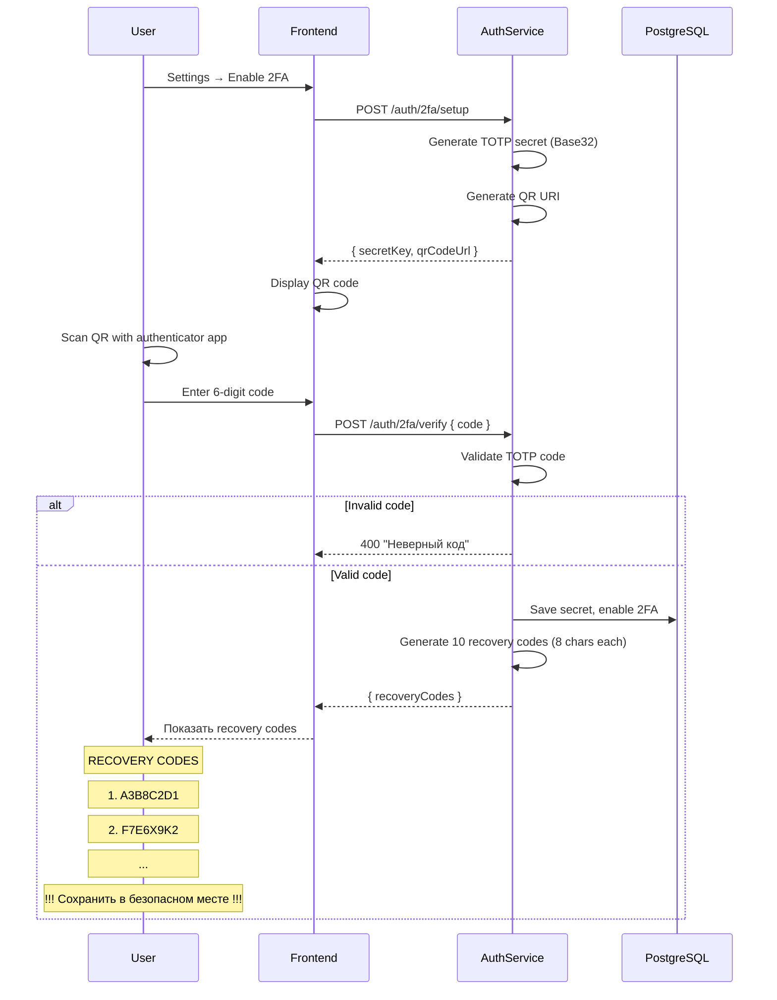
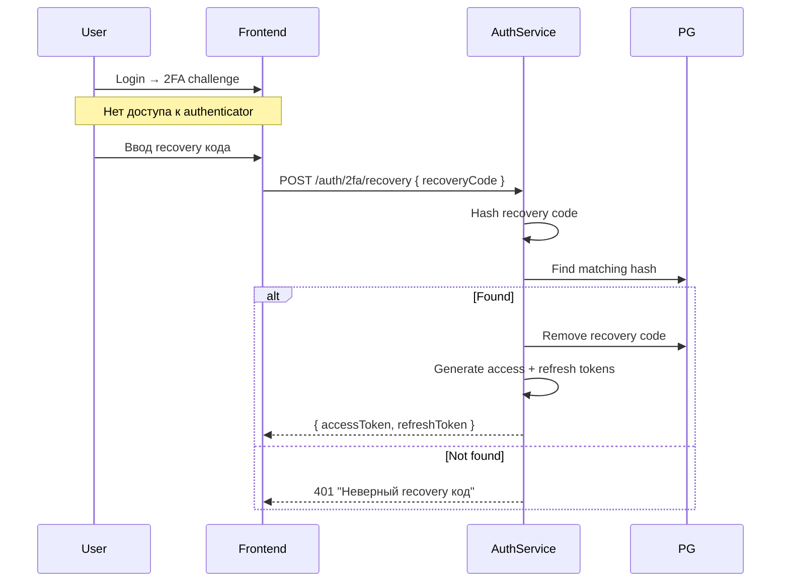

# Двухфакторная аутентификация (2FA TOTP)

> **Раздел**: 09_Auth
> **Версия**: 1.0 | **Последнее обновление**: 2026-05-24

---

## 📋 Обзор

GoldPC поддерживает **Time-based One-Time Password (TOTP)** для двухфакторной аутентификации.

**Параметры TOTP**:
- **Алгоритм**: HMAC-SHA1
- **Шаг**: 30 секунд
- **Длина кода**: 6 цифр
- **Кодировка secret**: Base32
- **Формат URI**: `otpauth://totp/GoldPC:{email}?secret={secret}&issuer=GoldPC`

---

## 🔄 Поток настройки 2FA



---

## ⚙️ TOTP Implementation

### Генерация секрета

```csharp
public TOTPSetupResponse GenerateTOTPSecret(string email)
{
    // Генерация 20 байт случайных данных
    var secretBytes = RandomNumberGenerator.GetBytes(20);
    var secret = Base32Encoding.ToString(secretBytes);
    
    // Формирование otpauth URI
    var uri = new OtpUri(OtpType.Totp, secret, email, "GoldPC")
    {
        Period = 30,  // шаг в секундах
        Digits = 6    // длина кода
    };
    
    return new TOTPSetupResponse
    {
        SecretKey = secret,
        QrCodeUrl = uri.ToString()
    };
}
```

### Валидация кода

```csharp
public bool ValidateTOTP(string secret, string code)
{
    var secretBytes = Base32Encoding.ToBytes(secret);
    
    // Проверка с допустимым окном ±1 шаг (90 секунд)
    var totp = new Totp(secretBytes, step: 30, totpSize: 6);
    return totp.VerifyTotp(code, out _, verificationWindow: new VerificationWindow(1, 1));
}
```

### Хранение

```csharp
public class UserTwoFactor
{
    public Guid Id { get; set; }
    public Guid UserId { get; set; }
    public string SecretKey { get; set; } // Base32 encoded
    public bool IsEnabled { get; set; }
    public string RecoveryCodes { get; set; } // JSON array
    public DateTime CreatedAt { get; set; }
    public User User { get; set; }
}
```

---

## 🔐 Recovery Codes

- **10 кодов** генерируются при включении 2FA
- **8 символов** каждый (A-Z, 0-9)
- **Хэшируются** (SHA-256) перед сохранением
- **Одноразовые** — после использования удаляются
- **Предупреждение**: пользователь должен сохранить их

```csharp
public string[] GenerateRecoveryCodes()
{
    var codes = new string[10];
    for (int i = 0; i < 10; i++)
    {
        var bytes = RandomNumberGenerator.GetBytes(6);
        codes[i] = Convert.ToHexString(bytes).ToUpper()[..8];
    }
    return codes;
}
```

### Использование recovery кода



---

## 📱 Совместимые приложения

- **Google Authenticator**
- **Microsoft Authenticator**
- **Authy**
- **1Password**
- **Bitwarden**
- Любое TOTP-совместимое приложение

---

## 🔗 Связанные страницы

- [[09_Auth/Обзор_аутентификации]] — auth overview
- [[09_Auth/Поток_регистрации_и_логина]] — login flow
- [[08_Security/Обзор_безопасности]] — security overview
