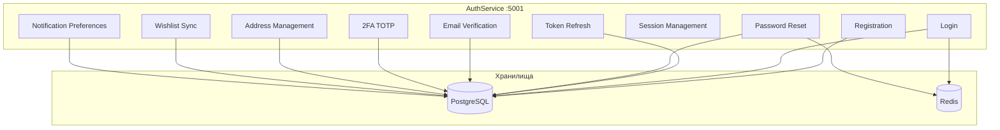
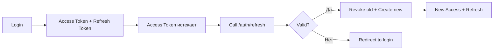

# Обзор аутентификации GoldPC

> **Раздел**: 09_Auth
> **Версия**: 1.0 | **Последнее обновление**: 2026-05-24

---

## 🏗️ Архитектура AuthService



---

## 📋 Функциональность

| Функция | Эндпоинт | Статус |
|---|---|---|
| **Регистрация** с email-верификацией | `POST /auth/register` | ✅ |
| **Логин** с блокировкой | `POST /auth/login` | ✅ |
| **Refresh** токенов | `POST /auth/refresh` | ✅ |
| **Logout** | `POST /auth/logout` | ✅ |
| **Forgot Password** (всегда 200) | `POST /auth/forgot-password` | ✅ |
| **Reset Password** (Redis + DB) | `POST /auth/reset-password` | ✅ |
| **Change Password** | `PUT /auth/password` | ✅ |
| **Email Verification** | `GET /auth/verify-email` | ✅ |
| **2FA Setup** | `POST /auth/2fa/setup` | ✅ |
| **2FA Verify** | `POST /auth/2fa/verify` | ✅ |
| **2FA Recovery** | `POST /auth/2fa/recovery` | ✅ |
| **Profile** CRUD | `GET/PUT /auth/profile` | ✅ |
| **Addresses** CRUD | `GET/POST/PUT/DELETE /auth/addresses` | ✅ |
| **Wishlist** | `GET/POST/DELETE /auth/wishlist` | ✅ |
| **Notification Preferences** | `GET/PUT /auth/notifications/preferences` | ✅ |

---

## 🔐 Политики безопасности

### Пароли

- **BCrypt**: 12 rounds
- **Минимальная длина**: 8 символов
- **Требования**: заглавная, строчная, цифра, спецсимвол
- **Common password check**: Levenshtein distance < 3 → отклоняется

### Блокировка

- **5 неудачных попыток** → блокировка 15 минут
- **Сброс счётчика**: после успешного входа
- **LoginHistory**: запись каждой попытки

```csharp
if (user.FailedLoginAttempts >= 5)
{
    user.LockedUntil = DateTime.UtcNow.AddMinutes(15);
}
```

### Защита от перечисления

- `POST /auth/forgot-password` — всегда **200 OK**
- `POST /auth/login` — общее сообщение об ошибке

---

## 🔄 Сессионное управление

| Компонент | Механизм | TTL |
|---|---|---|
| Access Token | JWT | 15 мин |
| Refresh Token | PostgreSQL | 7 дней |
| Password Reset Token | Redis + PostgreSQL | 1 час |
| Email Verification | PostgreSQL | 24 часа |

### Refresh Token ротация



---

## 👤 Управление профилем

### User entity fields

| Поле | Валидация |
|---|---|
| `email` | Email формат, уникальный |
| `firstName` | 1-100 символов |
| `lastName` | 1-100 символов |
| `phone` | +375XXXXXXXXX |
| `birthDate` | Дата, nullable |
| `company` | 0-200 символов, nullable |

### Address entity

```json
{
  "title": "Домой",
  "street": "ул. Ленина, 10, кв. 5",
  "city": "Минск",
  "postalCode": "220000",
  "country": "Беларусь",
  "isDefault": true
}
```

---

## 💖 Wishlist

Синхронизация избранного между сессиями:

```csharp
// Добавление в избранное
POST /auth/wishlist { "productId": "uuid" }

// Получение избранного
GET /auth/wishlist → ["uuid1", "uuid2", ...]

// Удаление
DELETE /auth/wishlist/{productId}
```

---

## 🔔 Notification Preferences

```json
{
  "orderUpdates": true,
  "promotions": false,
  "warrantyExpiry": true,
  "serviceStatus": true
}
```

---

## 📧 Email уведомления

| Событие | Шаблон |
|---|---|
| Регистрация | Подтверждение email |
| Сброс пароля | Ссылка для сброса |
| Изменение пароля | Уведомление |
| 2FA включена | Уведомление |

**SMTP**:
- Host: smtp.gmail.com
- Port: 587
- TLS: STARTTLS
- From: GoldPC <pascalixsprivate@gmail.com>

---

## 🔗 Связанные страницы

- [[09_Auth/Поток_регистрации_и_логина]] — детальный flow
- [[09_Auth/Поток_сброса_пароля]] — password reset flow
- [[09_Auth/2FA_TOTP]] — двухфакторная аутентификация
- [[08_Security/JWT_аутентификация]] — JWT детали
- [[08_Security/Обзор_безопасности]] — обзор безопасности
