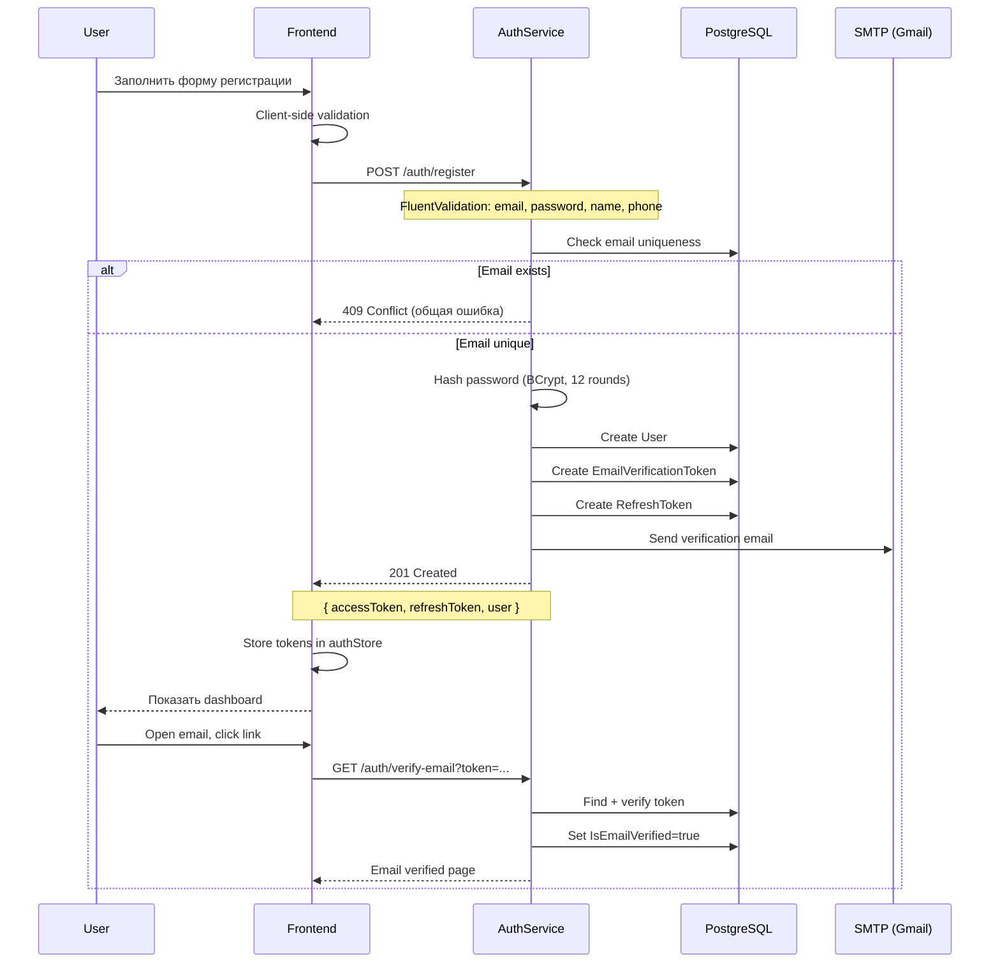
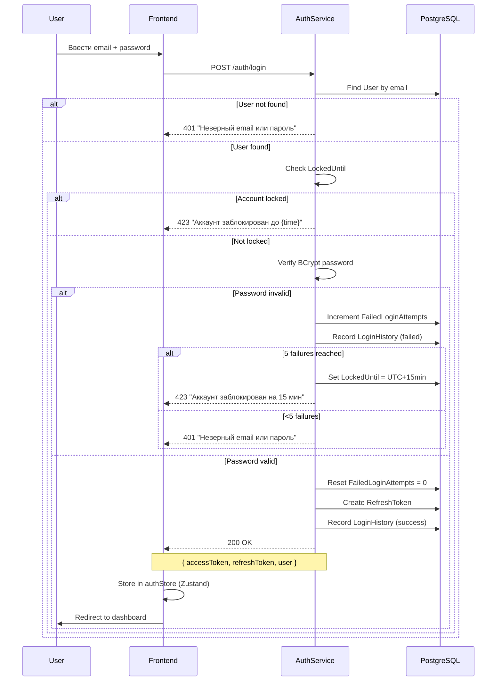
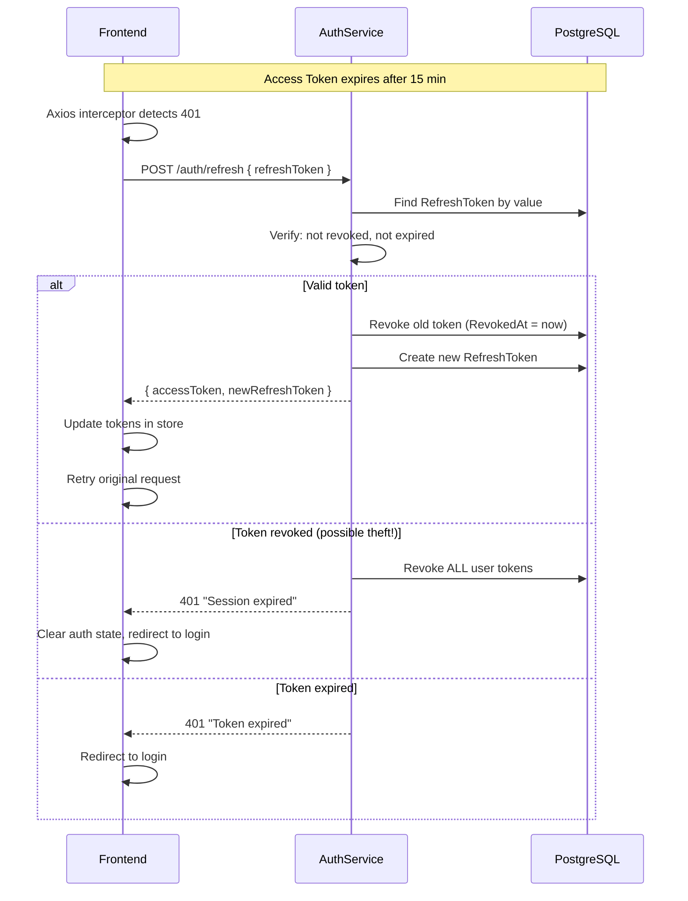

# Поток регистрации и логина

> **Раздел**: 09_Auth
> **Версия**: 1.0 | **Последнее обновление**: 2026-05-24

---

## 📝 Регистрация



### Валидация (FluentValidation)

```csharp
public class RegisterValidator : AbstractValidator<RegisterRequest>
{
    public RegisterValidator()
    {
        RuleFor(x => x.Email).EmailAddress().MaximumLength(256);
        RuleFor(x => x.Password)
            .MinimumLength(8)
            .Matches("[A-Z]").WithMessage("Требуется заглавная буква")
            .Matches("[a-z]").WithMessage("Требуется строчная буква")
            .Matches("[0-9]").WithMessage("Требуется цифра")
            .Matches("[^a-zA-Z0-9]").WithMessage("Требуется спецсимвол");
        RuleFor(x => x.FirstName).NotEmpty().MaximumLength(100);
        RuleFor(x => x.LastName).NotEmpty().MaximumLength(100);
        RuleFor(x => x.Phone).Matches(@"^\+375\d{9}$");
    }
}
```

---

## 🔑 Логин



---

## 🔄 Refresh Token Flow



---

## 📱 Аутентификация на фронтенде

### Zustand Store

```typescript
interface AuthState {
  user: User | null;
  accessToken: string | null;
  refreshToken: string | null;
  isAuthenticated: boolean;
  
  login: (email: string, password: string) => Promise<void>;
  register: (data: RegisterData) => Promise<void>;
  logout: () => Promise<void>;
  refresh: () => Promise<void>;
}

// Хранение: Zustand store (не localStorage)
// Токены хранятся в памяти, не в localStorage/cookies
```

### Axios Interceptors

```typescript
// Request: добавляем Bearer token
api.interceptors.request.use(config => {
  const token = useAuthStore.getState().accessToken;
  if (token) config.headers.Authorization = `Bearer ${token}`;
  return config;
});

// Response: автоматический refresh при 401
api.interceptors.response.use(
  res => res,
  async error => {
    if (error.response?.status === 401 && !error.config._retry) {
      error.config._retry = true;
      await useAuthStore.getState().refresh();
      return api(error.config);
    }
    return Promise.reject(error);
  }
);
```

---

## 🔗 Связанные страницы

- [[09_Auth/Обзор_аутентификации]] — auth overview
- [[09_Auth/Поток_сброса_пароля]] — password reset flow
- [[09_Auth/2FA_TOTP]] — двухфакторная аутентификация
- [[08_Security/JWT_аутентификация]] — JWT детали
