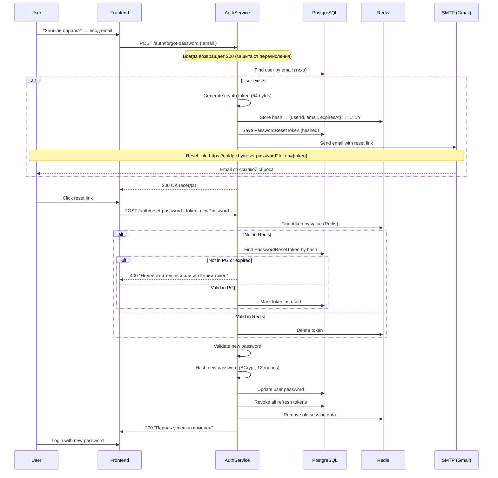

# Поток сброса пароля

> **Раздел**: 09_Auth
> **Версия**: 1.0 | **Последнее обновление**: 2026-05-24

---

## 📋 Двойное хранение токенов

GoldPC использует **двойное хранение** токенов сброса пароля: **Redis** (быстрый доступ) + **PostgreSQL** (постоянное хранение).



---

## 🔐 Детали безопасности

### Генерация токена

```csharp
public string GenerateResetToken()
{
    var tokenBytes = RandomNumberGenerator.GetBytes(64);
    return Convert.ToHexString(tokenBytes); // 128 символов hex
}
```

### Хранение в PostgreSQL (хэшированный)

```csharp
public class PasswordResetToken
{
    public Guid Id { get; set; }
    public Guid UserId { get; set; }
    public string TokenHash { get; set; } // SHA-256 хэш токена
    public DateTime ExpiresAt { get; set; } // +1 час
    public bool IsUsed { get; set; }
    public DateTime CreatedAt { get; set; }
    public User User { get; set; }
}
```

### Redis (plaintext, TTL)

```
Key: password_reset:{token}
Value: { "userId": "uuid", "email": "user@example.com" }
TTL: 3600 (1 час)
```

### Почему двойное хранение?

| Аспект | Redis | PostgreSQL |
|---|---|---|
| **Скорость** | O(1) доступ | O(log n) |
| **Персистентность** | Нет (если нет RDB/AOF) | Да |
| **Auto-expire** | TTL | Фоновый cleanup |
| **Защита от повторного использования** | DELETE | IsUsed flag |
| **Отказоустойчивость** | Redis down → fallback на PG | Всегда доступно |

---

## ⚙️ Валидация нового пароля

```csharp
public class ResetPasswordValidator : AbstractValidator<ResetPasswordRequest>
{
    public ResetPasswordValidator()
    {
        RuleFor(x => x.Token).NotEmpty();
        RuleFor(x => x.NewPassword)
            .MinimumLength(8)
            .Matches("[A-Z]").WithMessage("Требуется заглавная буква")
            .Matches("[a-z]").WithMessage("Требуется строчная буква")
            .Matches("[0-9]").WithMessage("Требуется цифра")
            .Matches("[^a-zA-Z0-9]").WithMessage("Требуется спецсимвол")
            .NotEqual(x => x.ConfirmPassword ?? "")
            .WithMessage("Пароли не совпадают");
    }
}
```

---

## 🔗 Связанные страницы

- [[09_Auth/Обзор_аутентификации]] — auth overview
- [[09_Auth/Поток_регистрации_и_логина]] — регистрация/логин
- [[08_Security/JWT_аутентификация]] — JWT детали
- [[08_Security/Обзор_безопасности]] — безопасность
