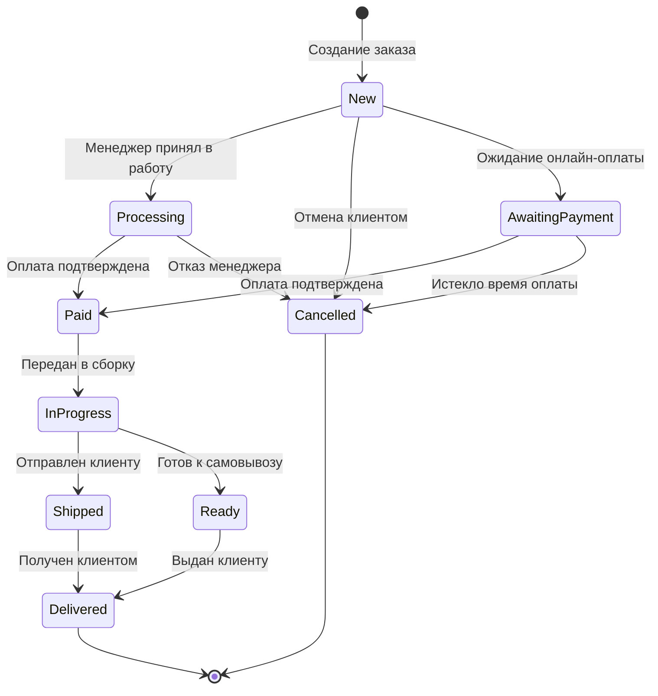
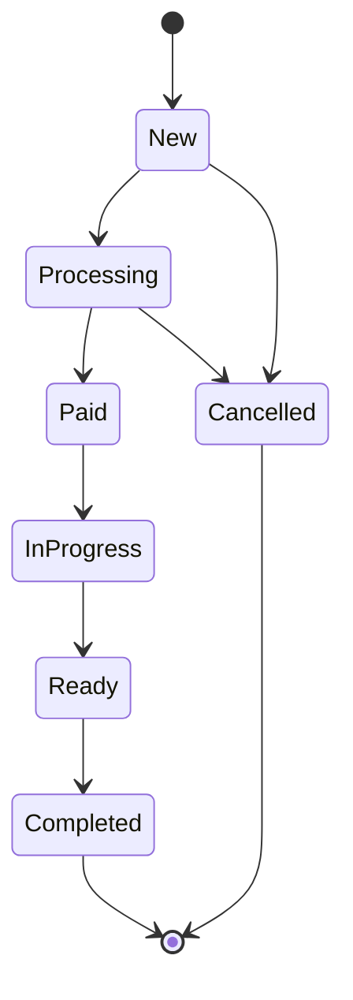

# 📦 Жизненный цикл заказа (Order FSM)

> **Раздел**: 10_Business_Logic
> **Версия**: 1.0 | **Последнее обновление**: 2026-05-24

---

## Содержание

1. [[#Диаграмма состояний]]
2. [[#Описание состояний]]
3. [[#Матрица переходов]]
4. [[#Бизнес-правила]]
5. [[#Уведомления]]
6. [[#Номер заказа]]
7. [[#История изменений]]
8. [[#Фоновая обработка]]

---

## Диаграмма состояний



### Упрощённая диаграмма (текущая реализация)



---

## Описание состояний

| Статус | Значение enum | Описание | Длительность |
|--------|--------------|----------|-------------|
| `New` | `OrderStatus.New = 0` | Заказ создан, ожидает обработки менеджером | ≤ 24ч |
| `Processing` | `OrderStatus.Processing = 1` | Менеджер работает с заказом, проверяет наличие | ≤ 48ч |
| `Paid` | `OrderStatus.Paid = 2` | Оплата подтверждена (онлайн или при получении) | — |
| `InProgress` | `OrderStatus.InProgress = 3` | Заказ передан в сборку/комплектацию | 1-3 дня |
| `Ready` | `OrderStatus.Ready = 4` | Заказ собран, готов к выдаче/отправке | — |
| `Completed` | `OrderStatus.Completed = 5` | Заказ получен клиентом (терминальное) | — |
| `Cancelled` | `OrderStatus.Cancelled = 6` | Заказ отменён (терминальное) | — |

### Дополнительное состояние (концептуальное)

| Статус | Описание |
|--------|----------|
| `AwaitingPayment` | Ожидание онлайн-оплаты (таймаут 30 мин → Cancelled) |

> ⚠️ **Примечание**: `AwaitingPayment` отсутствует в enum `OrderStatus`, но логически существует — заказ New с `paymentMethod = Online` ожидает платежа.

---

## Матрица переходов

Проверка валидности перехода — `OrdersService.IsValidStatusTransition()`:

```
New         → Processing, Paid, Cancelled
Processing  → Paid, Cancelled
Paid        → InProgress, Cancelled
InProgress  → Ready, Cancelled
Ready       → Completed, Cancelled
Completed   → (none, terminal)
Cancelled   → (none, terminal)
```

### Код валидации

```csharp
private static bool IsValidStatusTransition(OrderStatus from, OrderStatus to)
{
    return from switch
    {
        OrderStatus.New        => to == OrderStatus.Processing || to == OrderStatus.Paid || to == OrderStatus.Cancelled,
        OrderStatus.Processing => to == OrderStatus.Paid || to == OrderStatus.Cancelled,
        OrderStatus.Paid       => to == OrderStatus.InProgress || to == OrderStatus.Cancelled,
        OrderStatus.InProgress => to == OrderStatus.Ready || to == OrderStatus.Cancelled,
        OrderStatus.Ready      => to == OrderStatus.Completed || to == OrderStatus.Cancelled,
        OrderStatus.Completed  => false,
        OrderStatus.Cancelled  => false,
        _ => false
    };
}
```

---

## Бизнес-правила по статусам

### New
- **Создание**: POST /api/orders (JWT)
- **Валидация**:
  - Минимум 1 позиция (`Items.Count > 0`)
  - Макс. 5 единиц одного товара (`MaxItemQuantity = 5`)
  - Цена неотрицательная (`UnitPrice >= 0`)
  - Количество положительное (`Quantity > 0`)
  - DeliveryMethod ∈ {Pickup, Delivery}
  - PaymentMethod ∈ {Online, OnReceipt}
  - При Delivery — адрес обязателен
- **Резервация стока**: временно отключена (gRPC → CatalogService)
- **Генерация номера**: `ORD-{YYYY}-{NNNN}`

### Processing
- Менеджер проверяет наличие товаров
- Может запросить дополнительную информацию у клиента

### Paid
- `IsPaid = true`, `PaidAt = DateTime.UtcNow`
- При оплате через Stripe: обновление через webhook
- Должен был публиковаться `OrderPaidEvent` (отключено)

### InProgress
- Комплектация/сборка заказа
- Для PC Builder — сборка ПК

### Ready
- Товар готов к выдаче (Pickup) или передан в доставку
- Отправляется уведомление клиенту

### Completed
- Заказ выполнен
- Клиент получил товар (самовывоз или доставка)

### Cancelled
- Отмена клиентом (POST /api/orders/{id}/cancel)
- Отмена менеджером (PUT /api/orders/{id}/status)
- Освобождение стока: вызов `ReleaseOrderStockAsync()` через gRPC
- `Cancelled` не может быть изменён

---

## Уведомления

| Событие | Email | SMS | Куда |
|---------|-------|-----|------|
| Заказ создан | ✅ | — | Клиент |
| Статус изменён | ✅ | — | Клиент |
| Оплата получена | ✅ | — | Клиент |
| Заказ готов к выдаче | ✅ | ✅ | Клиент |
| Заказ отправлен | ✅ | ✅ | Клиент |
| Заказ отменён | ✅ | — | Клиент |

**Шаблон Email**: `Shared/Templates/OrderStatusUpdate.hbs`

```
Тема: Статус вашего заказа #{{OrderNumber}} обновлён
Переменные: OrderNumber, CustomerName, NewStatus, Comment, OrderUrl
```

---

## Номер заказа

**Формат**: `ORD-YYYY-NNNN`

| Часть | Описание |
|-------|----------|
| `ORD` | Префикс (Order) |
| `YYYY` | Год создания |
| `NNNN` | Порядковый номер (4 цифры, с ведущими нулями) |

**Генерация**:
```csharp
var year = DateTime.UtcNow.Year;
var lastOrder = await _context.Orders
    .Where(o => o.OrderNumber.StartsWith($"ORD-{year}-"))
    .OrderByDescending(o => o.OrderNumber)
    .FirstOrDefaultAsync();
// nextNumber = lastOrder.NNNN + 1
var orderNumber = $"ORD-{year}-{nextNumber:D4}";
```

Пример: `ORD-2026-0042`

> ⚠️ В документации API и модели встречается формат `GP-YYYY-NNNNNN` — это устаревший формат. Актуальный: `ORD-YYYY-NNNN`.

---

## История изменений

Каждое изменение статуса записывается в таблицу `OrderHistory`:

```csharp
public class OrderHistory
{
    public Guid Id { get; set; }
    public Guid OrderId { get; set; }      // FK → Order
    public OrderStatus PreviousStatus { get; set; }
    public OrderStatus NewStatus { get; set; }
    public string? Comment { get; set; }
    public Guid ChangedBy { get; set; }
    public DateTime ChangedAt { get; set; }
}
```

**Пример записи**:
| Id | OrderId | PreviousStatus | NewStatus | Comment | ChangedAt |
|----|---------|---------------|-----------|---------|-----------|
| ... | ... | New | Paid | Оплата через Stripe подтверждена | 2026-05-24T12:00:00Z |

---

## Фоновая обработка

### OrderExpirationWorker

```csharp
public class OrderExpirationWorker : BackgroundService
```

- Запускается раз в **30 минут**
- Находит заказы в статусе `New`, созданные > 24 часов назад
- Автоматически переводит их в `Cancelled`
- Логирует отменённые заказы

### OutboxProcessor (ОТКЛЮЧЁН)

```csharp
// TEMPORARILY DISABLED
// builder.Services.AddHostedService<OutboxProcessor>();
```

- Читает `OutboxMessage` из БД
- Публикует события в RabbitMQ
- Отключает обработанные сообщения

---

## Связанные страницы

- [[10_Business_Logic/Обзор_бизнес_логики]] — общий обзор
- [[03_Backend/Сервис_заказов_OrdersService]] — сервис заказов
- [[11_Integrations/Stripe_интеграция]] — платёжная интеграция
- [[11_Integrations/Email_уведомления]] — email-уведомления
- [[14_Queues_Events/MassTransit_настройка]] — MassTransit (отключён)
- [[00_Index/Главный_индекс]]
