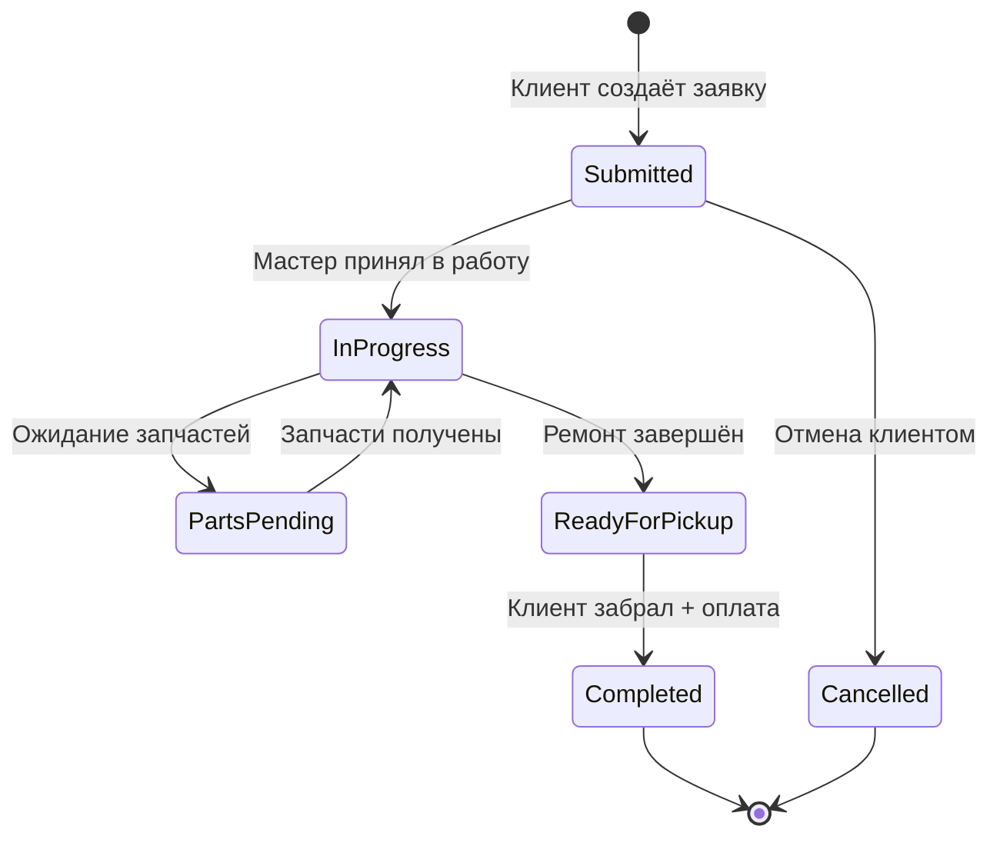
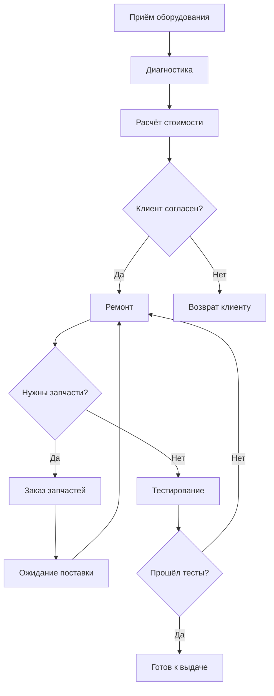

# 🔧 Жизненный цикл заявки сервисного центра

> **Раздел**: 10_Business_Logic
> **Версия**: 1.0 | **Последнее обновление**: 2026-05-24

---

## Содержание

1. [[#Диаграмма состояний]]
2. [[#Описание состояний]]
3. [[#Матрица переходов]]
4. [[#Бизнес-правила]]
5. [[#Номер заявки]]
6. [[#Процесс ремонта]]
7. [[#Интеграция с гарантией]]

---

## Диаграмма состояний



---

## Описание состояний

| Статус | Enum | Описание | Ответственный |
|--------|------|----------|---------------|
| `Submitted` | `ServiceRequestStatus.Submitted = 0` | Заявка подана клиентом через сайт | Клиент |
| `InProgress` | `ServiceRequestStatus.InProgress = 1` | Мастер диагностирует/ремонтирует | Мастер |
| `PartsPending` | `ServiceRequestStatus.PartsPending = 2` | Ожидание поставки запчастей | Мастер |
| `ReadyForPickup` | `ServiceRequestStatus.ReadyForPickup = 3` | Ремонт завершён, можно забирать | Мастер |
| `Completed` | `ServiceRequestStatus.Completed = 4` | Завершена, оплачена, выдана (терминальное) | Мастер |
| `Cancelled` | `ServiceRequestStatus.Cancelled = 5` | Отменена (терминальное) | Клиент/Мастер |

### Русские названия (из кода)

```csharp
ServiceRequestStatus.Submitted     => "Подана"
ServiceRequestStatus.InProgress     => "В работе"
ServiceRequestStatus.PartsPending   => "Ожидание запчастей"
ServiceRequestStatus.ReadyForPickup => "Готова к выдаче"
ServiceRequestStatus.Completed      => "Завершена"
ServiceRequestStatus.Cancelled      => "Отменена"
```

---

## Матрица переходов

Проверка валидности — `ServicesService.IsValidStatusTransition()`:

```
Submitted     → InProgress, Cancelled
InProgress    → PartsPending, ReadyForPickup
PartsPending  → InProgress
ReadyForPickup → Completed
Completed     → (none, terminal)
Cancelled     → (none, terminal)
```

### Код валидации

```csharp
private static bool IsValidStatusTransition(ServiceRequestStatus from, ServiceRequestStatus to)
{
    if (to == ServiceRequestStatus.Cancelled)
        return from == ServiceRequestStatus.Submitted;

    return from switch
    {
        ServiceRequestStatus.Submitted     => to == ServiceRequestStatus.InProgress,
        ServiceRequestStatus.InProgress    => to == ServiceRequestStatus.PartsPending 
                                            || to == ServiceRequestStatus.ReadyForPickup,
        ServiceRequestStatus.PartsPending  => to == ServiceRequestStatus.InProgress,
        ServiceRequestStatus.ReadyForPickup => to == ServiceRequestStatus.Completed,
        ServiceRequestStatus.Completed     => false,
        ServiceRequestStatus.Cancelled     => false,
        _ => false
    };
}
```

---

## Бизнес-правила

### Submitted
- Создание: `POST /api/services` (JWT)
- Поля: deviceType, deviceModel, serialNumber, problemDescription, customerPhone
- **Валидация**:
  - deviceType — обязателен
  - problemDescription — обязателен (мин. 10 символов)
  - customerPhone — обязателен
- **Проверка гарантии**: если serialNumber указан → запрос к WarrantyService

### InProgress
- Мастер начинает работу
- Создаётся `WorkReport` (отчёт о работе)
- Возможен возврат в Submitted? Нет, только вперёд

### PartsPending
- Если для ремонта требуются запчасти
- Мастер добавляет запчасти: `POST /api/services/{id}/parts`
- После получения → возврат в `InProgress`
- Цикл `InProgress ↔ PartsPending` может повторяться

### ReadyForPickup
- Работа завершена, составлен `WorkReport`
- Уведомление клиенту (SMS/Email)
- Клиент приезжает забирать оборудование

### Completed
- Клиент забрал оборудование
- Оплата произведена (если не была предоплачена)
- Формируется `WarrantyCard` на выполненные работы (опционально)
- Терминальный статус

### Cancelled
- Только из `Submitted`
- Клиент отменил заявку до начала работ
- Причина отмены фиксируется в истории

---

## Номер заявки

Формат: **`SR-YYYY-NNNNNN`**

| Часть | Описание |
|-------|----------|
| `SR` | Префикс (Service Request) |
| `YYYY` | Год |
| `NNNNNN` | Автоинкрементный номер (6 цифр) |

---

## Процесс ремонта



### Структура заявки

```csharp
public class ServiceRequest
{
    public Guid Id { get; set; }
    public string RequestNumber { get; set; }      // SR-2026-000001
    public Guid UserId { get; set; }
    public string CustomerName { get; set; }
    public string CustomerPhone { get; set; }
    public string CustomerEmail { get; set; }
    public string DeviceType { get; set; }          // notebook, pc, monitor...
    public string DeviceModel { get; set; }
    public string SerialNumber { get; set; }
    public string ProblemDescription { get; set; }
    public ServiceRequestStatus Status { get; set; }
    public decimal EstimatedCost { get; set; }
    public decimal FinalCost { get; set; }
    public List<ServicePart> Parts { get; set; }    // Использованные запчасти
    public List<WorkReport> WorkReports { get; set; } // История работы
}
```

### Отчёт о работе

```csharp
public class WorkReport
{
    public Guid Id { get; set; }
    public Guid ServiceRequestId { get; set; }
    public string WorkDescription { get; set; }     // Описание выполненной работы
    public string MasterName { get; set; }
    public decimal LaborCost { get; set; }
    public DateTime ReportDate { get; set; }
}
```

---

## Интеграция с гарантией

- При создании заявки с `serialNumber` → запрос к `WarrantyService`
- Если товар на гарантии → ремонт бесплатный
- Если гарантия истекла → платный ремонт
- В Development используется `WarrantyClientMock`

```csharp
// Development — всегда "на гарантии"
builder.Services.AddSingleton<IWarrantyClient>(sp =>
{
    var logger = sp.GetRequiredService<ILogger<WarrantyClientMock>>();
    return new WarrantyClientMock(logger);
});

// Production — HTTP к WarrantyService
builder.Services.AddHttpClient<IWarrantyClient, WarrantyClient>(client =>
{
    client.BaseAddress = new Uri("http://warranty-service:5004");
});
```

---

## Связанные страницы

- [[10_Business_Logic/Обзор_бизнес_логики]] — общий обзор
- [[03_Backend/Сервис_услуг_ServicesService]] — сервис заявок
- [[03_Backend/Сервис_гарантии_WarrantyService]] — проверка гарантии
- [[11_Integrations/Email_уведомления]] — уведомления о статусе
- [[00_Index/Главный_индекс]]
