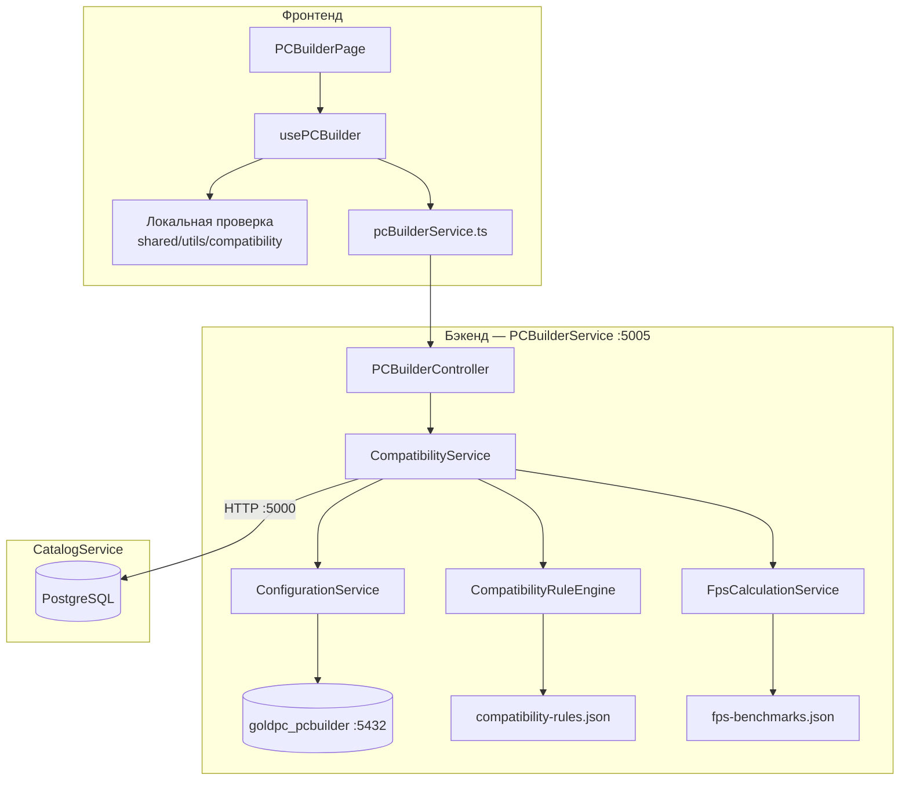
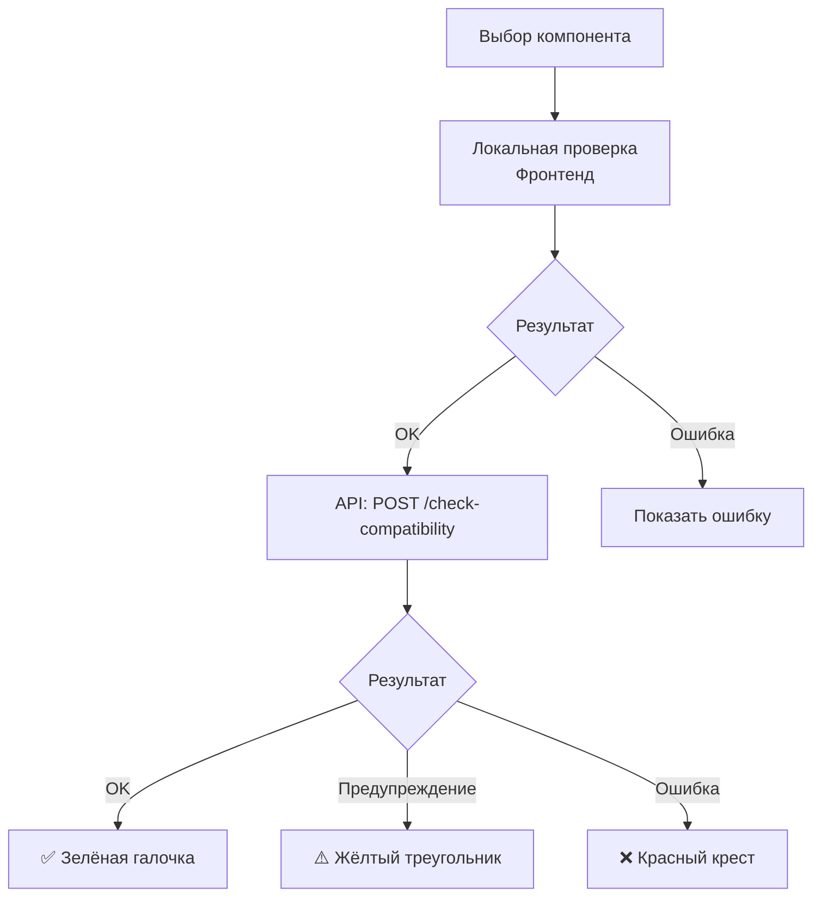

# 🖥️ Конструктор ПК и совместимость

> **Раздел**: 10_Business_Logic
> **Версия**: 1.0 | **Последнее обновление**: 2026-05-24

---

## Содержание

1. [[#Обзор]]
2. [[#Архитектура PC Builder]]
3. [[#Движок правил совместимости]]
4. [[#Формат правил compatibility-rules.json]]
5. [[#Расчёт FPS]]
6. [[#Сохранение и загрузка конфигураций]]
7. [[#Интеграция с фронтендом]]

---

## Обзор

PC Builder — ключевая функция GoldPC, позволяющая пользователям:

- Выбирать совместимые компоненты для сборки ПК
- Проверять совместимость в реальном времени
- Рассчитывать FPS для игр
- Сохранять конфигурации
- Добавлять сборку в корзину

**Сервис**: PCBuilderService (:5005)
**Фронтенд**: `features/pc-builder/` + `pages/pc-builder-page/`

---

## Архитектура PC Builder



---

## Движок правил совместимости

### CompatibilityRuleEngine

**Singleton** — загружает `compatibility-rules.json` при старте приложения.

```csharp
public class CompatibilityRuleEngine
{
    // Загружает правила из JSON при старте
    // Предоставляет методы проверки и фильтрации
    public CompatibilityReport CheckCompatibility(List<Product> components);
    public List<Product> GetCompatibleComponents(ComponentType type, Product selected);
}
```

### Два уровня проверки



**Локальная проверка** (`shared/utils/compatibility/`):
- Мгновенная реакция без запроса к серверу
- Проверка базовых правил (socket, RAM type, форм-фактор)
- Расчёт энергопотребления

**API проверка** (`POST /api/pcbuilder/check-compatibility`):
- Более точная с детальными спецификациями
- Учитывает все JSON-правила
- Актуальные данные из CatalogService

---

## Формат правил compatibility-rules.json

**Файл**: `src/PCBuilderService/Data/compatibility-rules.json` (v1.1.0)

### Структура

```json
{
  "$schema": "../schemas/compatibility-rules.schema.json",
  "version": "1.1.0",
  "description": "Декларативные правила совместимости компонентов ПК",
  "socketCompatibility": { ... },
  "formFactorCompatibility": { ... },
  "ramCompatibility": { ... },
  "psuCompatibility": { ... },
  "coolerCompatibility": { ... },
  "gpuCompatibility": { ... }
}
```

### Socket Compatibility

Группы сокетов с чипсетами, типом RAM и максимальной скоростью:

```json
{
  "groups": [
    {
      "id": "am5",
      "sockets": ["AM5"],
      "chipsets": ["A620","B650","B650E","X670","X670E","B850","X870","X870E"],
      "ramType": "DDR5",
      "maxRamSpeed": 8400,
      "biosWarning": {
        "enabled": true,
        "message": "Возможно потребуется обновление BIOS для поддержки данного процессора",
        "probability": "low"
      }
    }
  ]
}
```

**Поддерживаемые группы сокетов**:

| Группа | Сокеты | RAM | Чипсеты |
|--------|--------|-----|---------|
| AM4 | AM4 | DDR4 | A320–X570 |
| AM5 | AM5 | DDR5 | A620–X870E |
| LGA1200 | LGA1200 | DDR4 | H410–W580 |
| LGA1700 | LGA1700 | DDR4/DDR5 | H610–Z790 |
| LGA1851 | LGA1851 | DDR5 | Z890, B860, H810 |
| LGA1151 | LGA1151, LGA1151 v2 | DDR4 | H110–Z390 |
| TR4/TR5 | TR4, TRX4, TR5, sWRX8 | DDR4/DDR5 | X399–TRX50 |
| SP3/SP5 | SP3, SP5 | DDR4/DDR5 | — |

### Form Factor Compatibility

Иерархия: `Mini-ITX < micro-ATX < ATX < eATX`

```json
{
  "hierarchy": ["Mini-ITX", "micro-ATX", "ATX", "eATX"],
  "rules": [
    { "caseFormFactor": "Mini-ITX",  "supportedMotherboards": ["Mini-ITX"] },
    { "caseFormFactor": "micro-ATX", "supportedMotherboards": ["Mini-ITX", "micro-ATX"] },
    { "caseFormFactor": "ATX",       "supportedMotherboards": ["Mini-ITX", "micro-ATX", "ATX"] },
    { "caseFormFactor": "eATX",      "supportedMotherboards": ["Mini-ITX", "micro-ATX", "ATX", "eATX"] }
  ],
  "aliases": {
    "M-ATX": "micro-ATX", "E-ATX": "eATX", ...
  }
}
```

### RAM Compatibility

```json
{
  "validTypes": ["DDR4", "DDR5"],
  "channelConfigs": [
    { "type": "DDR5", "configs": ["1x", "2x", "4x"] }
  ]
}
```

### PSU Compatibility

```json
{
  "connectors": {
    "cpuPower": { "type": "EPS12V", "minCount": 1 },
    "gpuPower": { "types": ["PCIe 8-pin", "PCIe 6-pin", "12VHPWR"] },
    "motherboardPower": { "type": "ATX" }
  },
  "efficiencyStandards": ["80 PLUS Bronze", "80 PLUS Silver", "80 PLUS Gold", "80 PLUS Platinum", "80 PLUS Titanium"]
}
```

### Cooler Compatibility

```json
{
  "types": ["air", "aio", "custom"],
  "tdpLimits": {
    "air_low_profile": { "maxTdp": 100 },
    "air_tower_single": { "maxTdp": 150 },
    "air_tower_dual": { "maxTdp": 220 },
    "aio_120": { "maxTdp": 150 },
    "aio_240": { "maxTdp": 250 },
    "aio_360": { "maxTdp": 350 },
    "aio_420": { "maxTdp": 400 }
  }
}
```

### GPU Compatibility

```json
{
  "connectors": ["PCIe 8-pin", "PCIe 6-pin", "12VHPWR"],
  "maxLengthByCaseFormFactor": {
    "Mini-ITX": 300,
    "micro-ATX": 350,
    "ATX": 400,
    "eATX": 500
  }
}
```

---

## Расчёт FPS

### FpsCalculationService

**Файл**: `Data/fps-benchmarks.json` (v1.0.0)

**Singleton** — загружает бенчмарки при старте.

```json
{
  "gpuModel": "NVIDIA GeForce RTX 4070 SUPER",
  "cpuModel": "AMD Ryzen 5 5600X",
  "benchmarks": [
    { "game": "Cyberpunk 2077", "settings": "Ultra 1080p", "fps": 95 },
    { "game": "Cyberpunk 2077", "settings": "Ultra 1440p", "fps": 72 },
    { "game": "Cyberpunk 2077", "settings": "Ultra 4K", "fps": 38 }
  ]
}
```

### Локальный расчёт (фронтенд)

```typescript
// features/pc-builder/logic/performance.ts
function calculatePerformance(cpu, gpu, ram) {
  return {
    estimatedFps: { min: number, max: number, average: number },
    bottleneck: string | null,
    bottleneckSeverity: 'balanced' | 'cpu-bound' | 'gpu-bound' | null
  };
}
```

### API расчёт

```http
POST /api/pcbuilder/fps-estimate
Content-Type: application/json

{
  "cpuId": "guid",
  "gpuId": "guid",
  "game": "Cyberpunk 2077",
  "resolution": "1440p",
  "settings": "Ultra"
}
```

**Ответ**:
```json
{
  "cpuScore": 85,
  "gpuScore": 92,
  "overallScore": 88,
  "bottleneck": "CPU",
  "games": [
    { "gameName": "Cyberpunk 2077", "resolutions": { "1080p": 120, "1440p": 85, "4k": 45 } }
  ],
  "ramFactor": 1.0
}
```

---

## Сохранение и загрузка конфигураций

### Клиентское (localStorage)

- Ключ: `goldpc-pcbuilder`
- Автосохранение через хук `usePersistence`
- Восстановление при повторном визите

```typescript
function loadFromLocalStorage(): PCBuilderSelectedState;
function saveToLocalStorage(state: PCBuilderSelectedState): void;
function clearLocalStorage(): void;
```

### Серверное (PostgreSQL)

**Таблица**: `PC_Configuration` (goldpc_pcbuilder :5432)

```csharp
public class PCConfiguration
{
    public Guid Id { get; set; }
    public Guid UserId { get; set; }
    public string Name { get; set; }         // Название сборки
    public JsonDocument Components { get; set; } // JSON с компонентами
    public decimal TotalPrice { get; set; }
    public DateTime CreatedAt { get; set; }
}
```

**Endpoints**:

| Метод | Endpoint | Описание |
|-------|----------|----------|
| GET | `/api/pcbuilder/configurations` | Список конфигураций |
| POST | `/api/pcbuilder/configurations` | Сохранить конфигурацию |
| GET | `/api/pcbuilder/configurations/{id}` | Конфигурация по ID |
| DELETE | `/api/pcbuilder/configurations/{id}` | Удалить конфигурацию |

---

## Интеграция с фронтендом

### State — PCBuilderSelectedState

```typescript
interface PCBuilderSelectedState {
  cpu?: SelectedComponent;
  gpu?: SelectedComponent;
  motherboard?: SelectedComponent;
  psu?: SelectedComponent;
  case?: SelectedComponent;
  cooling?: SelectedComponent;
  ram: SelectedComponent[];        // 0-8 модулей
  storage: SelectedComponent[];    // 0-8 накопителей
  fan: SelectedComponent[];        // 0-8 вентиляторов
  monitor?: SelectedComponent;
  keyboard?: SelectedComponent;
  mouse?: SelectedComponent;
  headphones?: SelectedComponent;
}
```

### Лимиты компонентов

| Компонент | Максимум | Константа |
|-----------|----------|-----------|
| RAM | 8 | `MAX_RAM_MODULES = 8` |
| Storage | 8 | `MAX_STORAGE_MODULES = 8` |
| Fans | 8 | `MAX_FAN_MODULES = 8` |
| Категорий | 13 | `TOTAL_CATEGORIES = 13` |

> Лимит RAM динамический — зависит от выбранной материнской платы (`getMaxRamModules()`)

---

## Связанные страницы

- [[10_Business_Logic/Обзор_бизнес_логики]] — общий обзор
- [[03_Backend/Сервис_ПК_конструктора_PCBuilderService]]
- [[04_Frontend/ПК_конструктор]]
- [[03_Backend/Сервис_каталога_CatalogService]]
- [[00_Index/Главный_индекс]]
