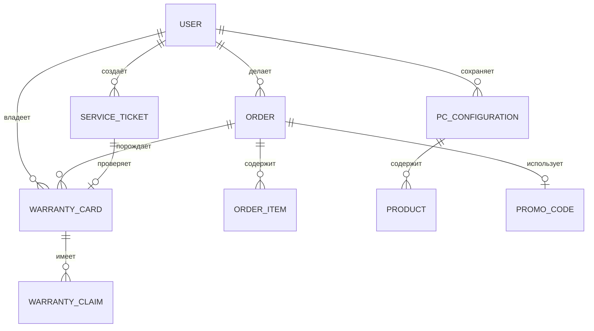
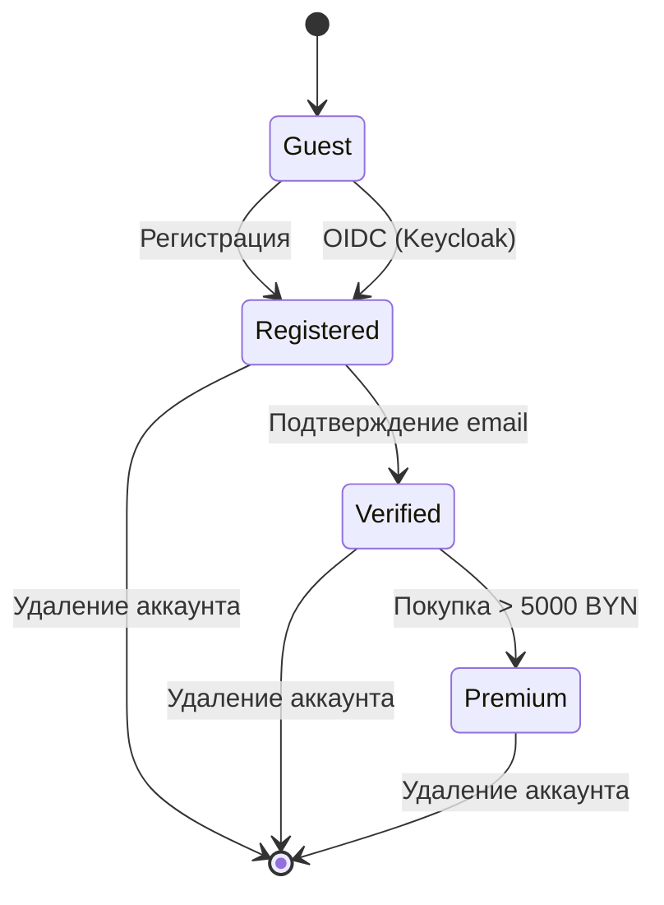
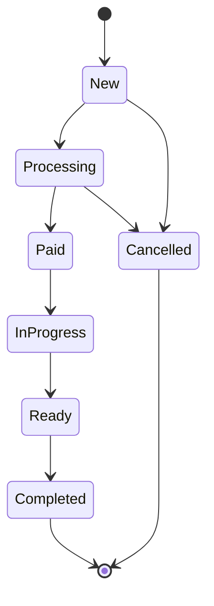
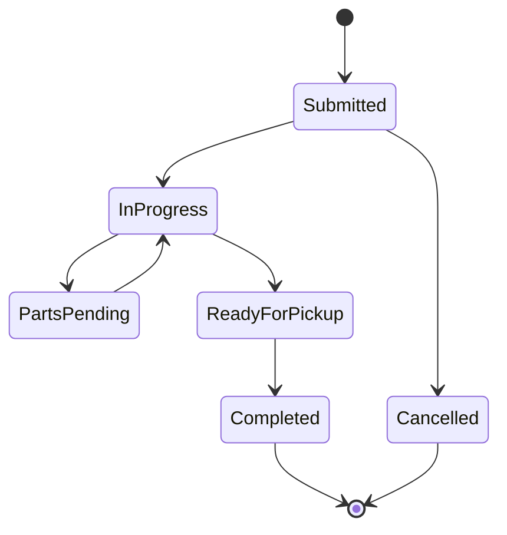
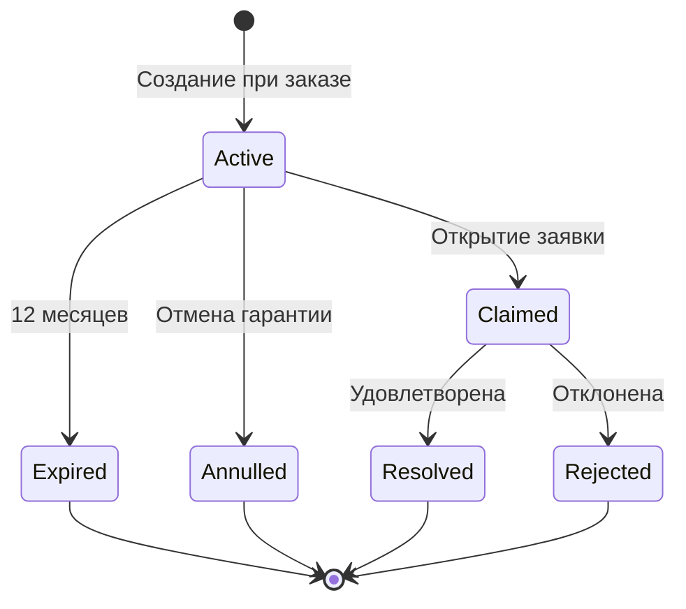
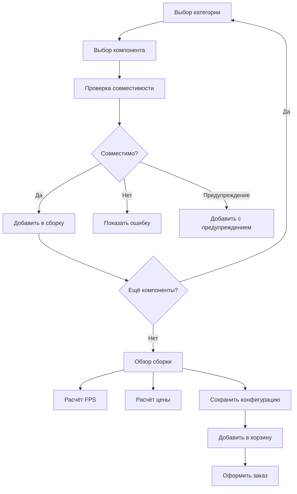
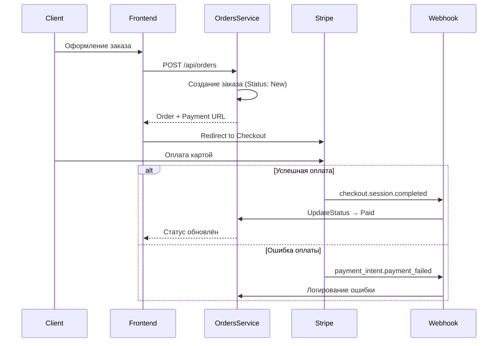

# 🏗️ Обзор бизнес-логики GoldPC

> **Раздел**: 10_Business_Logic
> **Версия**: 1.0 | **Последнее обновление**: 2026-05-24

---

## 📋 Содержание

1. [[#Бизнес-сущности]]
2. [[#Жизненный цикл пользователя]]
3. [[#Жизненный цикл заказа]]
4. [[#Жизненный цикл заявки СЦ]]
5. [[#Жизненный цикл гарантии]]
6. [[#PC Builder — поток сборки]]
7. [[#Платёжный поток]]
8. [[#Бизнес-правила и инварианты]]

---

## Бизнес-сущности

| Сущность | Сервис | Описание |
|----------|--------|----------|
| **Product** | CatalogService | Товар: комплектующие, периферия, софт |
| **Order** | OrdersService | Заказ клиента с товарами и статусом |
| **ServiceTicket** | ServicesService | Заявка в сервисный центр на ремонт/обслуживание |
| **WarrantyCard** | WarrantyService | Гарантийный талон на товар (12 мес.) |
| **WarrantyClaim** | WarrantyService | Гарантийная заявка (претензия) |
| **PCConfiguration** | PCBuilderService | Сборка ПК из совместимых компонентов |
| **PromoCode** | OrdersService | Промокод на скидку |
| **Cart** | Frontend (Zustand) | Корзина покупок (клиентское состояние) |

### Связи между сущностями

---

## Жизненный цикл пользователя

| Статус | Описание |
|--------|----------|
| **Guest** | Неавторизованный посетитель — просмотр каталога, PC Builder |
| **Registered** | Зарегистрирован, email не подтверждён |
| **Verified** | Email подтверждён — полный доступ к заказам, гарантиям |
| **Premium** | Потенциальное расширение (сумма покупок > 5000 BYN) |

**Роли в системе**:
- `Client` — покупатель (по умолчанию)
- `Manager` — менеджер магазина
- `Master` — мастер сервисного центра
- `Admin` — администратор
- `Accountant` — бухгалтер

**Связанные страницы**: [[09_Auth/Обзор_аутентификации]] | [[09_Auth/Поток_регистрации_и_логина]]

---

## Жизненный цикл заказа

Подробнее: [[10_Business_Logic/Жизненный_цикл_заказа]]

---

## Жизненный цикл заявки СЦ

Подробнее: [[10_Business_Logic/Жизненный_цикл_заявки_СЦ]]

---

## Жизненный цикл гарантии

| Статус | Enum | Описание |
|--------|------|----------|
| `Active` | `WarrantyStatus.Active = 0` | Гарантия действует |
| `Expired` | `WarrantyStatus.Expired = 1` | Срок истёк |
| `Annulled` | `WarrantyStatus.Annulled = 2` | Аннулирована |
| `New` (заявка) | `WarrantyStatus.New = 3` | Новая гарантийная заявка |
| `InProgress` | `WarrantyStatus.InProgress = 4` | В обработке |
| `Resolved` | `WarrantyStatus.Resolved = 5` | Решена |
| `Rejected` | `WarrantyStatus.Rejected = 6` | Отклонена |

> ⚠️ **Техдолг**: `WarrantyStatus` объединяет статусы карт (0-2) и заявок (3-6) в одном enum.

**Связанные страницы**: [[03_Backend/Сервис_гарантии_WarrantyService]]

---

## PC Builder — поток сборки

Подробнее: [[10_Business_Logic/Конструктор_ПК_и_совместимость]]

---

## Платёжный поток

Подробнее: [[11_Integrations/Stripe_интеграция]]

---

## Бизнес-правила и инварианты

### Заказы (OrdersService)

| Правило | Описание | Жёсткость |
|---------|----------|-----------|
| `MaxItemQuantity = 5` | Максимум 5 единиц одного товара | FAIL |
| `DeliveryMethod ∈ {Pickup, Delivery}` | Только самовывоз или доставка | FAIL |
| `PaymentMethod ∈ {Online, OnReceipt}` | Только онлайн или при получении | FAIL |
| Free delivery ≥ 200 BYN | Бесплатная доставка от 200 BYN | RULE |
| Delivery in Minsk: 5 BYN | Доставка по Минску — 5 BYN | RULE |
| Other cities: 10 BYN | Доставка в другие города — 10 BYN | RULE |
| Order number format | `ORD-YYYY-NNNN` (GP-YYYY-NNNNNN в документации) | FORMAT |
| Status transition validation | FSM с валидацией каждого перехода | FAIL |
| No negative total | Общая стоимость не может быть отрицательной | FAIL |

### PC Builder

| Правило | Описание |
|---------|----------|
| Socket matching | CPU ↔ Motherboard (AM5, LGA1700, etc.) |
| Chipset compatibility | CPU ↔ Motherboard chipset |
| RAM type | DDR4/DDR5 — MB ↔ RAM |
| RAM speed limit | MB max speed ≥ RAM speed |
| PSU wattage | PSU ≥ Σ TDP всех компонентов |
| Form factor | Case ↔ Motherboard (hierarchy: Mini-ITX < micro-ATX < ATX < eATX) |
| Cooler TDP | Cooler TDP ≥ CPU TDP |
| GPU length | Case max GPU length ≥ GPU length |
| Max RAM modules | 8 (динамически от MB) |
| Max storage | 8 |
| Max fans | 8 |
| BIOS warning | Возможно, требуется обновление BIOS |

### Гарантии (WarrantyService)

| Правило | Описание |
|---------|----------|
| Warranty period | 12 месяцев от даты заказа |
| Auto-creation | При создании заказа (через OrderPlacedEvent) |
| Expiration check | Ежедневно — проверка гарантий, истекающих через 30 дней |
| Serial number uniqueness | Серийный номер уникален в рамках продукта |

### Сервисные заявки (ServicesService)

| Правило | Описание |
|---------|----------|
| Cancellation only from Submitted | Отменить можно только новую заявку |
| PartsPending ↔ InProgress | Цикл "ожидание запчастей → в работу" |
| Completed is terminal | Завершённую заявку нельзя изменить |
| Warranty check | Проверка гарантии по серийному номеру (через WarrantyClient) |

---

## 🔗 Связанные страницы

- [[10_Business_Logic/Жизненный_цикл_заказа]] — детальный FSM заказа
- [[10_Business_Logic/Жизненный_цикл_заявки_СЦ]] — детальный FSM заявки СЦ
- [[10_Business_Logic/Конструктор_ПК_и_совместимость]] — PC Builder логика
- [[03_Backend/Сервис_заказов_OrdersService]]
- [[03_Backend/Сервис_гарантии_WarrantyService]]
- [[03_Backend/Сервис_услуг_ServicesService]]
- [[03_Backend/Сервис_ПК_конструктора_PCBuilderService]]
- [[11_Integrations/Stripe_интеграция]]
- [[00_Index/Главный_индекс]]
