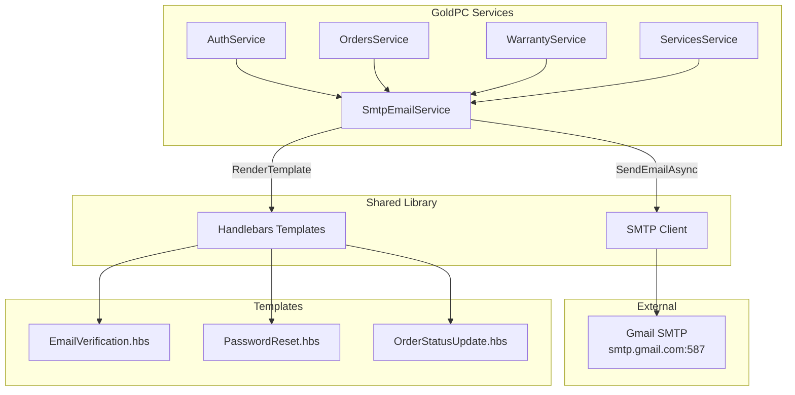

# 📧 Email-уведомления

> **Раздел**: 11_Integrations
> **Версия**: 1.0 | **Последнее обновление**: 2026-05-24

---

## Содержание

1. [[#Архитектура]]
2. [[#SmtpEmailService]]
3. [[#Handlebars шаблоны]]
4. [[#SMTP конфигурация]]
5. [[#Фоновые задачи]]
6. [[#Retry политика]]

---

## Архитектура



**SmtpEmailService** — единственный класс для отправки email, живёт в `GoldPC.Shared`.

---

## SmtpEmailService

**Класс**: `src/Shared/Services/Implementations/SmtpEmailService.cs`

### Отправка email

```csharp
public async Task<(bool Success, string? Error)> SendEmailAsync(
    string email, 
    string subject, 
    string body, 
    bool isHtml = true)
{
    var message = new MimeMessage();
    message.From.Add(new MailboxAddress(
        _configuration["Smtp:FromName"] ?? "GoldPC",
        _configuration["Smtp:FromEmail"] ?? "no-reply@goldpc.example.com"));
    message.To.Add(new MailboxAddress(string.Empty, email));
    message.Subject = subject;
    message.Body = new TextPart(isHtml ? "html" : "plain") { Text = body };

    using var client = new MailKit.Net.Smtp.SmtpClient();
    await client.ConnectAsync(host, port, SecureSocketOptions.Auto);
    
    if (!string.IsNullOrEmpty(user))
        await client.AuthenticateAsync(user, pass);
    
    await client.SendAsync(message);
    await client.DisconnectAsync(true);
}
```

### Рендеринг шаблона

```csharp
public string RenderTemplate(string templateName, object data)
{
    var templatePath = Path.Combine(
        AppContext.BaseDirectory, "Templates", $"{templateName}.hbs");

    var source = File.ReadAllText(templatePath);
    var template = Handlebars.Compile(source);
    return template(data);
}
```

---

## Handlebars шаблоны

Все шаблоны имеют тёмную тему **GoldPC** (золотой + тёмный).

### EmailVerification.hbs

**Путь**: `src/AuthService/Templates/EmailVerification.hbs`
**Назначение**: Подтверждение email при регистрации

**Переменные**:
| Параметр | Тип | Описание |
|----------|-----|----------|
| `{{UserName}}` | string | Имя пользователя |
| `{{VerificationLink}}` | string | Ссылка для подтверждения (действительна 24ч) |
| `{{Year}}` | number | Текущий год (для футера) |

**Пример**:
```
Тема: Подтверждение email — GoldPC
Привет, Иван!
Спасибо за регистрацию в GoldPC. 
Пожалуйста, подтвердите ваш email, нажав на кнопку ниже.
[Подтвердить email]
Ссылка действительна в течение 24 часов.
```

### PasswordReset.hbs

**Путь**: `src/AuthService/Templates/PasswordReset.hbs`
**Назначение**: Сброс пароля

**Переменные**:
| Параметр | Тип | Описание |
|----------|-----|----------|
| `{{UserName}}` | string | Имя пользователя |
| `{{ResetLink}}` | string | Ссылка для сброса пароля |
| `{{ExpirationHours}}` | number | Срок действия ссылки (часы) |
| `{{Year}}` | number | Текущий год |

**Пример**:
```
Тема: Восстановление пароля — GoldPC
Привет, Иван!
Вы получили это письмо, потому что запросили восстановление пароля.
[Сбросить пароль]
Ссылка действительна в течение 1 часа.
```

### OrderStatusUpdate.hbs

**Путь**: `src/Shared/Templates/OrderStatusUpdate.hbs`
**Назначение**: Уведомление об изменении статуса заказа

**Переменные**:
| Параметр | Тип | Описание |
|----------|-----|----------|
| `{{OrderNumber}}` | string | Номер заказа (ORD-2026-0042) |
| `{{CustomerName}}` | string | Имя клиента |
| `{{NewStatus}}` | string | Новый статус заказа |
| `{{Comment}}` | string | Комментарий (опционально) |
| `{{OrderUrl}}` | string | Ссылка на заказ в ЛК |

### Дизайн шаблонов

Все шаблоны используют:
- **Фон**: `#0b0e11` (тёмный)
- **Карточка**: `#1e2329` (серый)
- **Акцент**: `#FCD535` (золотой GoldPC)
- **Текст**: `#eaecef` (светлый)
- **Второстепенный**: `#707a8a` (серый)
- **Шрифт**: Inter, sans-serif

```html
<!-- Структура шаблона -->
<table bgcolor="#0b0e11">
  <tr>
    <td>
      <table bgcolor="#1e2329">
        <!-- Header: GoldPC логотип -->
        <!-- Body: контент с CTA кнопкой -->
        <!-- Warning: срок действия -->
        <!-- Footer: copyright -->
      </table>
    </td>
  </tr>
</table>
```

---

## SMTP конфигурация

### appsettings.json

```json
{
  "Smtp": {
    "Host": "smtp.gmail.com",
    "Port": 587,
    "Username": "your-email@gmail.com",
    "Password": "your-app-password",
    "FromEmail": "no-reply@goldpc.example.com",
    "FromName": "GoldPC"
  }
}
```

| Параметр | Описание | По умолчанию |
|----------|----------|-------------|
| `Host` | SMTP сервер | `localhost` |
| `Port` | Порт SMTP | `587` |
| `Username` | Имя пользователя | (пусто) |
| `Password` | Пароль / App Password | (пусто) |
| `FromEmail` | Email отправителя | `no-reply@goldpc.example.com` |
| `FromName` | Имя отправителя | `GoldPC` |

### DI Registration

```csharp
// AuthService
builder.Services.AddSingleton<SmtpEmailService>();

// OrdersService
builder.Services.AddSingleton<SmtpEmailService>();

// Shared — общая регистрация
services.AddSingleton<SmtpEmailService>();
```

### Для Gmail

1. Включить 2FA на аккаунте Google
2. Создать **App Password** (Пароль приложения)
3. Использовать `smtp.gmail.com:587` с TLS

---

## Фоновые задачи

### EmailBackgroundWorker

**Класс**: `src/Shared/Services/Background/EmailBackgroundWorker.cs`

```csharp
public class EmailBackgroundWorker : BackgroundService
{
    private readonly SmtpEmailService _emailService;
    // Обрабатывает очередь email-уведомлений
    // Запускается каждые N секунд
}
```

- Обрабатывает отложенные email-уведомления
- Берёт задачи из очереди/БД
- Отправляет через SmtpEmailService
- Логирует успешные и неуспешные отправки

---

## Retry политика

SmtpEmailService использует **Polly** для повторных попыток:

```csharp
_resiliencePolicy = Policy.Handle<Exception>()
    .WaitAndRetryAsync(3, retryAttempt => 
        TimeSpan.FromSeconds(Math.Pow(2, retryAttempt)));
```

**Стратегия**: 3 попытки, задержка: 2с → 4с → 8с.

---

## Связанные страницы

- [[11_Integrations/Обзор_интеграций]] — общий обзор интеграций
- [[03_Backend/Сервис_аутентификации_AuthService]] — регистрация, сброс пароля
- [[03_Backend/Сервис_заказов_OrdersService]] — уведомления о заказах
- [[03_Backend/Сервис_гарантии_WarrantyService]] — уведомления об истечении гарантии
- [[09_Auth/Поток_регистрации_и_логина]]
- [[09_Auth/Поток_сброса_пароля]]
- [[00_Index/Главный_индекс]]
