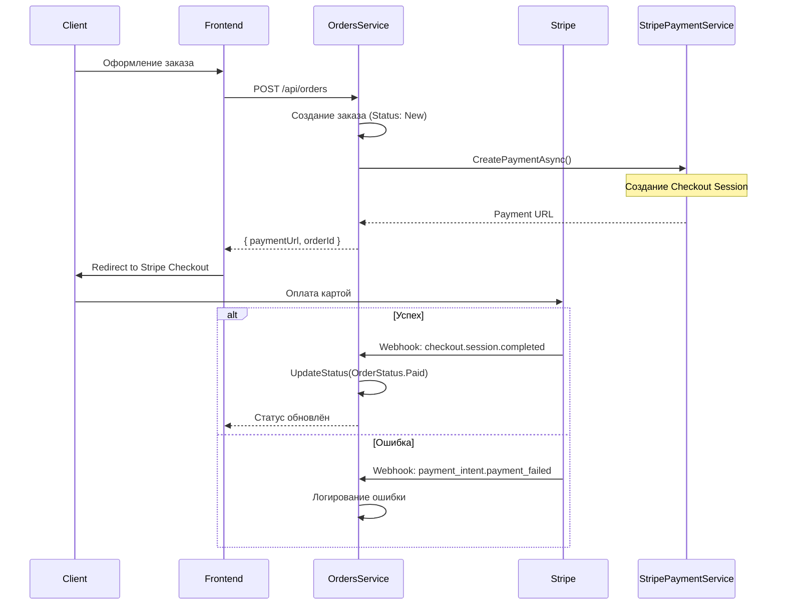

# 💳 Stripe интеграция

> **Раздел**: 11_Integrations
> **Версия**: 1.0 | **Последнее обновление**: 2026-05-24

---

## Содержание

1. [[#Платёжный поток]]
2. [[#Два webhook-контроллера — технический долг]]
3. [[#StripePaymentService]]
4. [[#Webhook-обработчики]]
5. [[#Конфигурация]]
6. [[#Симулятор оплаты]]
7. [[#Соображения безопасности]]

---

## Платёжный поток



---

## Два webhook-контроллера — технический долг

В OrdersService существует **два** webhook-контроллера, обрабатывающих одни и те же события Stripe:

### 1. StripeWebhookController (старый)

- **Путь**: `POST /api/v1/webhooks/stripe`
- **Класс**: `Controllers/Webhooks/StripeWebhookController.cs`
- **Особенности**:
  - Проверяет `Stripe:WebhookSecret`
  - Обрабатывает `checkout.session.completed` и `payment_intent.payment_failed`
  - Имеет **симулятор** на `GET /api/v1/webhooks/stripe/simulate`

### 2. PaymentWebhookController (новый)

- **Путь**: `POST /api/webhooks/payment/stripe`
- **Класс**: `Controllers/PaymentWebhookController.cs`
- **Особенности**:
  - Бросает исключение если `Stripe:WebhookSecret` не настроен
  - Обрабатывает `checkout.session.completed`, `checkout.session.expired`, `payment_intent.payment_failed`
  - При неудачной оплате устанавливает статус обратно в `New`

### Сравнение

| Характеристика | StripeWebhookController (старый) | PaymentWebhookController (новый) |
|---------------|----------------------------------|----------------------------------|
| Путь | `/api/v1/webhooks/stripe` | `/api/webhooks/payment/stripe` |
| Симулятор | ✅ Есть (GET /simulate) | ❌ Нет |
| Обработка `checkout.session.completed` | ✅ | ✅ |
| Обработка `payment_intent.payment_failed` | ✅ | ✅ |
| Обработка `checkout.session.expired` | ❌ | ✅ |
| Интеграция Stripe | `EventUtility.ConstructEvent` | `EventUtility.ConstructEvent` |
| Возврат при ошибке | `BadRequest()` | `BadRequest()` / `StatusCode(500)` |

> ⚠️ **Риск**: Если оба контроллера зарегистрированы в production, Stripe может отправлять webhook на оба URL, вызывая двойную обработку платежа.

---

## StripePaymentService

**Класс**: `Services/StripePaymentService.cs`
**Интерфейс**: `IPaymentService`

### Создание платежа

```csharp
public async Task<(string? PaymentUrl, string? Error)> CreatePaymentAsync(Guid orderId, decimal amount)
{
    // Если UseSimulator = true — возвращает URL симулятора
    if (_configuration.GetValue<bool>("Stripe:UseSimulator", true))
    {
        var mockPaymentUrl = $"{baseUrl}/api/v1/webhooks/stripe/simulate?orderId={orderId}";
        return (mockPaymentUrl, null);
    }

    // Создание Checkout Session
    var options = new SessionCreateOptions
    {
        PaymentMethodTypes = new List<string> { "card" },
        LineItems = new List<SessionLineItemOptions>
        {
            new SessionLineItemOptions
            {
                PriceData = new SessionLineItemPriceDataOptions
                {
                    UnitAmount = (long)(amount * 100),  // Stripe использует центы
                    Currency = "usd",
                    ProductData = new SessionLineItemPriceDataProductDataOptions
                    {
                        Name = $"Заказ GoldPC #{orderId}",
                    },
                },
                Quantity = 1,
            },
        },
        Mode = "payment",
        SuccessUrl = _successUrl,
        CancelUrl = _cancelUrl,
        ClientReferenceId = orderId.ToString(),
        Metadata = new Dictionary<string, string> { { "OrderId", orderId.ToString() } }
    };

    var service = new SessionService();
    Session session = await service.CreateAsync(options);
    return (session.Url, null);
}
```

### Обработка callback

```csharp
public async Task<(bool Success, string? Error)> ProcessPaymentCallbackAsync(string paymentId, bool success)
{
    var service = new SessionService();
    Session session = await service.GetAsync(paymentId);
    
    if (session.PaymentStatus == "paid")
        return (true, null);
    
    return (false, $"Статус платежа: {session.PaymentStatus}");
}
```

---

## Webhook-обработчики

### Проверка подписи

Оба контроллера используют `EventUtility.ConstructEvent` для верификации:

```csharp
var stripeEvent = EventUtility.ConstructEvent(
    json, 
    Request.Headers["Stripe-Signature"], 
    webhookSecret
);
```

### Обрабатываемые события

| Событие Stripe | Действие |
|---------------|----------|
| `checkout.session.completed` | `OrderStatus.New → Paid` + `IsPaid = true`, `PaidAt = now` |
| `payment_intent.payment_failed` | Логирование ошибки (новый: устанавливает New) |
| `checkout.session.expired` | Логирование (новый: устанавливает New) |

### Пример успешной обработки

```csharp
// StripeWebhookController
private async Task HandleCheckoutSessionCompleted(Stripe.Checkout.Session? session)
{
    if (session == null || string.IsNullOrEmpty(session.ClientReferenceId)) return;
    
    if (Guid.TryParse(session.ClientReferenceId, out var orderId))
    {
        await _ordersService.UpdateStatusAsync(orderId, OrderStatus.Paid, Guid.Empty, 
            "Оплата через Stripe подтверждена");
    }
}
```

---

## Конфигурация

### appsettings.json

```json
{
  "Stripe": {
    "SecretKey": "sk_test_replace_me",
    "WebhookSecret": "whsec_replace_me",
    "SuccessUrl": "https://localhost:3000/order/success/{CHECKOUT_SESSION_ID}",
    "CancelUrl": "https://localhost:3000/order/cancel",
    "UseSimulator": true
  }
}
```

| Параметр | Описание | По умолчанию |
|----------|----------|-------------|
| `SecretKey` | Секретный ключ Stripe (sk_test_*) | — |
| `WebhookSecret` | Секрет вебхука (whsec_*) | — |
| `SuccessUrl` | URL успешной оплаты | `https://localhost:3000/order/success/{CHECKOUT_SESSION_ID}` |
| `CancelUrl` | URL отмены оплаты | `https://localhost:3000/order/cancel` |
| `UseSimulator` | Включить симулятор (Development) | `true` |

### DI Registration

```csharp
// Development — PaymentServiceMock
builder.Services.AddSingleton<IPaymentService, PaymentServiceMock>();

// Production — StripePaymentService (с декоратором логгирования)
builder.Services.AddSingleton<IPaymentService, StripePaymentService>();
```

---

## Симулятор оплаты

**URL**: `GET /api/v1/webhooks/stripe/simulate?orderId={orderId}&amount={amount}`

В Development режиме используется HTML-страница-симулятор:

```html
<!-- Симулятор оплаты -->
<button onclick='pay(true)'>✅ Оплатить успешно</button>
<button onclick='pay(false)'>❌ Ошибка оплаты</button>

<script>
async function pay(success) {
    await fetch('/api/v1/webhooks/stripe', {
        method: 'POST',
        body: JSON.stringify({
            type: success ? 'checkout.session.completed' : 'payment_intent.payment_failed',
            data: { object: { client_reference_id: '{orderId}' } }
        })
    });
}
</script>
```

---

## Соображения безопасности

| Проблема | Статус | Рекомендация |
|----------|--------|-------------|
| `sk_test_replace_me` в конфиге | ⚠️ | Использовать User Secrets / ENV переменные |
| Два webhook — двойная обработка | ⚠️ | Удалить старый контроллер |
| `UseSimulator: true` в Production | ❌ | Всегда `false` в Production |
| Stripe API Key в конфигурации | ⚠️ | Хранить в `appsettings.Production.json` или ENV |
| Отсутствие idempotency key | ⚠️ | Stripe может повторно отправить webhook |
| Webhook без аутентификации | ✅ | Проверка подписи через `EventUtility` |

### Рекомендации для Production

1. Установить `UseSimulator: false`
2. Настроить Stripe Webhook в Dashboard на **один** URL
3. Использовать `Stripe:WebhookSecret` из ENV или Secret Manager
4. Добавить идемпотентность: проверять `PaymentIntent.Id` в БД перед обработкой
5. Настроить Stripe Dashboard на отправку только нужных событий

---

## Связанные страницы

- [[11_Integrations/Обзор_интеграций]] — общий обзор интеграций
- [[03_Backend/Сервис_заказов_OrdersService]] — сервис заказов
- [[14_Queues_Events/MassTransit_настройка]] — отключённая публикация событий
- [[08_Security/Обзор_безопасности]] — безопасность
- [[00_Index/Главный_индекс]]
