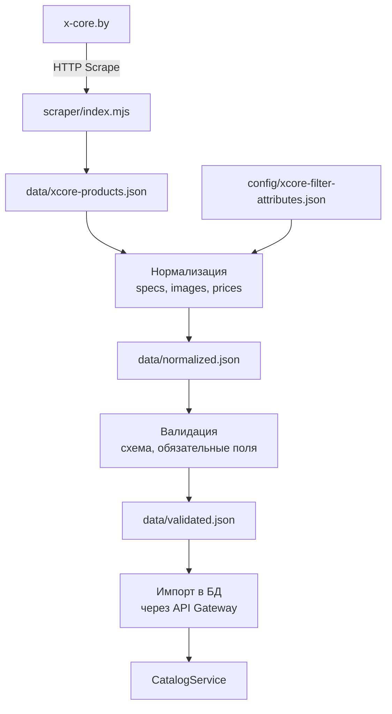
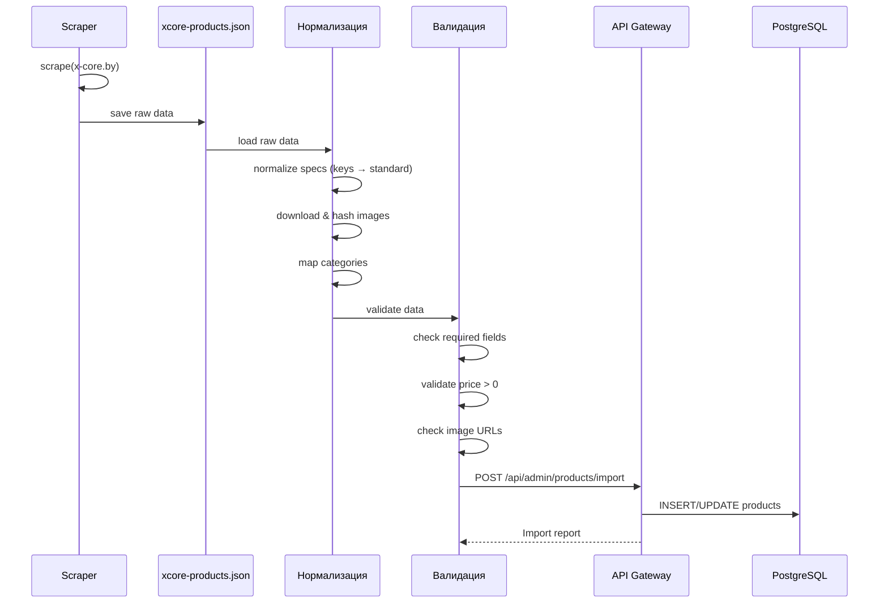

# 🕷️ X-Core скрапинг — импорт товаров

> **Раздел**: 11_Integrations
> **Версия**: 1.0 | **Последнее обновление**: 2026-05-24

---

## Содержание

1. [[#Обзор]]
2. [[#Архитектура скрапера]]
3. [[#Формат данных]]
4. [[#Пайплайн импорта]]
5. [[#Команды управления]]
6. [[#Интеграция с фронтендом]]

---

## Обзор

X-Core scraper — Node.js скрипты для импорта товаров с сайта **x-core.by** (конкурент/поставщик). Позволяет автоматически загружать каталог комплектующих в GoldPC.

**Статус**: ✅ Активно используется
**Язык**: Node.js (ECMAScript Modules)
**Директория**: `scripts/scraper/`

---

## Архитектура скрапера



### Ключевые файлы

| Файл | Назначение |
|------|-----------|
| `scripts/scraper/index.mjs` | Главный скрипт скрапера |
| `scripts/scraper/data/xcore-products.json` | Сырые данные с x-core.by |
| `scripts/scraper/data/all-filters-dump.json` | Дамп фильтров каталога |
| `scripts/scraper/config/xcore-filter-attributes.json` | Маппинг атрибутов фильтров |
| `scripts/scraper/data/` | Директория с данными (не в git) |
| `scripts/specs/generateSpecLabels.ts` | Генерация меток спецификаций |

---

## Формат данных

### xcore-products.json

```json
{
  "products": [
    {
      "name": "Процессор AMD Ryzen 5 5600X OEM",
      "category": "processors",
      "price": 599.00,
      "currency": "BYN",
      "specifications": {
        "socket": "AM4",
        "cores": "6",
        "threads": "12",
        "base_frequency": "3.7 ГГц",
        "max_frequency": "4.6 ГГц",
        "tdp": "65 Вт",
        "manufacturer": "AMD"
      },
      "images": [
        "https://x-core.by/upload/images/ryzen-5600x.jpg"
      ],
      "sku": "100-100000065WOF",
      "stock": 15,
      "legal_info": {
        "warranty_months": 36,
        "country": "Китай"
      }
    }
  ]
}
```

### all-filters-dump.json

Дамп фильтров из CatalogService:

```json
{
  "categories": {
    "processors": {
      "attributes": [
        { "key": "socket", "displayName": "Сокет", "type": "select" },
        { "key": "cores", "displayName": "Количество ядер", "type": "range" }
      ]
    }
  }
}
```

### xcore-filter-attributes.json

Маппинг между x-core атрибутами и внутренними фильтрами:

```json
{
  "gpu": [
    { "attribute_key": "memory_size", "display_name": "Объем видеопамяти" },
    { "attribute_key": "memory_type", "display_name": "Тип памяти" }
  ]
}
```

---

## Пайплайн импорта



### Этапы

#### 1. Scrape
- HTTP-запросы к x-core.by
- Парсинг HTML/JSON
- Извлечение: name, price, specs, images, legal info

#### 2. Normalize
- Приведение ключей спецификаций к стандарту GoldPC
- Скачивание изображений
- Маппинг категорий x-core → GoldPC
- Фильтрация дубликатов

#### 3. Validate
- Проверка обязательных полей (name, price, category)
- Валидация цены > 0
- Проверка URL изображений
- Проверка SKU на уникальность

#### 4. Import
- Отправка через API Gateway
- UPSERT: обновление существующих / вставка новых
- Логирование импорта

### Image download & SHA256 mapping

```mermaid
flowchart LR
    IMG[URL изображения] --> DOWNLOAD[Скачивание]
    DOWNLOAD --> HASH[SHA256 хеш]
    HASH --> PATH[upload/{hash[:2]}/{hash[2:4]}/{hash}.jpg]
    PATH --> STORAGE[Файловое хранилище]
```

Изображения сохраняются в структуру директорий на основе SHA256:
- Первые 2 символа → вложенная папка уровня 1
- Символы 2-4 → вложенная папка уровня 2
- Полный хеш → имя файла

---

## Скрипты генерации меток

### generateSpecLabels.ts

Скрипт для генерации маппинга ключей спецификаций в читаемые названия.

**Источники**:
1. `CatalogDbContext.cs` — приоритет 1 (авторитетные метки из back-end seed)
2. `xcore-filter-attributes.json` — приоритет 2 (из фильтров x-core)
3. `all-filters-dump.json` — приоритет 3 (дамп фильтров)
4. `xcore-products.json` — приоритет 4 (статистика ключей из scraper)

**Выход**: `src/frontend/src/utils/specLabels.generated.ts`

```typescript
// Авто-генерируемый файл
export const SPEC_LABELS_GENERATED: Record<string, string> = {
  "socket": "Сокет",
  "cores": "Количество ядер",
  "tdp": "TDP",
  "base_frequency": "Базовая частота",
  // ...
};
```

---

## Команды управления

Скрипт `scripts/scraper/index.mjs` поддерживает командный интерфейс с 14 командами:

| Команда | Описание |
|---------|----------|
| `scrape` | Запустить скрапинг x-core.by |
| `scrape:full` | Полный скрапинг всех категорий |
| `scrape:category <name>` | Скрапинг одной категории |
| `normalize` | Нормализация данных |
| `validate` | Валидация данных |
| `import` | Импорт в БД |
| `import:dry-run` | Пробный импорт без изменений |
| `images:download` | Скачать изображения |
| `images:check` | Проверить целостность изображений |
| `images:cleanup` | Очистить неиспользуемые изображения |
| `diff` | Сравнить с предыдущим импортом |
| `diff:stats` | Статистика изменений |
| `export:filters` | Экспорт фильтров в JSON |
| `status` | Статус последнего импорта |

---

## Интеграция с фронтендом

### Обработка изображений

Фронтенд ожидает изображения по пути:

```typescript
// src/frontend/src/utils/image.ts
'/upload/CNext/'  // дефолтный placeholder x-core.by
```

**Правила**:
- Внешние URL (x-core и др.) с API не приходят и в `` не подставляются
- Изображения скачиваются локально и хешируются
- Placeholder используется если изображение не найдено

---

## Связанные страницы

- [[11_Integrations/Обзор_интеграций]] — общий обзор интеграций
- [[03_Backend/Сервис_каталога_CatalogService]] — целевой сервис импорта
- [[04_Frontend/Каталог_и_фильтрация]] — каталог на фронтенде
- [[04_Frontend/API_слой]] — API слой фронтенда
- [[00_Index/Главный_индекс]]
