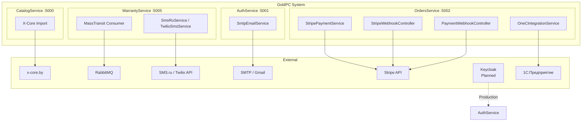
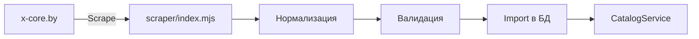
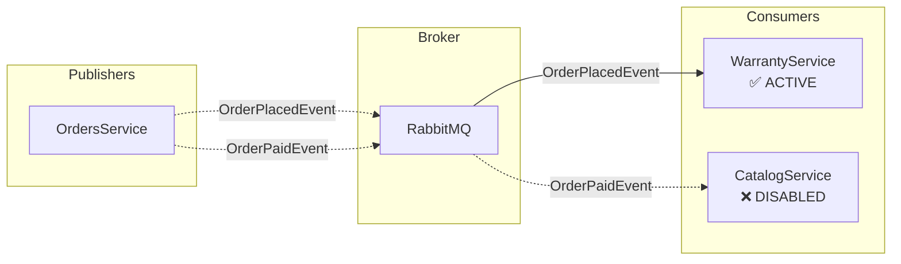

# 🔌 Обзор интеграций GoldPC

> **Раздел**: 11_Integrations
> **Версия**: 1.0 | **Последнее обновление**: 2026-05-24

---

## Содержание

1. [[#Карта интеграций]]
2. [[#Stripe — платёжный шлюз]]
3. [[#SMTP/Gmail — Email-уведомления]]
4. [[#SMS.ru / Twilio — SMS-уведомления]]
5. [[#X-Core scraper — импорт товаров]]
6. [[#RabbitMQ — асинхронные сообщения]]
7. [[#Keycloak — OIDC аутентификация]]
8. [[#1С — бухгалтерская интеграция]]

---

## Карта интеграций



---

## Stripe — платёжный шлюз

**Сервис**: OrdersService
**Статус**: ✅ Активно (Development — симулятор)

| Компонент | Назначение |
|-----------|------------|
| `StripePaymentService` | Создание Checkout Session |
| `StripeWebhookController` (старый) | Webhook: `/api/v1/webhooks/stripe` |
| `PaymentWebhookController` (новый) | Webhook: `/api/webhooks/payment/stripe` |

**Конфигурация**:
```json
{
  "Stripe:SecretKey": "sk_test_...",
  "Stripe:WebhookSecret": "whsec_...",
  "Stripe:SuccessUrl": "https://localhost:3000/order/success/{CHECKOUT_SESSION_ID}",
  "Stripe:CancelUrl": "https://localhost:3000/order/cancel",
  "Stripe:UseSimulator": true
}
```

> ⚠️ **Техдолг**: Два webhook-контроллера обрабатывают одни и те же события — возможна дуальная обработка.

Подробнее: [[11_Integrations/Stripe_интеграция]]

---

## SMTP/Gmail — Email-уведомления

**Сервисы**: AuthService, OrdersService, WarrantyService
**Статус**: ✅ Активно

**SmtpEmailService** (из `Shared`):

| Свойство | Значение по умолчанию |
|----------|----------------------|
| Host | localhost |
| Port | 587 |
| FromEmail | no-reply@goldpc.example.com |
| FromName | GoldPC |

**Шаблоны** (Handlebars .hbs):

| Шаблон | Назначение | Сервис |
|--------|------------|--------|
| `EmailVerification.hbs` | Подтверждение email | AuthService |
| `PasswordReset.hbs` | Сброс пароля | AuthService |
| `OrderStatusUpdate.hbs` | Обновление статуса заказа | Shared/Templates |

**Retry policy**: Polly — 3 попытки с экспоненциальной задержкой (2ⁿ сек).

Подробнее: [[11_Integrations/Email_уведомления]]

---

## SMS.ru / Twilio — SMS-уведомления

**Сервисы**: WarrantyService, ServicesService, OrdersService
**Статус**: ✅ Активно (Development — моки)

| Сервис | Класс | Статус |
|--------|-------|--------|
| SMS.ru | `SmsRuService` | Мок (Development) |
| Twilio | `TwilioSmsService` | Production |

**Production Notification Service**:
```csharp
// Использует Twilio для SMS + асинхронную очередь для Email
services.AddSingleton<TwilioSmsService>();
services.AddSingleton<ProductionNotificationService>();
```

**Circuit Breaker**: TwilioSmsService использует Polly Circuit Breaker:
- При 3 ошибках подряд — размыкается на 30 секунд
- После ожидания — пробует снова

---

## X-Core scraper — импорт товаров

**Сервис**: Скрипты Node.js → CatalogService
**Статус**: ✅ Активно

Скрипты импорта данных с сайта x-core.by (конкурент/поставщик).



**Ключевые файлы**:
- `scripts/scraper/index.mjs` — основной скрапер
- `scripts/scraper/data/xcore-products.json` — выгруженные товары
- `scripts/scraper/config/xcore-filter-attributes.json` — атрибуты фильтров

Подробнее: [[11_Integrations/X_Core_скрапинг]]

---

## RabbitMQ — асинхронные сообщения

**Сервисы**: OrdersService, CatalogService, WarrantyService
**Статус**: ⚠️ Частично отключён



**События**:
- `OrderPlacedEvent` → WarrantyService (создание гарантийной карты)
- `OrderPaidEvent` → CatalogService (ОТКЛЮЧЕНО)

Подробнее: [[14_Queues_Events/Обзор_очередей_событий]]

---

## Keycloak — OIDC аутентификация

**Сервис**: AuthService (Planned)
**Статус**: 🔮 Запланировано

```csharp
// в Production используем Keycloak (OIDC)
// builder.Services.AddKeycloakAuthentication();
```

- Планируется замена JWТ-аутентификации на Keycloak
- OIDC протокол
- Разделение на frontend- и backend-клиенты

---

## 1С — бухгалтерская интеграция

**Сервис**: OrdersService
**Статус**: ⚠️ Частично реализован

| Компонент | Назначение |
|-----------|------------|
| `OneCController` | Endpoints для 1С |
| `OneCIntegrationService` | Экспорт заказов в XML (CommerceML) |

**Endpoints**:

| Метод | Endpoint | Описание |
|-------|----------|----------|
| GET | `/api/1c/orders` | Экспорт заказов в XML |
| PUT | `/api/1c/status` | Обновление статуса из 1С |

**Аутентификация**: API Key (`OneC:ApiKey`)

**Формат**: CommerceML (XML) — стандарт 1С для обмена данными.

```xml
<?xml version="1.0" encoding="UTF-8"?>
<КоммерческаяИнформация>
  <Документ>
    <Номер>ORD-2026-0042</Номер>
    <Дата>2026-05-24</Дата>
    ...
  </Документ>
</КоммерческаяИнформация>
```

---

## Sentry — отслеживание ошибок

**Статус**: 🔮 Запланировано

Планируется интеграция Sentry для:
- Сбора исключений в production
- Отслеживания производительности
- Алертов при падении сервисов

---

## Application Insights — телеметрия

**Статус**: ⚠️ Упоминается в OrdersService

- Регистрация в `Program.cs` (закомментирована)
- Планируется для сбора метрик production

---

## Сводная таблица

| Интеграция | Статус | Сервис | Назначение |
|-----------|--------|--------|-----------|
| Stripe | ✅ Активно | OrdersService | Платежи |
| SMTP/Gmail | ✅ Активно | Auth/Order/Warranty | Email-уведомления |
| SMS.ru | ✅ Активно (мок) | Warranty/Services | SMS-уведомления |
| Twilio | ✅ Активно (production) | Warranty/Services | SMS-уведомления |
| X-Core scraper | ✅ Активно | Scripts → Catalog | Импорт товаров |
| RabbitMQ | ⚠️ Частично | Order/Warranty/Catalog | Асинхронные события |
| 1С | ⚠️ Частично | OrdersService | Бухгалтерия |
| Keycloak | 🔮 План | AuthService | OIDC auth |
| Sentry | 🔮 План | Все сервисы | Error tracking |
| App Insights | 🔮 План | Все сервисы | Телеметрия |

---

## Связанные страницы

- [[11_Integrations/Stripe_интеграция]] — детали Stripe
- [[11_Integrations/X_Core_скрапинг]] — детали X-Core
- [[11_Integrations/Email_уведомления]] — детали Email
- [[14_Queues_Events/Обзор_очередей_событий]] — RabbitMQ
- [[14_Queues_Events/MassTransit_настройка]] — MassTransit
- [[00_Index/Главный_индекс]]
