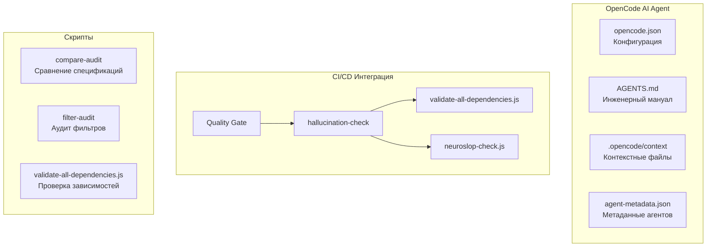
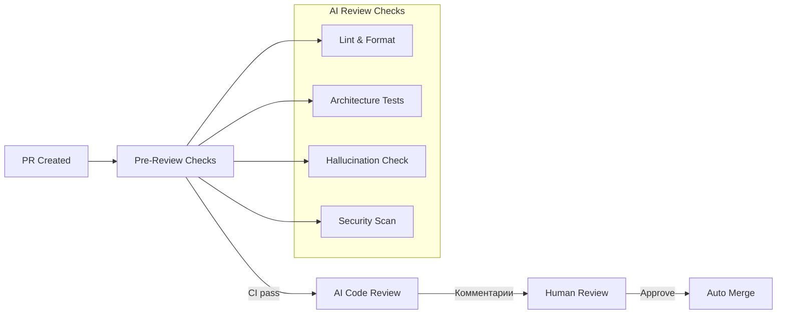

# 🤖 AI-модули и автоматизация

> **Раздел**: 12_AI_Modules
> **Версия**: 1.0 | **Последнее обновление**: 2026-05-24

---

## Содержание

1. [[#Обзор]]
2. [[#OpenCode AI Agent]]
3. [[#AGENTS.md — инженерный мануал]]
4. [[#.opencode контекст]]
5. [[#Neuroslop Check — детектор галлюцинаций]]
6. [[#AI-assisted Code Review]]
7. [[#Скрипты сравнения и аудита]]

---

## Обзор

В проекте GoldPC используется интегрированная AI-агентная система **OpenCode** для автоматизации разработки, включая:

- **OpenCode AI Agent** — конфигурация агентов, команд и контекстов
- **AGENTS.md** — инженерный мануал для AI-агентов
- **Neuroslop Check** — детектор AI-галлюцинаций в зависимостях
- **Скрипты валидации** — проверка зависимостей и кода



---

## OpenCode AI Agent

### Конфигурация (opencode.json)

```json
{
  "plugin": ["@mingeon/opencode-blueprint"],
  "$schema": "https://opencode.ai/config.json"
}
```

Плагин `@mingeon/opencode-blueprint` добавляет функциональность управления планами и задачами.

### Метаданные агентов

**Файл**: `.opencode/config/agent-metadata.json`

Содержит 22 зарегистрированных агентов и саб-агентов:

| Агент | Категория | Роль |
|-------|-----------|------|
| `openagent` | core | Основной координатор |
| `opencoder` | core | Разработка и кодинг |
| `repo-manager` | meta | Управление репозиторием |
| `system-builder` | meta | Генерация системы |
| `copywriter` | content | Контент и маркетинг |
| `technical-writer` | content | Техническая документация |
| `data-analyst` | data | Анализ данных |
| `eval-runner` | testing | Запуск оценок |

**Саб-агенты**:

| Саб-агент | Категория | Роль |
|-----------|-----------|------|
| `task-manager` | core | Декомпозиция задач |
| `batch-executor` | core | Параллельное выполнение |
| `documentation` (DocWriter) | core | Документирование |
| `contextscout` | core | Контекстный поиск |
| `externalscout` | core | Внешний поиск |
| `coder-agent` | code | Написание кода |
| `tester` (TestEngineer) | code | Тестирование |
| `reviewer` (CodeReviewer) | code | Ревью кода |
| `build-agent` | code | Сборка |
| `frontend-specialist` | development | Фронтенд |
| `devops-specialist` | development | DevOps |
| `agent-generator` | system-builder | Генерация агентов |
| `command-creator` | system-builder | Генерация команд |
| `domain-analyzer` | system-builder | Анализ домена |
| `context-organizer` | system-builder | Организация контекста |
| `workflow-designer` | system-builder | Дизайн воркфлоу |

### Команды OpenCode

| Команда | Файл | Назначение |
|---------|------|-----------|
| `start-work` | `.opencode/commands/start-work.md` | Начать работу над задачей |
| `fix-plan` | `.opencode/commands/fix-plan.md` | Исправить план |
| `add-context` | `.opencode/command/add-context.md` | Добавить контекст |
| `commit` | `.opencode/command/commit.md` | Создать коммит |
| `test` | `.opencode/command/test.md` | Запустить тесты |
| `optimize` | `.opencode/command/optimize.md` | Оптимизировать код |
| `clean` | `.opencode/command/clean.md` | Очистить проект |
| `context` | `.opencode/command/context.md` | Управление контекстом |
| `validate-repo` | `.opencode/command/validate-repo.md` | Валидация репозитория |
| `analyze-patterns` | `.opencode/command/analyze-patterns.md` | Анализ паттернов |

---

## AGENTS.md — инженерный мануал

**Файл**: `/home/goldie/Progs/kursovaya/GoldPC/AGENTS.md`

Инженерный мануал для AI-агентов, определяющий **жёсткие правила** поведения:

### 6 Hard Behavioral Rules

1. **Think Before You Code** — при неясностях спросить на русском
2. **Simplicity First** — минимальный код, без "future-proof"
3. **Surgical Changes Only** — только необходимые файлы
4. **Goal-Driven Execution** — каждое изменение = верифицируемая цель
5. **When in Doubt — ASK** — не гадать, спросить
6. **No Hallucinations** — не выдумывать API, пропсы, токены

### Структура мануала

| Раздел | Описание |
|--------|----------|
| Project Architecture | Stack, директории, правила стилизации |
| Styling & Typography | Как Tailwind переопределяет CSS |
| AI Agent Workflow | 4-фазный цикл: INSPECT → PROPOSE → IMPLEMENT → VERIFY |
| Component & Data Patterns | Правила использования компонентов |
| Emergency Rollback | `git checkout -- <file>` |
| New Files Reference | Актуальные компоненты и страницы |

---

## .opencode контекст

Директория `.opencode/context/` содержит knowledge base для AI-агентов:

```
.opencode/context/
├── navigation.md
├── project-intelligence/
│   ├── business-domain.md          # Бизнес-домен GoldPC
│   ├── business-tech-bridge.md     # Связь бизнеса и технологий
│   ├── decisions-log.md            # Логи решений
│   ├── living-notes.md             # Живые заметки
│   └── technical-domain.md         # Технический домен
├── development/
│   ├── navigation.md
│   ├── ai/                         # AI/ML контекст (Mastra AI)
│   ├── backend/                    # Бэкенд контекст
│   ├── data/                       # Данные
│   ├── frameworks/                 # Фреймворки
│   ├── frontend/                   # Фронтенд
│   ├── infrastructure/             # Инфраструктура
│   ├── integration/                # Интеграции
│   └── principles/                 # Принципы (clean-code, api-design)
├── ui/
│   ├── navigation.md
│   ├── web/                        # Web UI (React, Tailwind, анимации)
│   └── terminal/                   # Terminal UI
├── openagents-repo/
│   └── navigation.md
└── standards/
    ├── code/                       # Стандарты кода
    ├── docs/                       # Стандарты документации
    ├── review/                     # Стандарты ревью
    └── tests/                      # Стандарты тестов
```

---

## Neuroslop Check — детектор галлюцинаций

**Статус**: ✅ Интегрирован в CI/CD (Quality Gate)

**Скрипт**: `scripts/neuroslop-check.js` (в референсах, упомянут в workflow)

### Что проверяет

1. **Несуществующие npm-пакеты** — проверка через registry.npmjs.org
2. **Несуществующие NuGet-пакеты** — проверка через api.nuget.org
3. **Вымышленные API endpoints** — grep по паттернам
4. **Несуществующие компоненты** — проверка импортов
5. **AI-сгенерированный код-мусор** — эвристики

### validate-all-dependencies.js

**Файл**: `scripts/validate-all-dependencies.js` (624 строки)

```bash
node scripts/validate-all-dependencies.js [--verbose] [--json] [--quiet]
```

- Проверяет все зависимости из `package.json` и `.csproj` файлов
- Делает HTTP-запросы к registries
- Exit code: 0 = всё ок, 1 = найдены галлюцинации

### Интеграция в CI/CD

```yaml
# quality-gate.yml
hallucination-check:
  name: 🛡️ Hallucination Check
  steps:
    - run: node scripts/validate-all-dependencies.js
    - run: node scripts/neuroslop-check.js
```

---

## AI-assisted Code Review

Процесс ревью с AI:



**AGENTS.md** определяет, как AI-агенты должны выполнять ревью:
- Проверка соблюдения правил AGENTS.md
- Верификация отсутствия галлюцинаций
- Проверка архитектурных ограничений

---

## Скрипты сравнения и аудита

### dump-all-filters.mjs

**Файл**: `scripts/dump-all-filters.mjs`

```bash
node scripts/dump-all-filters.mjs [url] [out]
# По умолчанию: url=http://localhost:5000, out=scripts/scraper/data/all-filters-dump.json
```

- Дамп всех фильтров каталога из API
- Используется для сравнения и аудита
- Сохраняет структуру фильтров для offline-анализа

### generateSpecLabels.ts

**Файл**: `scripts/specs/generateSpecLabels.ts`

```bash
npx tsx scripts/specs/generateSpecLabels.ts
```

Генерирует маппинг ключей спецификаций → русские названия:
- Источники: CatalogDbContext, x-core данные, фильтры
- Выход: `src/frontend/src/utils/specLabels.generated.ts`
- Приоритеты: backend seed > filter dumps > x-core stats > fallback

---

## Связанные страницы

- [[13_Workflows/Обзор_воркфлоу]] — GitHub Actions (Quality Gate)
- [[07_Infra_DevOps/GitHub_Actions]] — CI/CD pipeline
- [[04_Frontend/Каталог_и_фильтрация]] — фильтры каталога
- [[11_Integrations/X_Core_скрапинг]] — X-Core и скрапинг
- [[00_Index/Главный_индекс]]
