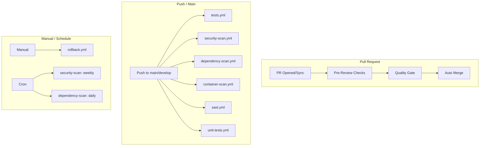
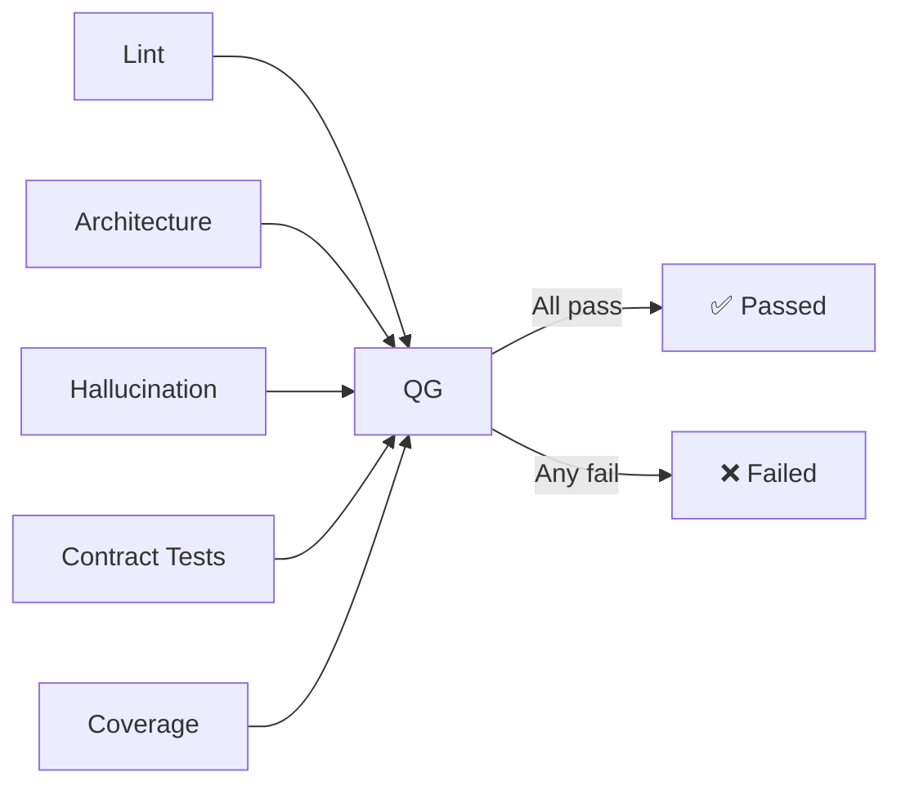

# ⚙️ GitHub Actions — Обзор воркфлоу

> **Раздел**: 13_Workflows
> **Версия**: 1.0 | **Последнее обновление**: 2026-05-24

---

## Содержание

1. [[#Обзор]]
2. [[#Pre-Review Checks]]
3. [[#Quality Gate]]
4. [[#Tests]]
5. [[#Security Scanning]]
6. [[#SAST]]
7. [[#Dependency Scanning]]
8. [[#Container Scanning]]
9. [[#Rollback]]
10. [[#Auto Merge]]

---

## Обзор

В проекте настроено **11 GitHub Actions workflow** + Dependabot.



### Все workflow

| Файл | Название | Триггер |
|------|----------|---------|
| `pre-review.yml` | Pre-Review Checks | PR → main/develop |
| `quality-gate.yml` | Quality Gate | Push/PR → main/develop |
| `tests.yml` | Tests | Push/PR → main/develop |
| `unit-tests.yml` | Unit Tests | Push/PR → main/develop |
| `e2e-tests.yml` | E2E Tests | Push/PR → main/develop |
| `security-scan.yml` | Security Scan | Push + weekly |
| `sast.yml` | SAST | Push/PR → main/develop |
| `dependency-scan.yml` | Dependency Scan | Push + daily |
| `container-scan.yml` | Container Scan | Push/PR → main/develop |
| `rollback.yml` | Rollback | workflow_dispatch |
| `auto-merge.yml` | Auto Merge | PR review approved |

---

## Pre-Review Checks

**Файл**: `pre-review.yml`
**Триггер**: `pull_request` на `main`/`develop`

### Джобы

| Джоба | Инструмент | Описание |
|-------|-----------|----------|
| `lint` | `dotnet format`, ESLint, Prettier | Статический анализ кода |
| `build` | `dotnet build`, `npm run build` | Сборка backend + frontend |
| `unit-tests` | `dotnet test` + XPlat Code Coverage | Unit-тесты, порог 70% |
| `security-scan` | Semgrep + Snyk | Базовый security-скан |
| `architecture-tests` | NetArchTest | Проверка архитектуры |

### Gate

```yaml
review-gate:
  needs: [lint, build, unit-tests, security-scan, architecture-tests]
  if: success()
```

- Запускается **перед** Code Review
- Автоматический комментарий с результатами в PR

### Порог покрытия

```yaml
env:
  DOTNET_VERSION: '8.0.x'
  NODE_VERSION: '20.x'
  COVERAGE_THRESHOLD: 70
```

---

## Quality Gate

**Файл**: `quality-gate.yml`
**Триггер**: `push`/`pull_request` на `main`/`develop`

| Джоба | Описание |
|-------|----------|
| `lint` | ESLint, Prettier, `dotnet format --warnaserror` |
| `architecture` | NetArchTest + Dependency Cruiser |
| `hallucination-check` | `validate-all-dependencies.js` + `neuroslop-check.js` |
| `contract-tests` | Pact provider verification |
| `coverage` | Проверка порога >80% |

### Hallucination Check

```bash
node scripts/validate-all-dependencies.js  # Проверка всех NPM и NuGet пакетов
node scripts/neuroslop-check.js            # Детектор AI-галлюцинаций
```

Проверяет:
- Существуют ли все зависимости в registries
- Нет ли вымышленных пакетов
- Нет ли AI-сгенерированного мусора

### Quality Gate Summary



---

## Tests

**Файл**: `tests.yml`
**Триггер**: `push`/`pull_request` на `main`/`develop`

| Джоба | Описание |
|-------|----------|
| `backend-unit-tests` | Unit-тесты .NET + Codecov |
| `contract-tests` | Pact consumer + provider |
| `integration-tests` | Testcontainers (PostgreSQL + Redis) |
| `frontend-unit-tests` | Vitest + React Testing Library |
| `e2e-tests` | Playwright (зависит от unit) |
| `load-tests` | k6 (только main) |
| `coverage-check` | Проверка покрытия |

### Пороги покрытия

| Категория | Минимум |
|-----------|---------|
| Backend | ≥80% |
| Frontend | ≥70% |
| Critical paths | ≥90% |

### Unit Tests (unit-tests.yml)

Отдельный быстрый workflow для unit-тестов:

```yaml
backend-unit-tests:
  - dotnet test AuthService.Tests
  - dotnet test PCBuilderService.Tests
  - dotnet test WarrantyService.Tests
  - dotnet test GoldPC.UnitTests

frontend-unit-tests:
  - npm run test:coverage (Vitest)
```

### E2E Tests (e2e-tests.yml)

| Джоба | Инструмент | Пороги |
|-------|-----------|--------|
| `e2e-tests` | Playwright (Chrome, FF, WebKit) | Все тесты проходят |
| `load-tests` | k6 | p95 < 500ms, error < 1% |

**Процесс E2E**:
1. Запуск `docker-compose.test.yml`
2. Ожидание healthcheck всех сервисов
3. Установка Playwright с браузерами
4. Запуск тестов
5. Загрузка отчёта (HTML)
6. Очистка окружения

---

## Security Scanning

**Файл**: `security-scan.yml`
**Триггер**: push/main, PR/main, **еженедельно по понедельникам**

| Джоба | Инструмент | Вывод |
|-------|-----------|-------|
| `trivy` | Trivy (filesystem) | SARIF → Security tab |
| `codeql` | CodeQL (C#, JS/TS) | SARIF → Security tab |
| `gitleaks` | Gitleaks | SARIF → Security tab |
| `zap` | OWASP ZAP Baseline | DAST отчёт |

```yaml
# CodeQL
queries: security-extended,security-and-quality
```

---

## SAST

**Файл**: `sast.yml`
**Триггер**: push/PR на `main`/`develop`

| Джоба | Инструмент |
|-------|-----------|
| `sonarqube` | SonarQube Scan + Quality Gate |
| `semgrep` | Semgrep CI |
| `codeql` | GitHub CodeQL |

```yaml
# SonarQube
- uses: sonarsource/sonarqube-scan-action@master
- uses: sonarsource/sonarqube-quality-gate-action@master
```

---

## Dependency Scanning

**Файл**: `dependency-scan.yml`
**Триггер**: push/PR, **ежедневно в 6:00 UTC**

| Джоба | Инструмент | Описание |
|-------|-----------|----------|
| `snyk` | Snyk (Node + .NET) | Severity ≥ HIGH, fail on upgradable |
| `npm-audit` | `npm audit` | Frontend зависимости |
| `dotnet-vulnerable` | `dotnet list package --vulnerable` | .NET уязвимости |
| `dependency-review` | GitHub Dependency Review | Проверка лицензий |

**Snyk monitor** (только main): отправляет данные в Snyk Dashboard.

---

## Container Scanning

**Файл**: `container-scan.yml`
**Триггер**: push/PR на `main`/`develop`

| Джоба | Инструмент | Описание |
|-------|-----------|----------|
| `trivy-scan` | Trivy на образах | Backend + Frontend images |
| `trivy-fs-scan` | Trivy на файловой системе | Полное сканирование |

---

## Rollback

**Файл**: `rollback.yml`
**Триггер**: `workflow_dispatch` (ручной)

### Параметры

| Параметр | Описание | По умолчанию |
|----------|----------|-------------|
| `version` | Версия для отката | **required** |
| `reason` | Причина отката | `Emergency rollback` |
| `skip_health_check` | Пропустить healthcheck | `false` |
| `services` | Сервисы (backend, frontend, all) | `all` |

### Процесс

```mermaid
flowchart LR
    TRIGGER[Ручной запуск] --> VALIDATE[Валидация параметров]
    VALIDATE --> PULL[Pull образов из Registry]
    PULL --> DETECT[Определение текущего<br/>blue/green]
    DETECT --> SWITCH[Переключение Nginx upstream]
    SWITCH --> HEALTH[Healthcheck]
    HEALTH --> STOP[Остановка старого окружения]
    STOP --> NOTIFY[Slack уведомление]
    NOTIFY --> AUDIT[Audit log entry]
```



Подробнее: [[15_Deployments/Blue_Green_стратегия]]

---

## Auto Merge

**Файл**: `auto-merge.yml`
**Триггер**: `pull_request_review` (approved)

### Условия

- Не draft PR
- ≥1 approval (develop) / ≥2 approvals (main)
- Все CI checks passed
- Нет merge conflicts

**Метод**: squash merge

```yaml
on:
  pull_request_review:
    types: [submitted]
```

---

## Dependabot

Настроен в `.github/dependabot.yml`:

| Экосистема | Директория | Расписание |
|-----------|-----------|-----------|
| `npm` | `/src/frontend` | weekly |
| `nuget` | `/src` | weekly |
| `docker` | `/docker` | weekly |

---

## Статистика

| Workflow | Среднее время | Частота |
|----------|--------------|---------|
| Pre-Review Checks | ~3 мин | Каждый PR |
| Quality Gate | ~5 мин | Push/PR |
| Tests | ~8 мин | Push/PR |
| E2E Tests | ~15 мин | Push/PR |
| Security Scan | ~10 мин | Push + weekly |
| Dependency Scan | ~4 мин | Push + daily |

---

## Связанные страницы

- [[07_Infra_DevOps/GitHub_Actions]] — описание workflow (старый)
- [[07_Infra_DevOps/Обзор_инфраструктуры]] — инфраструктура
- [[15_Deployments/Обзор_деплоя]] — деплой
- [[15_Deployments/Blue_Green_стратегия]] — blue-green
- [[17_Tests/Обзор_тестирования]] — тесты
- [[08_Security/Обзор_безопасности]] — безопасность
- [[00_Index/Главный_индекс]]
