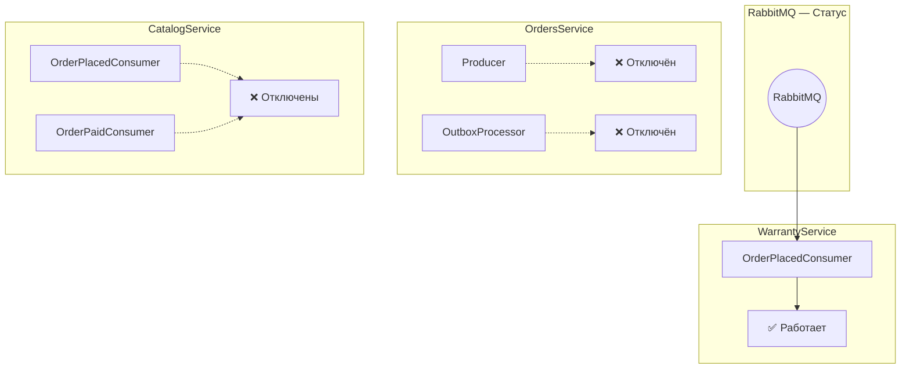

# ⚙️ MassTransit — настройка

> **Раздел**: 14_Queues_Events
> **Версия**: 1.0 | **Последнее обновление**: 2026-05-24

---

## Содержание

1. [[#Конфигурация]]
2. [[#Подключение в сервисах]]
3. [[#Контракты событий]]
4. [[#Retry и обработка ошибок]]
5. [[#Текущий статус]]

---

## Конфигурация

### MessagingExtensions

**Файл**: `src/Shared/Messaging/MessagingExtensions.cs`

Единая точка настройки MassTransit для всех сервисов:

```csharp
public static IServiceCollection AddMessaging(
    this IServiceCollection services, 
    IConfiguration configuration, 
    Action<IBusRegistrationConfigurator>? configureConsumers = null)
{
    services.AddMassTransit(x =>
    {
        x.SetKebabCaseEndpointNameFormatter();

        if (configureConsumers != null)
        {
            configureConsumers(x);
        }

        x.UsingRabbitMq((context, cfg) =>
        {
            var rabbitMqOptions = configuration.GetSection("RabbitMQ");
            cfg.Host(rabbitMqOptions["Host"] ?? "localhost", "/", h =>
            {
                h.Username(rabbitMqOptions["Username"] ?? "guest");
                h.Password(rabbitMqOptions["Password"] ?? "guest");
            });

            cfg.ConfigureEndpoints(context);
        });
    });

    return services;
}
```

### Параметры RabbitMQ

| Параметр | Конфиг | По умолчанию |
|----------|--------|-------------|
| Host | `RabbitMQ:Host` | `localhost` |
| Virtual Host | — | `/` |
| Username | `RabbitMQ:Username` | `guest` |
| Password | `RabbitMQ:Password` | `guest` |

**Endpoint Name Formatter**: `KebabCase` — `order-placed-event` → `order-placed` consumer queue

---

## Подключение в сервисах

### WarrantyService — ✅ Активен

```csharp
// Program.cs
builder.Services.AddMessaging(builder.Configuration, x =>
{
    x.AddConsumer<OrderPlacedConsumer>();
});
```

- Consumer: `Consumers/OrderPlacedConsumer.cs`
- Единственный активный MassTransit consumer в системе
- Создаёт гарантийные карты при получении `OrderPlacedEvent`

### OrdersService — ❌ Отключён

```csharp
// Program.cs — DISABLED
// Messaging (MassTransit/RabbitMQ) - TEMPORARILY DISABLED
// builder.Services.AddMessaging(builder.Configuration);

// Outbox Processor
// builder.Services.AddHostedService<OutboxProcessor>();
```

- Не публикует события (код закомментирован)
- OutboxProcessor отключён
- События не уходят в RabbitMQ

### CatalogService — ❌ Отключён

```csharp
// Program.cs — DISABLED
// TEMPORARILY DISABLED for performance testing
// builder.Services.AddMessaging(builder.Configuration, x =>
// {
//     x.AddConsumer<OrderPlacedConsumer>();
//     x.AddConsumer<OrderPaidConsumer>();
// });
```

- Consumers: `Consumers/OrderPlacedConsumer.cs`, `Consumers/OrderPaidConsumer.cs`
- Отключены для тестирования производительности
- При включении: резервация и списание стока

---

## Контракты событий

Все контракты находятся в **SharedKernel/Events/**.

### IntegrationEvent (базовый)

```csharp
public abstract record IntegrationEvent
{
    public Guid Id { get; init; } = Guid.NewGuid();
    public DateTime CreatedAt { get; init; } = DateTime.UtcNow;
    public string CorrelationId { get; init; } = Guid.NewGuid().ToString();
}
```

### OrderPlacedEvent

```csharp
// SharedKernel/Events/OrderPlacedEvent.cs
public record OrderPlacedEvent : IntegrationEvent
{
    public Guid OrderId { get; init; }
    public Guid CustomerId { get; init; }
    public decimal TotalAmount { get; init; }
    public ICollection<OrderItemEventDto> Items { get; init; } = new List<OrderItemEventDto>();
}
```

**MassTransit Queue**: `order-placed-event` (kebab-case)

### OrderPaidEvent

```csharp
// SharedKernel/Events/OrderPaidEvent.cs
public record OrderPaidEvent : IntegrationEvent
{
    public Guid OrderId { get; init; }
    public decimal AmountPaid { get; init; }
    public List<OrderItemEventDto> Items { get; init; } = new();
}
```

**MassTransit Queue**: `order-paid-event` (kebab-case)

### OrderItemEventDto

```csharp
// SharedKernel/Events/OrderItemEventDto.cs
public record OrderItemEventDto
{
    public Guid ProductId { get; init; }
    public string ProductName { get; init; }
    public int Quantity { get; init; }
    public decimal Price { get; init; }
}
```

---

## Retry и обработка ошибок

На данный момент **не настроены** — используется поведение MassTransit по умолчанию.

### Что нужно настроить

```csharp
x.UsingRabbitMq((context, cfg) =>
{
    // Настройка повторных попыток
    cfg.UseMessageRetry(r => 
    {
        r.Interval(3, TimeSpan.FromSeconds(5));   // 3 попытки, 5 сек интервал
        r.Handle<TimeoutException>();              // Только для TimeoutException
    });

    // Настройка Circuit Breaker
    cfg.UseCircuitBreaker(cb =>
    {
        cb.TrackingPeriod = TimeSpan.FromMinutes(1);
        cb.TripThreshold = 15;
        cb.ActiveThreshold = 10;
        cb.ResetInterval = TimeSpan.FromMinutes(5);
    });
});
```

### Текущее поведение

- При ошибке consumer'а → сообщение возвращается в очередь
- После 3 неудачных попыток → сообщение в `_error` очередь (dead letter)
- Нет мониторинга dead letter очередей

---

## Текущий статус



### Последствия отключения

| Последствие | Влияние |
|-------------|---------|
| Гарантии не создаются | ❌ — WarrantyService не получает события |
| Сток не резервируется | ⚠️ — gRPC тоже отключён (ручное управление) |
| Сток не списывается | ⚠️ — при оплате |
| Outbox сообщения копятся | ❌ — если события раньше публиковались |

### Что нужно для включения

```csharp
// 1. OrdersService — раскомментировать AddMessaging и OutboxProcessor
builder.Services.AddMessaging(builder.Configuration);
builder.Services.AddHostedService<OutboxProcessor>();

// 2. OrdersService.Services.OrdersService — раскомментировать SaveToOutbox

// 3. CatalogService — раскомментировать AddMessaging с consumers
builder.Services.AddMessaging(builder.Configuration, x =>
{
    x.AddConsumer<OrderPlacedConsumer>();
    x.AddConsumer<OrderPaidConsumer>();
});

// 4. Настроить RabbitMQ connection
{
  "RabbitMQ": {
    "Host": "localhost",
    "Username": "guest",
    "Password": "guest"
  }
}
```

---

## Связанные страницы

- [[14_Queues_Events/Обзор_очередей_событий]] — общий обзор событий
- [[03_Backend/Сервис_заказов_OrdersService]] — producer
- [[03_Backend/Сервис_гарантии_WarrantyService]] — активный consumer
- [[03_Backend/Сервис_каталога_CatalogService]] — отключённый consumer
- [[03_Backend/Shared_SharedKernel]] — контракты событий
- [[00_Index/Главный_индекс]]
