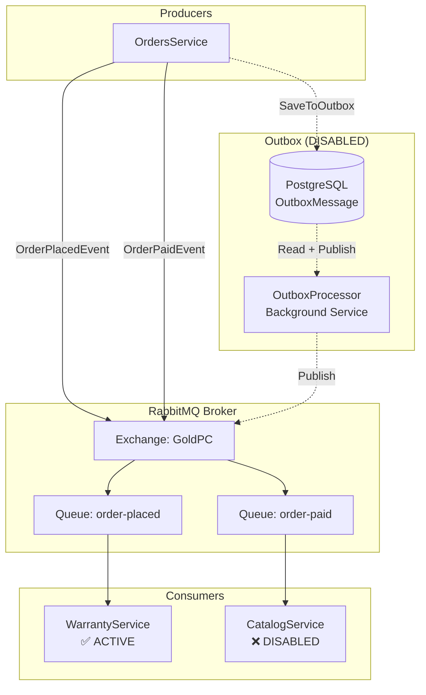
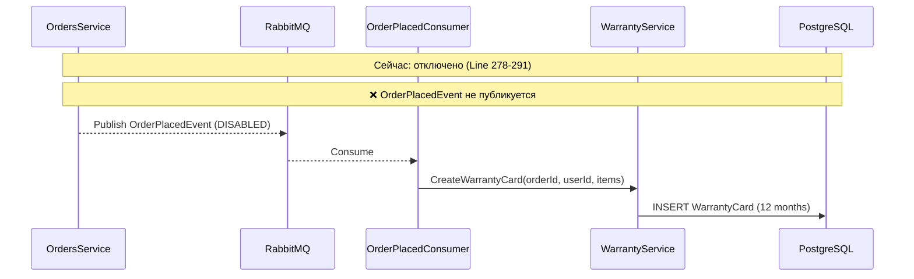
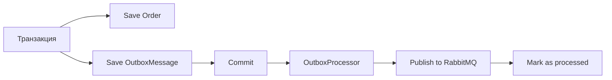
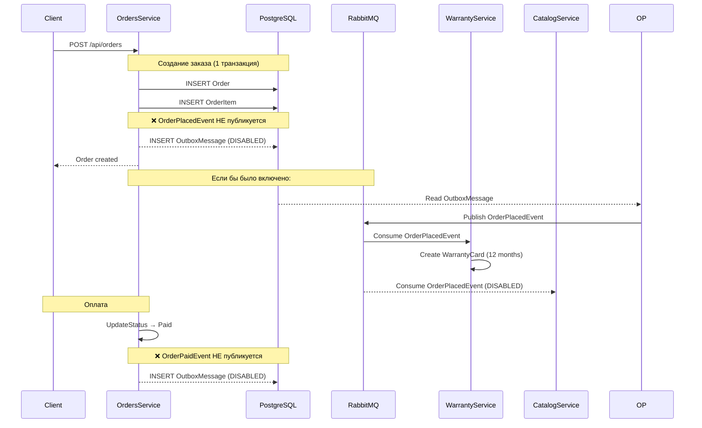

# 📨 Event-Driven Architecture — Обзор очередей и событий

> **Раздел**: 14_Queues_Events
> **Версия**: 1.0 | **Последнее обновление**: 2026-05-24

---

## Содержание

1. [[#Архитектура]]
2. [[#События]]
3. [[#Потребители событий]]
4. [[#Outbox Pattern]]
5. [[#Статус подключения]]
6. [[#Диаграмма потоков]]

---

## Архитектура



**Технологии**:
- **RabbitMQ** — брокер сообщений
- **MassTransit** — .NET библиотека для работы с RabbitMQ
- **Outbox Pattern** — гарантированная доставка (отключена)

---

## События

### Базовый класс

```csharp
public abstract record IntegrationEvent
{
    public Guid Id { get; init; } = Guid.NewGuid();
    public DateTime CreatedAt { get; init; } = DateTime.UtcNow;
    public string CorrelationId { get; init; } = Guid.NewGuid().ToString();
}
```

### OrderPlacedEvent

**Публикуется**: при создании заказа (`OrdersService.CreateAsync`)
**Статус**: ❌ Отключено

```csharp
public record OrderPlacedEvent : IntegrationEvent
{
    public Guid OrderId { get; init; }
    public Guid CustomerId { get; init; }
    public decimal TotalAmount { get; init; }
    public ICollection<OrderItemEventDto> Items { get; init; }
}
```

**Потребитель**: WarrantyService (создаёт гарантийные карты)

### OrderPaidEvent

**Публикуется**: при подтверждении оплаты (`OrdersService.UpdateStatusAsync → Paid`)
**Статус**: ❌ Отключено

```csharp
public record OrderPaidEvent : IntegrationEvent
{
    public Guid OrderId { get; init; }
    public decimal AmountPaid { get; init; }
    public List<OrderItemEventDto> Items { get; init; }
}
```

**Потребитель**: CatalogService (DISABLED) — предполагалось обновление стока

---

## Потребители событий

### WarrantyService — OrderPlacedConsumer

**Статус**: ✅ **АКТИВЕН** — единственный работающий consumer

```csharp
// Program.cs
builder.Services.AddMessaging(builder.Configuration, x =>
{
    x.AddConsumer<OrderPlacedConsumer>();
});
```

**Логика**:

```csharp
public class OrderPlacedConsumer : IConsumer<OrderPlacedEvent>
{
    public async Task Consume(ConsumeContext<OrderPlacedEvent> context)
    {
        var message = context.Message;
        
        // Для каждого товара создаётся WarrantyCard на 12 месяцев
        foreach (var item in message.Items)
        {
            var warrantyCard = new WarrantyCard
            {
                OrderId = message.OrderId,
                UserId = message.CustomerId,
                ProductId = item.ProductId,
                ProductName = item.ProductName,
                StartDate = DateTime.UtcNow,
                EndDate = DateTime.UtcNow.AddMonths(12),
                Status = WarrantyStatus.Active
            };
            await _warrantyService.CreateCardAsync(warrantyCard);
        }
    }
}
```

**Поток**:



### CatalogService — OrderPlacedConsumer / OrderPaidConsumer

**Статус**: ❌ **ОТКЛЮЧЕНЫ**

```csharp
// Program.cs — DISABLED
// builder.Services.AddMessaging(builder.Configuration, x =>
// {
//     x.AddConsumer<OrderPlacedConsumer>();
//     x.AddConsumer<OrderPaidConsumer>();
// });
```

Предполагались для:
- `OrderPlacedConsumer` — резервация стока
- `OrderPaidConsumer` — списание со стока

---

## Outbox Pattern

### Концепция

Outbox гарантирует доставку событий: сообщение сохраняется в БД в одной транзакции с бизнес-данными, затем фоновый процесс отправляет его в RabbitMQ.



### Текущий статус: ❌ ОТКЛЮЧЁН

```csharp
// Program.cs
// Outbox Processor
// builder.Services.AddHostedService<OutboxProcessor>();

// Messaging (MassTransit/RabbitMQ) - TEMPORARILY DISABLED
// builder.Services.AddMessaging(builder.Configuration);
```

### Код OutboxProcessor

```csharp
public class OutboxProcessor : BackgroundService
{
    protected override async Task ExecuteAsync(CancellationToken stoppingToken)
    {
        while (!stoppingToken.IsCancellationRequested)
        {
            await ProcessOutboxMessages(stoppingToken);
            await Task.Delay(TimeSpan.FromSeconds(15), stoppingToken);
        }
    }
    
    private async Task ProcessOutboxMessages(CancellationToken stoppingToken)
    {
        var messages = await context.OutboxMessages
            .Where(m => m.Status == "Pending")
            .OrderBy(m => m.CreatedAt)
            .Take(50)
            .ToListAsync(stoppingToken);
        
        foreach (var message in messages)
        {
            // Десериализовать → опубликовать через IBus → отметить обработанным
        }
    }
}
```

### Сущность OutboxMessage

```csharp
public class OutboxMessage
{
    public Guid Id { get; set; }
    public string Type { get; set; }         // AssemblyQualifiedName события
    public string Content { get; set; }      // JSON события
    public string Status { get; set; }       // "Pending" | "Processed" | "Failed"
    public DateTime CreatedAt { get; set; }
    public DateTime? ProcessedAt { get; set; }
}
```

---

## Статус подключения масс-транзита

| Сервис | Consumer | Статус | Причина |
|--------|----------|--------|---------|
| WarrantyService | OrderPlacedConsumer | ✅ **ACTIVE** | Создание гарантий |
| OrdersService | Producer | ❌ DISABLED | "Временно" |
| CatalogService | OrderPlacedConsumer | ❌ DISABLED | Тестирование производительности |
| CatalogService | OrderPaidConsumer | ❌ DISABLED | Тестирование производительности |

---

## Диаграмма потоков событий



---

## Связанные страницы

- [[14_Queues_Events/MassTransit_настройка]] — конфигурация MassTransit
- [[03_Backend/Сервис_заказов_OrdersService]] — producer
- [[03_Backend/Сервис_гарантии_WarrantyService]] — активный consumer
- [[03_Backend/Сервис_каталога_CatalogService]] — отключённый consumer
- [[11_Integrations/Обзор_интеграций]] — общий обзор интеграций
- [[00_Index/Главный_индекс]]
