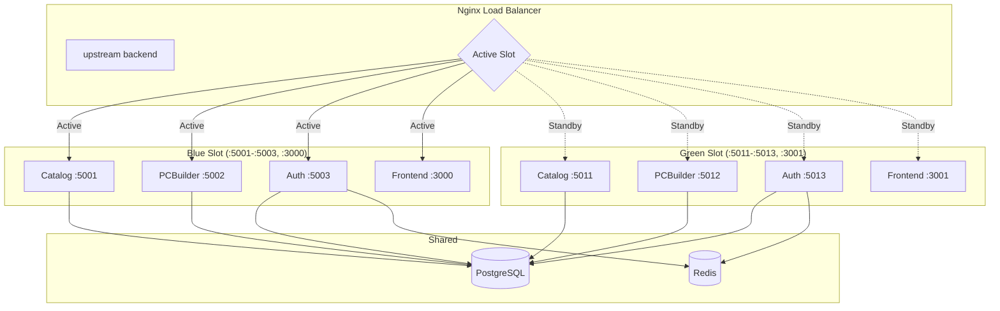
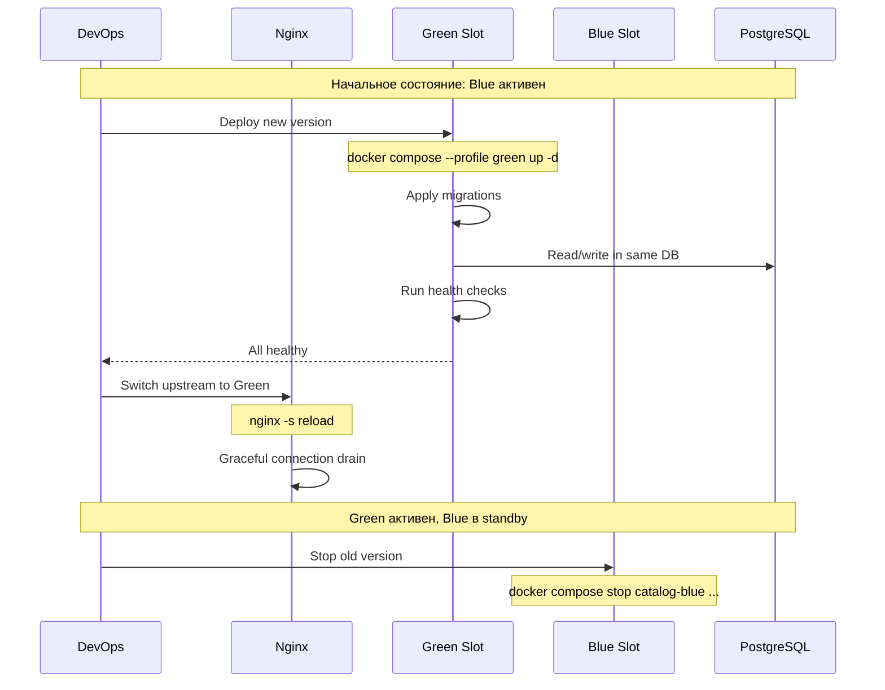
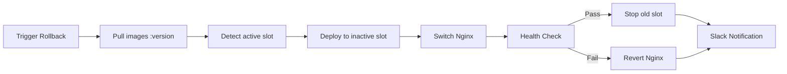

# Blue-Green стратегия деплоя

> **Раздел**: 15_Deployments
> **Версия**: 1.0 | **Последнее обновление**: 2026-05-24

---

## 📋 Обзор

**Blue-Green deployment** — стратегия zero-downtime деплоя, при которой одновременно работают две идентичные production среды (Blue и Green), и трафик переключается между ними через Nginx.



---

## 🔄 Процесс деплоя



---

## ⚙️ Nginx конфигурация

### upstream.conf (активный)

```nginx
upstream backend {
    # Active slot — GREEN
    server catalog-green:5011 weight=1;
    server pcbuilder-green:5012 weight=1;
    server auth-green:5013 weight=1;
    
    # Standby — BLUE (закомментировано)
    # server catalog-blue:5001;
    # server pcbuilder-blue:5002;
    # server auth-blue:5003;
}

upstream frontend {
    # Active slot — GREEN
    server frontend-green:3001 weight=1;
    
    # Standby — BLUE
    # server frontend-blue:3000;
}
```

### Переключение (upstream-switch.sh)

```bash
#!/bin/bash
# Переключение между Blue и Green

CURRENT_ENV=$1  # "blue" или "green"

if [ "$CURRENT_ENV" = "blue" ]; then
    TARGET_ENV="green"
else
    TARGET_ENV="blue"
fi

# Замена в конфигурации
sed -i "s/catalog-$CURRENT_ENV/catalog-$TARGET_ENV/g" /etc/nginx/conf.d/default.conf
sed -i "s/frontend-$CURRENT_ENV/frontend-$TARGET_ENV/g" /etc/nginx/conf.d/default.conf

# Проверка и перезагрузка
nginx -t && nginx -s reload
echo "Switched from $CURRENT_ENV to $TARGET_ENV"
```

---

## 🚨 Emergency Rollback

### GitHub Actions (rollback.yml)

```yaml
# Ручной запуск
name: Emergency Rollback
on:
  workflow_dispatch:
    inputs:
      version:
        description: 'Version to rollback to'
        required: true
      reason:
        description: 'Reason for rollback'
        default: 'Emergency rollback'
      skip_health_check:
        type: boolean
        default: false
```

**Процесс rollback**:
1. Pull указанной версии образов из Registry
2. Определить текущий активный слот (blue/green)
3. Развернуть предыдущую версию в неактивный слот
4. Переключить Nginx upstream
5. Healthcheck verification
6. Остановка старого слота
7. Slack уведомление
8. Audit log entry



---

## ⏱️ Zero-downtime гарантии

| Аспект | Гарантия |
|---|---|
| **Downtime при деплое** | 0 (graceful Nginx reload) |
| **Downtime при rollback** | < 1 секунда |
| **Потеря соединений** | Nginx gracefully drain |
| **Миграции БД** | Обратно-совместимые (add-only) |
| **Кэш** | Redis общий, прогревается |

### Graceful drain

Nginx при перезагрузке (`nginx -s reload`) завершает текущие соединения, а новые направляет на новый upstream:

```nginx
# Zero-downtime reload
worker_processes auto;
worker_shutdown_timeout 30s;  # Ждём завершения запросов до 30s
```

---

## 💾 Порты сервисов

| Сервис | Dev | Blue | Green |
|---|---|---|---|
| CatalogService | :5000 | :5001 | :5011 |
| PCBuilderService | :5004 | :5002 | :5012 |
| AuthService | :5001 | :5003 | :5013 |
| Frontend | :5173/:3002 | :3000 | :3001 |

### Docker Compose profiles

```bash
# Deploy Blue
docker compose -f docker-compose.prod.yml --profile blue up -d

# Deploy Green
docker compose -f docker-compose.prod.yml --profile green up -d

# Deploy Monitoring
docker compose -f docker-compose.prod.yml --profile monitoring up -d

# Всё сразу
docker compose -f docker-compose.prod.yml --profile all up -d
```

---

## 🔗 Связанные страницы

- [[15_Deployments/Обзор_деплоя]] — общая стратегия
- [[07_Infra_DevOps/Docker_окружение]] — Docker Compose prod
- [[07_Infra_DevOps/GitHub_Actions]] — rollback.yml
- [[17_Tests/Обзор_тестирования]] — тестирование перед деплоем
