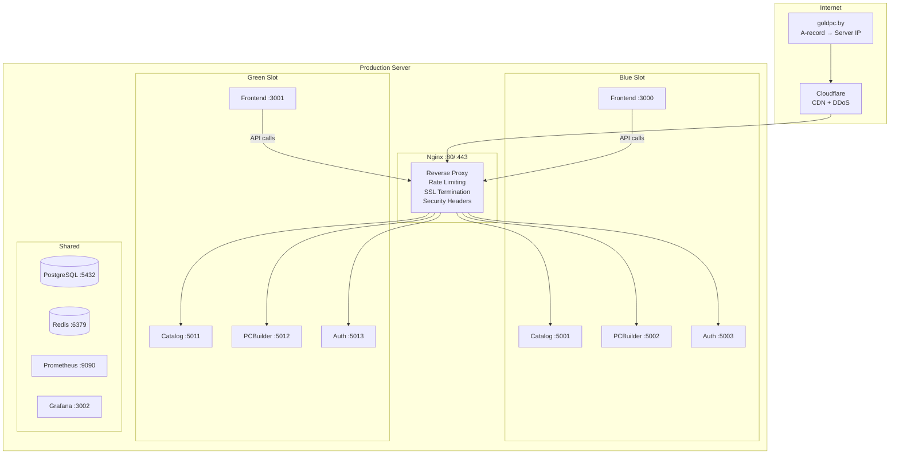
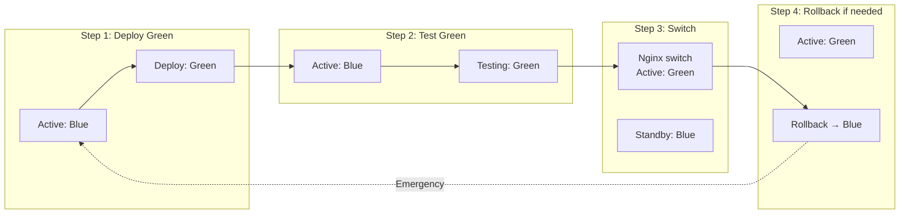

# Обзор деплоя GoldPC

> **Раздел**: 15_Deployments
> **Версия**: 1.0 | **Последнее обновление**: 2026-05-24

---

## 🏗️ Production архитектура



---

## 🔄 Blue-Green стратегия

GoldPC использует **Blue-Green deployment** для zero-downtime деплоя.



Подробнее: [[15_Deployments/Blue_Green_стратегия]]

---

## ✅ Развёртывание (Checklist)

### Pre-deployment

- [ ] Все CI checks пройдены
- [ ] Quality Gate passed
- [ ] Security scans clean
- [ ] Тесты (unit + integration + e2e) пройдены
- [ ] Lighthouse CI ≥ 90
- [ ] Docker образы собраны и запушены
- [ ] Миграции БД проверены (необратимые — вручную)

### Deployment

```bash
# 1. Pull последние образы
docker pull ghcr.io/goldpc/goldpc-catalog:latest
docker pull ghcr.io/goldpc/goldpc-frontend:latest

# 2. Запуск Green slot
docker compose -f docker-compose.prod.yml --profile green up -d

# 3. Healthcheck
curl -f http://localhost:5011/health  # catalog
curl -f http://localhost:5012/health  # pcbuilder
curl -f http://localhost:5013/health  # auth
curl -f http://localhost:3001/health  # frontend

# 4. Switch Nginx
# Обновить upstream.conf → переключить на green
nginx -t && nginx -s reload

# 5. Остановка Blue
docker compose -f docker-compose.prod.yml stop catalog-blue pcbuilder-blue auth-blue frontend-blue
```

### Post-deployment

- [ ] Smoke test всех критических путей
- [ ] Проверить логи (Nginx, сервисы)
- [ ] Проверить метрики (Prometheus/Grafana)
- [ ] Sentry — нет новых ошибок
- [ ] Проверить WebSocket (SignalR)
- [ ] Проверить платежи (Stripe webhook)

---

## 🔄 Rollback

| Сценарий | Действие | Время |
|---|---|---|
| Green не прошёл healthcheck | Переключить Nginx обратно на Blue | ~10 секунд |
| Ошибка в новой версии | GitHub Actions: Rollback workflow | ~2 минуты |
| Проблема с БД | Восстановление из backup | Зависит от размера |

```bash
# Ручной rollback
docker compose -f docker-compose.prod.yml stop catalog-green pcbuilder-green auth-green frontend-green
# Nginx upstream → только blue
nginx -s reload
```

Подробнее: [[07_Infra_DevOps/GitHub_Actions]] (rollback.yml)

---

## 🏥 Health Checks

| Сервис | Endpoint | Ожидание |
|---|---|---|
| CatalogService | `/health` | 200 OK |
| AuthService | `/health` | 200 OK |
| PCBuilderService | `/health` | 200 OK |
| Frontend | `/health` | 200 OK |

### Liveness / Readiness

```csharp
app.MapHealthChecks("/health/live", new HealthCheckOptions
{
    Predicate = _ => false // Только проверка, что сервис запущен
});
app.MapHealthChecks("/health/ready", new HealthCheckOptions
{
    Predicate = check => check.Tags.Contains("ready")
});
app.MapHealthChecks("/health", new HealthCheckOptions
{
    Predicate = _ => true // Все проверки
});
```

---

## 📦 Используемые образы

| Компонент | Image | Source |
|---|---|---|
| Backend | `ghcr.io/goldpc/goldpc-backend` | GitHub Container Registry |
| Frontend | `ghcr.io/goldpc/goldpc-frontend` | GitHub Container Registry |
| PostgreSQL | `postgres:16-alpine` | Docker Hub |
| Redis | `redis:7-alpine` | Docker Hub |
| Nginx | `nginx:alpine` | Docker Hub |

---

## 🔗 Связанные страницы

- [[15_Deployments/Blue_Green_стратегия]] — детали Blue-Green
- [[07_Infra_DevOps/GitHub_Actions]] — CI/CD workflow
- [[07_Infra_DevOps/Docker_окружение]] — Docker Compose prod
- [[18_Monitoring/Обзор_мониторинга]] — мониторинг деплоя
