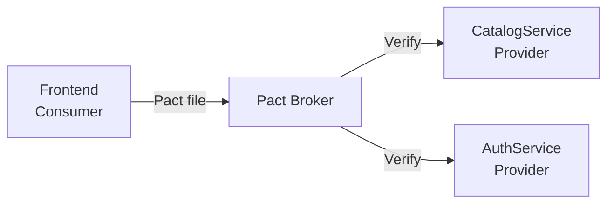

# Обзор тестирования GoldPC

> **Раздел**: 17_Tests
> **Версия**: 1.0 | **Последнее обновление**: 2026-05-24

---

## 📊 Пирамида тестирования

```mermaid
graph TB
    subgraph "E2E"
        E2E["Playwright + Cucumber<br/>Критические бизнес-пути"]
    end

    subgraph "Integration"
        INT["xUnit + Testcontainers<br/>БД, Redis, API сценарии"]
    end

    subgraph "Contract"
        CTR["Pact.js + Pact.NET<br/>Межсервисные контракты"]
    end

    subgraph "Unit — Backend"
        UB["xUnit + Moq + FluentAssertions<br/>AutoFixture + Bogus"]
    end

    subgraph "Unit — Frontend"
        UF["Vitest + @testing-library/react<br/>Component + Hook tests"]
    end

    subgraph "Load & Performance"
        LD["k6 + Lighthouse CI<br/>p95 < 500ms"]
    end

    subgraph "Mutation (отключено)"
        MT[Stryker.NET<br/>Планируется]
    end

    E2E --> INT
    INT --> CTR
    CTR --> UB & UF
    UB & UF --> LD
    UB & UF -.->|Disabled| MT
```

---

## 🧪 Backend Unit Tests

### Технологии

| Инструмент | Назначение |
|---|---|
| **xUnit** | Фреймворк тестирования (.NET) |
| **Moq** | Мокирование зависимостей |
| **FluentAssertions** | Читаемые assertions |
| **AutoFixture** | Генерация тестовых данных |
| **Bogus** | Реалистичные фейковые данные |
| **coverlet** | Code coverage |

### Пример

```csharp
[Fact]
public void CreateOrder_WithValidData_SetsStatusToNew()
{
    // Arrange
    var fixture = new Fixture();
    var order = fixture.Build<Order>()
        .With(o => o.Status, OrderStatus.New)
        .Create();

    // Assert
    order.Status.Should().Be(OrderStatus.New);
    order.OrderNumber.Should().NotBeNullOrEmpty();
}
```

### Покрытие

| Компонент | Цель |
|---|---|
| Backend services | ≥ 80% |
| Critical paths (auth, payments, orders) | ≥ 90% |

**Проекты**:
- `AuthService.Tests`
- `PCBuilderService.Tests`
- `WarrantyService.Tests`
- `GoldPC.UnitTests`

---

## 💻 Frontend Unit Tests

### Технологии

| Инструмент | Назначение |
|---|---|
| **Vitest** | Фреймворк тестирования (Vite-native) |
| **@testing-library/react** | Component testing |
| **@testing-library/user-event** | User interactions |
| **msw** | API мокирование |
| **zustand** тесты | Store testing |

### Пример

```typescript
import { render, screen } from '@testing-library/react';
import userEvent from '@testing-library/user-event';
import { ProductCard } from './ProductCard';

describe('ProductCard', () => {
  it('renders product name and price', () => {
    render(<ProductCard product={mockProduct} />);
    expect(screen.getByText('AMD Ryzen 5 5600X')).toBeInTheDocument();
    expect(screen.getByText('549.00 BYN')).toBeInTheDocument();
  });
});
```

### Покрытие

| Компонент | Цель |
|---|---|
| Frontend components | ≥ 70% |
| Critical paths | ≥ 90% |

---

## 🔗 Integration Tests

### Технологии

| Инструмент | Назначение |
|---|---|
| **Testcontainers** | PostgreSQL + Redis контейнеры |
| **WebApplicationFactory** | In-memory сервер ASP.NET |
| **Respawn** | Сброс БД между тестами |

### Пример

```csharp
[Fact]
public async Task GetProducts_ReturnsPagedResults()
{
    // Arrange
    await using var postgres = new PostgreSqlBuilder()
        .WithImage("postgres:16-alpine")
        .Build();
    await postgres.StartAsync();

    var factory = new WebApplicationFactory<Program>()
        .WithConnectionString(postgres.GetConnectionString());

    var client = factory.CreateClient();

    // Act
    var response = await client.GetAsync("/api/v1/catalog/products?page=1&pageSize=10");

    // Assert
    response.StatusCode.Should().Be(HttpStatusCode.OK);
}
```

---

## 🤝 Contract Tests (Pact)

| Компонент | Инструмент | Описание |
|---|---|---|
| **Consumer** | Pact.js (frontend) | Проверка формата ответов |
| **Provider** | Pact.NET (backend) | Верификация контрактов |



---

## 🌐 E2E Tests

### Playwright + Cucumber (BDD)

**Браузеры**: Chromium, Firefox, WebKit

```gherkin
Feature: Оформление заказа
  Scenario: Гость может просмотреть каталог
    Given пользователь открывает главную страницу
    When он нажимает "Каталог"
    Then он видит список категорий товаров

  Scenario: Авторизованный пользователь может оформить заказ
    Given пользователь авторизован
    When он добавляет товар в корзину
    And оформляет заказ
    Then заказ создаётся с статусом "New"
```

### Docker Compose Test Environment

```bash
# 7 сервисов в tmpfs (без персистентности)
docker compose -f docker-compose.test.yml up -d

# Запуск Playwright
npx playwright test --reporter=html

# Очистка
docker compose -f docker-compose.test.yml down -v
```

---

## ⚡ Load Tests (k6)

```javascript
import http from 'k6/http';
import { check, sleep } from 'k6';

export const options = {
  stages: [
    { duration: '2m', target: 50 },  // ramp up
    { duration: '5m', target: 50 },  // steady
    { duration: '2m', target: 0 },   // ramp down
  ],
  thresholds: {
    http_req_duration: ['p(95)<500'], // p95 < 500ms
    http_req_failed: ['rate<0.01'],   // error rate < 1%
  },
};

export default function () {
  const res = http.get(`${__ENV.BASE_URL}/api/v1/catalog/products`);
  check(res, { 'status is 200': (r) => r.status === 200 });
  sleep(1);
}
```

---

## 📈 Performance Tests (Lighthouse CI)

```yaml
# Локальные проверки производительности
- name: Run Lighthouse CI
  uses: treosh/lighthouse-ci-action@v10
  with:
    urls: |
      https://goldpc.by/
      https://goldpc.by/catalog
      https://goldpc.by/pcbuilder
    budgetPath: ./lighthouse-budget.json
    uploadArtifacts: true
```

---

## 🧬 Mutation Tests (Stryker.NET)

**Статус**: ❌ Отключено (слишком долго)

```xml
<!-- stryker-config.json -->
{
  "stryker-config": {
    "project": "CatalogService.csproj",
    "test-project": "CatalogService.Tests.csproj",
    "reporters": ["html", "progress"],
    "timeout-ms": 30000
  }
}
```

---

## 🏗️ Architecture Tests (NetArchTest)

```csharp
[Fact]
public void Services_ShouldNot_DependOnInfrastructure()
{
    var result = Types.InAssembly(typeof(CatalogService.Program).Assembly)
        .That().ResideInNamespace("CatalogService.Services")
        .ShouldNot().HaveDependencyOn("Microsoft.EntityFrameworkCore")
        .GetResult();
    
    result.IsSuccessful.Should().BeTrue();
}
```

---

## 📊 Coverage Requirements

| Уровень | Backend | Frontend |
|---|---|---|
| **Общее** | ≥ 80% | ≥ 70% |
| **Critical** | ≥ 90% | ≥ 90% |
| **Line coverage** | ≥ 80% | ≥ 70% |
| **Branch coverage** | ≥ 70% | ≥ 60% |

### Codecov интеграция

```yaml
- name: Upload Coverage to Codecov
  uses: codecov/codecov-action@v3
  with:
    files: ./coverage.cobertura.xml
    flags: backend-unit
    fail_ci_if_error: true
```

---

## 🔗 Связанные страницы

- [[07_Infra_DevOps/GitHub_Actions]] — CI/CD workflows
- [[07_Infra_DevOps/Docker_окружение]] — test environment
- [[15_Deployments/Обзор_деплоя]] — deployment checklist
