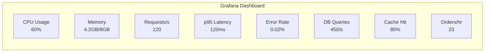

# Обзор мониторинга GoldPC

> **Раздел**: 18_Monitoring
> **Версия**: 1.0 | **Последнее обновление**: 2026-05-24

---

## 🏗️ Архитектура мониторинга

```mermaid
graph TB
    subgraph "Microservices"
        CS[CatalogService<br/>:5000]
        AS[AuthService<br/>:5001]
        OS[OrdersService<br/>:5002]
        SVS[ServicesService<br/>:5003]
        WS[WarrantyService<br/>:5005]
    end

    subgraph "Metrics & Tracing"
        PRM[Prometheus<br/>:9090]
        JR[Jaeger<br/>OTLP :4317]
        SEN[Sentry]
        AI[Application Insights]
    end

    subgraph "Visualization"
        GF[Grafana<br/>:3002]
    end

    subgraph "Logging"
        NGX_LOG[Nginx JSON Logs]
        APP_LOG[Serilog]
    end

    subgraph "Health"
        H1[/health]
        H2[/health/ready]
        H3[/health/live]
    end

    CS & AS & OS & SVS & WS -->|/metrics| PRM
    CS & AS & OS & SVS & WS -->|OpenTelemetry| JR
    CS & AS & OS & SVS & WS -->|Sentry SDK| SEN
    CS & AS & OS & SVS & WS -->|App Insights| AI
    CS & AS & OS & SVS & WS --> H1 & H2 & H3
    PRM --> GF
    NGX_LOG -->|File| APP_LOG
```

---

## 📊 Prometheus

Сбор метрик **Pull model** через `/metrics` endpoint на каждом сервисе.

### Метрики

| Метрика | Тип | Описание |
|---|---|---|
| `http_requests_total` | Counter | Всего запросов |
| `http_request_duration_seconds` | Histogram | Длительность запросов |
| `http_requests_in_flight` | Gauge | Текущие запросы |
| `db_queries_total` | Counter | Количество запросов к БД |
| `db_query_duration_seconds` | Histogram | Длительность запросов |
| `cache_hits_total` | Counter | Попаданий в кэш |
| `cache_misses_total` | Counter | Промахов кэша |
| `orders_total` | Counter | Количество заказов |
| `errors_total` | Counter | Количество ошибок |

### prometheus.yml

```yaml
scrape_configs:
  - job_name: 'catalog-service'
    static_configs:
      - targets: ['catalog-blue:5001', 'catalog-green:5011']
  
  - job_name: 'auth-service'
    static_configs:
      - targets: ['auth-blue:5003', 'auth-green:5013']
  
  - job_name: 'postgres'
    static_configs:
      - targets: ['postgres:5432']
```

---

## 📈 Grafana

**URL**: `http://goldpc.by:3002` (или localhost:3002)
**Login**: admin/admin (настраивается)

### Дашборды

| Дашборд | Описание |
|---|---|
| **GoldPC — Overview** | CPU, Memory, Request rate, Error rate |
| **GoldPC — Business Metrics** | Orders, Revenue, Active users |
| **GoldPC — Database** | Slow queries, Connections, Cache hit ratio |
| **GoldPC — Services Health** | Uptime, Health checks, Latency |
| **GoldPC — gRPC** | gRPC call rate, latency |

### Метрики на дашборде

```sql
-- Request rate by service
sum(rate(http_requests_total[5m])) by (service)

-- P95 latency
histogram_quantile(0.95, 
  sum(rate(http_request_duration_seconds_bucket[5m])) by (le, service))

-- Error rate
sum(rate(errors_total[5m])) / sum(rate(http_requests_total[5m])) * 100
```

---

## 🔍 Jaeger (OpenTelemetry)

**Endpoint**: OTLP `:4317` (gRPC)
**UI**: `http://localhost:16686`

### Настройка в сервисах

```csharp
builder.Services.AddOpenTelemetry()
    .WithTracing(tracerProviderBuilder =>
    {
        tracerProviderBuilder
            .AddSource("CatalogService")
            .SetResourceBuilder(ResourceBuilder.CreateDefault()
                .AddService("CatalogService"))
            .AddAspNetCoreInstrumentation()
            .AddHttpClientInstrumentation()
            .AddEntityFrameworkCoreInstrumentation()
            .AddGrpcClientInstrumentation()
            .AddOtlpExporter(options =>
            {
                options.Endpoint = new Uri("http://jaeger:4317");
            });
    });
```

### Трассируемые операции

| Операция | Span | Сервис |
|---|---|---|
| `GET /api/v1/catalog/products` | HTTP request → DB query → Cache | CatalogService |
| `POST /auth/login` | HTTP → BCrypt → DB write | AuthService |
| `POST /orders` | HTTP → DB → Stripe → RabbitMQ | OrdersService |
| gRPC `GetProductById` | gRPC → DB → Response | CatalogService |

---

## 🚨 Sentry

**DSN**: `https://xxx@sentry.goldpc.by/1`
**Traces Sample Rate**: 0.2 (20% запросов)

### Настройка

```csharp
builder.WebHost.UseSentry(options =>
{
    options.Dsn = sentryDsn;
    options.TracesSampleRate = 0.2;
    options.Environment = builder.Environment.EnvironmentName;
    options.Debug = builder.Environment.IsDevelopment();
});
```

### Ошибки, отслеживаемые Sentry

- 500 ошибки сервера
- Необработанные исключения
- Медленные запросы (> 1 секунда)
- Ошибки аутентификации
- Ошибки платежей Stripe

---

## 📱 Application Insights

Альтернативный (дополнительный) мониторинг через Azure Application Insights:

```csharp
builder.Services.AddApplicationInsightsTelemetry(options =>
{
    options.ConnectionString = appInsightsConnectionString;
});
```

---

## 📝 Nginx JSON Logging

```nginx
log_format json_combined escape=json
    '{'
    '"time_local":"$time_local",'
    '"remote_addr":"$remote_addr",'
    '"remote_user":"$remote_user",'
    '"request":"$request",'
    '"status":$status,'
    '"body_bytes_sent":$body_bytes_sent,'
    '"http_referrer":"$http_referer",'
    '"http_user_agent":"$http_user_agent",'
    '"request_time":$request_time,'
    '"upstream_addr":"$upstream_addr",'
    '"upstream_response_time":"$upstream_response_time",'
    '"upstream_status":$upstream_status'
    '}';

access_log /var/log/nginx/access.log json_combined;
```

---

## 🏥 Health Checks

Каждый сервис предоставляет 3 health check endpoint:

| Endpoint | Описание | Используется |
|---|---|---|
| `/health` | Все проверки | Docker Compose healthcheck |
| `/health/ready` | Readiness (БД, Redis) | Kubernetes readinessProbe |
| `/health/live` | Liveness (сервис запущен) | Kubernetes livenessProbe |

```csharp
app.MapHealthChecks("/health", new HealthCheckOptions
{
    Predicate = _ => true
});
app.MapHealthChecks("/health/ready", new HealthCheckOptions
{
    Predicate = check => check.Tags.Contains("ready")
});
app.MapHealthChecks("/health/live", new HealthCheckOptions
{
    Predicate = _ => false
});
```

### Проверяемые компоненты

- PostgreSQL: `pg_isready` (Docker)
- Redis: `redis-cli ping` (Docker)
- RabbitMQ: `rabbitmq-diagnostics ping` (Docker)
- Connectivity: возможность подключения к БД (EF Core)
- Cache: соединение с Redis
- Queue: соединение с RabbitMQ

---

## 📊 Load Testing (k6)

### Пороги

| Метрика | Порог | Описание |
|---|---|---|
| `http_req_duration (p95)` | < 500ms | 95% запросов быстрее 500ms |
| `http_req_failed` | < 1% | Менее 1% ошибок |

### Профили нагрузки

| Сценарий | Вирт. пользователи | Длительность |
|---|---|---|
| Ramp up | 0 → 50 | 2 мин |
| Steady | 50 | 5 мин |
| Spike | 0 → 100 | 30 сек |
| Stress | 0 → 200 | 5 мин |

---

## 📋 Дашборд: Быстрый взгляд



---

## 🔗 Связанные страницы

- [[07_Infra_DevOps/Обзор_инфраструктуры]] — инфраструктура
- [[07_Infra_DevOps/Docker_окружение]] — Docker Compose monitoring
- [[07_Infra_DevOps/GitHub_Actions]] — CI/CD pipelines
- [[17_Tests/Обзор_тестирования]] — k6 load tests
