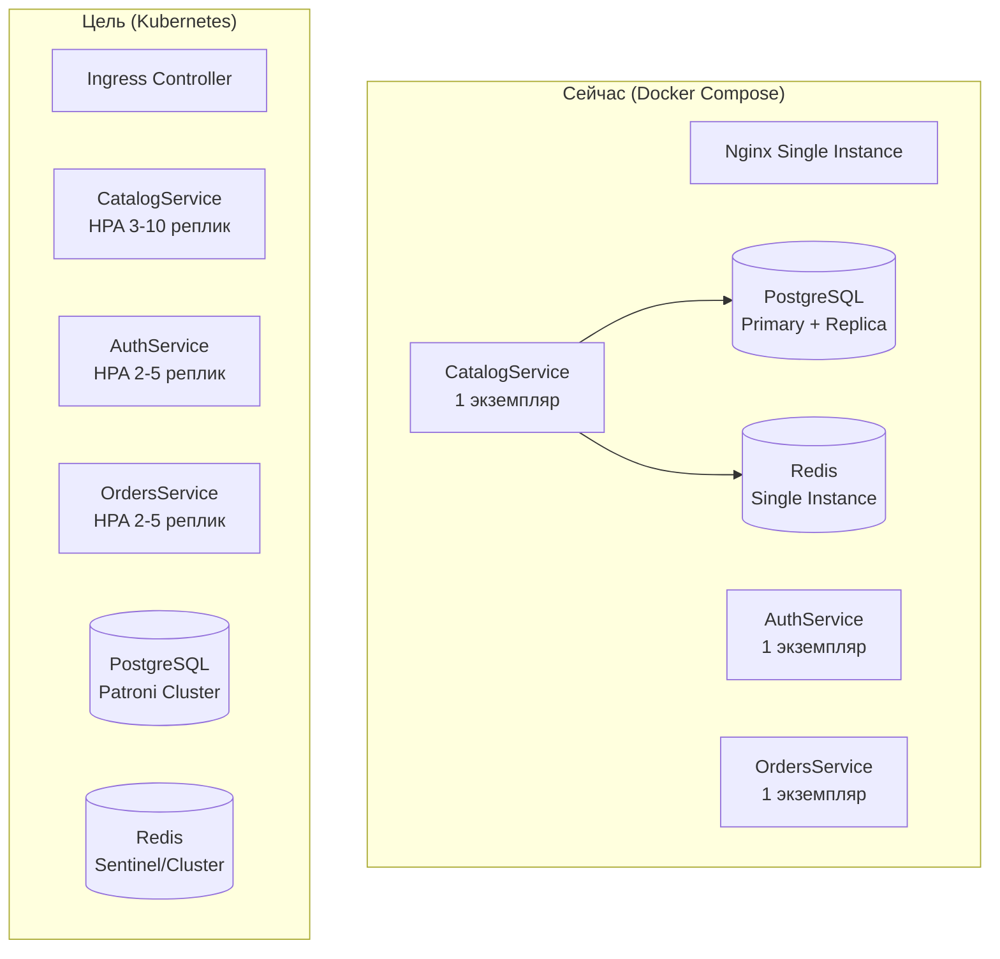
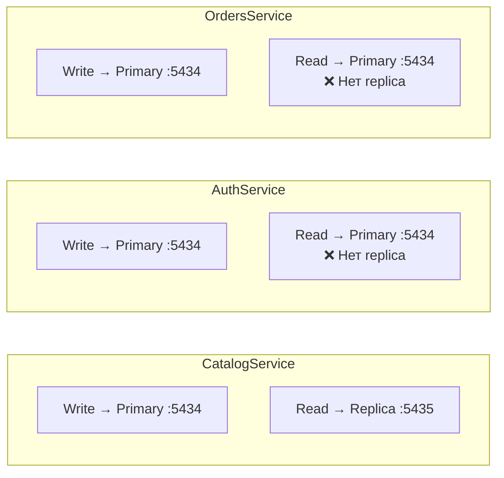
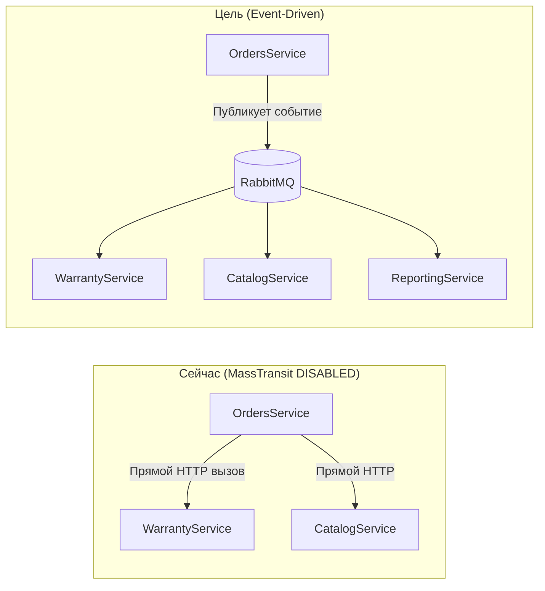
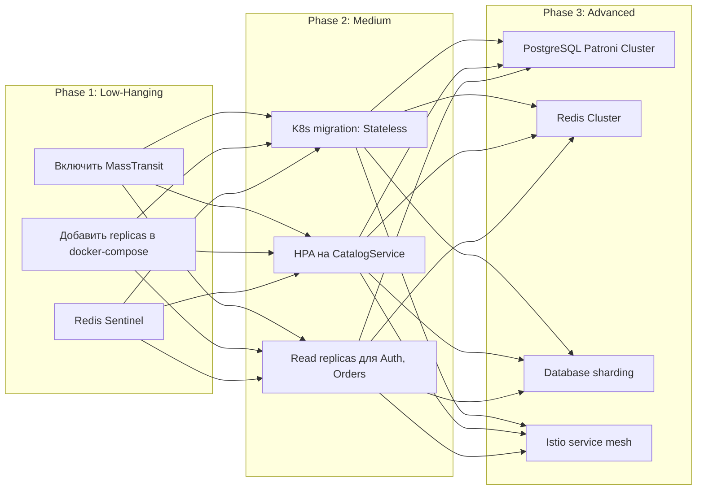

# 📈 Проблемы масштабирования GoldPC

> **Раздел**: 19_Tech_Debt
> **Версия**: 1.0 | **Последнее обновление**: 2026-05-24
> **Статус**: Актуально (проект не рассчитан на production-нагрузку)

---

## 🏗️ Текущая архитектура vs. масштабируемая



---

## 🔴 1. Нет горизонтального масштабирования CatalogService

| Аспект | Текущее состояние | Необходимо |
|--------|------------------|------------|
| Инстансов | 1 (или 2 blue/green) | 3-10 (HPA) |
| Auto-scaling | Нет | Kubernetes HPA по CPU/RPS |
| Session affinity | Не требуется (stateless) | OK |

**Проблема**: CatalogService — самый нагруженный сервис (каталог — главная страница). Single instance = точка отказа.

---

## 🔴 2. Read Replica для Catalog, но не для других сервисов



**Проблема**: Только CatalogService использует read replica. AuthService и OrdersService читают с primary, создавая лишнюю нагрузку на основной сервер БД.

---

## 🟡 3. Нет Redis Cluster (Single Instance)

| Аспект | Текущее состояние | Риск |
|--------|------------------|------|
| Топология | Один Redis :6379 | Single point of failure |
| Репликация | Нет | Нет failover |
| Sharding | Нет | 2GB maxmemory (прод) |
| Persistence | AOF | Данные могут быть потеряны |

**Проблема**: Падение Redis =:
- Сброс всех кэшей CatalogService → лавинный запрос к БД
- Потеря токенов сброса пароля
- Время восстановления кэша ~15 минут

---

## 🟡 4. MassTransit DISABLED — tight coupling



**Проблема**: Без MassTransit сервисы вызывают друг друга синхронно. При росте нагрузки:
- OrdersService блокируется в ожидании ответа от других сервисов
- Нет асинхронной обработки (fan-out)
- Падение одного сервиса блокирует другие

---

## 🟡 5. Нет k8s оркестрации (Docker Compose только)

| Функция | Docker Compose | Kubernetes |
|---------|---------------|------------|
| Auto-scaling | ❌ Нет | ✅ HPA |
| Self-healing | ❌ restart: always | ✅ ReplicaSet |
| Rolling update | ❌ Вручную | ✅ Стратегия |
| Service discovery | ❌ Статические имена | ✅ DNS |
| Secrets | ❌ .env файлы | ✅ Secrets |
| Config Maps | ❌ appsettings.json | ✅ ConfigMap |
| Load balancing | ❌ Nginx | ✅ Service/Ingress |
| Canary deploy | ❌ | ✅ |

---

## 🟢 6. Нет шардинга БД

**Текущее состояние**: Каждый сервис имеет свою БД (`goldpc_catalog`, `goldpc_auth`, `goldpc_orders`). Это уже database-per-service, что хорошо. Но:

| БД | Размер (оценка) | Шардинг |
|----|-----------------|---------|
| goldpc_catalog | ~10K товаров | Не нужен (мало записей) |
| goldpc_auth | ~1K пользователей | Не нужен |
| goldpc_orders | ~10K заказов | Не нужен |
| goldpc_reporting | FDW агрегация | Потенциально |

**Проблема**: При росте до миллионов записей — никакой стратегии шардинга нет.

---

## 🟢 7. ReportingService зависит от postgres_fdw

```sql
-- ReportingService использует foreign data wrappers для объединения БД
CREATE SERVER catalog_server FOREIGN DATA WRAPPER postgres_fdw 
    OPTIONS (host 'catalog-db', dbname 'goldpc_catalog');

CREATE FOREIGN TABLE catalog_products (...) SERVER catalog_server;

-- Проблема: при горизонтальном масштабировании FDW ломается
```

**Проблема**: 
- `postgres_fdw` работает только с одним экземпляром PostgreSQL
- При шардинге или репликации FDW перестанет быть надёжной
- Нет isolation — ошибка FDW валит отчёты

---

## 📊 Матрица масштабирования

| Компонент | Текущая ёмкость | Предел | Узкое место |
|-----------|-----------------|--------|-------------|
| CatalogService | ~100 RPS | ~500 RPS | Single instance, БД |
| AuthService | ~50 RPS | ~200 RPS | BCrypt (CPU-bound) |
| OrdersService | ~30 RPS | ~100 RPS | Stripe API, БД |
| PostgreSQL Primary | ~500 QPS | ~2000 QPS | CPU, WAL |
| PostgreSQL Replica | ~300 QPS | ~1000 QPS | CPU |
| Redis | ~10000 ops/s | ~50000 ops/s | Network |
| RabbitMQ | ~100 msg/s | ~1000 msg/s | Disk I/O |

---

## 🔧 План масштабирования



---

## 🔗 Связанные страницы

- [[19_Tech_Debt/Обзор_техдолга]] — общая сводка
- [[19_Tech_Debt/Архитектурные_проблемы]] — архитектурные проблемы
- [[02_Architecture/Архитектура_системы]] — архитектура
- [[03_Backend/Обзор_бэкенда]] — backend сервисы
- [[05_Database/Обзор_БД]] — база данных
- [[07_Infra_DevOps/Обзор_инфраструктуры]] — инфраструктура
