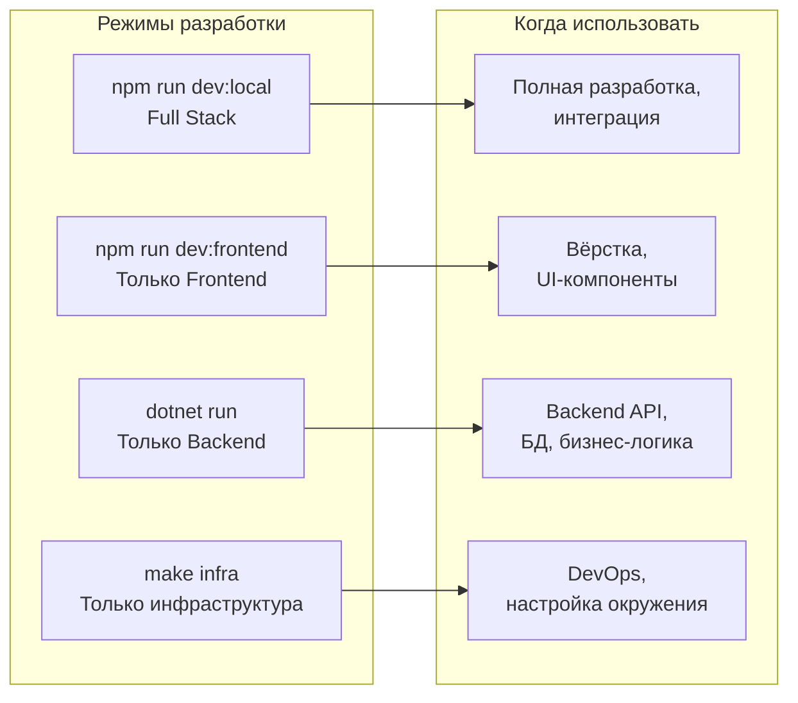

# 💻 Локальная разработка GoldPC

> **Раздел**: 20_Developer_Guides
> **Версия**: 1.0 | **Последнее обновление**: 2026-05-24

---

## 🏗️ Режимы запуска



---

## 🖥️ Полный стек (Full Stack)

```bash
# Всё в одном терминале — инфраструктура, backend, frontend
npm run dev:local
```

Это запускает:
1. Docker инфраструктуру (через `docker compose`)
2. Backend сервисы (через `dotnet run` параллельно)
3. Frontend (Vite dev server с прокси на backend)

**Порты**: все сервисы доступны локально (см. [[20_Developer_Guides/Как_поднять_проект|таблицу портов]])

---

## 🎨 Frontend отдельно

```bash
# 1. Запустить инфраструктуру и backend (если нужны API)
make infra
# Запустить нужные сервисы отдельно...

# 2. Установить зависимости и запустить
cd src/frontend
npm install
npm run dev

# Frontend на http://localhost:5173
# Vite проксирует /api → backend
```

### Vite proxy config

```typescript
// vite.config.ts
export default defineConfig({
  server: {
    port: 5173,
    proxy: {
      '/api': {
        target: 'http://localhost:5008', // BFF
        changeOrigin: true,
      },
    },
  },
});
```

---

## ⚙️ Backend отдельно

```bash
# 1. Инфраструктура
make infra

# 2. Запустить конкретный сервис
cd src/backend/AuthService
dotnet run --urls "http://localhost:5001"

# Или несколько сервисов параллельно
# Терминал 1:
cd src/backend/CatalogService && dotnet run
# Терминал 2:
cd src/backend/AuthService && dotnet run
# Терминал 3:
cd src/backend/OrdersService && dotnet run
```

---

## 🗄️ База данных и миграции

### Подключение к БД

```bash
# Через Adminer
# http://localhost:9090
# Система: PostgreSQL
# Сервер: postgres
# Пользователь: postgres
# Пароль: postgres
# БД: goldpc_catalog / goldpc_auth / goldpc_orders

# Через psql
docker exec -it goldpc-postgres psql -U postgres -d goldpc_catalog
```

### Создание и применение миграций

```bash
# AuthService
cd src/backend/AuthService
dotnet ef migrations add AddNewEntity
dotnet ef database update

# CatalogService
cd src/backend/CatalogService
dotnet ef migrations add AddNewEntity
dotnet ef database update

# OrdersService
cd src/backend/OrdersService
dotnet ef migrations add AddNewEntity
dotnet ef database update
```

Подробнее: [[20_Developer_Guides/Работа_с_БД]]

---

## 🌱 Заполнение данными (Seed)

```bash
# Через Makefile
make db-seed

# Через npm
npm run seed-xcore    # Импорт из X-Core (реальные товары)

# Через скрипты
node scripts/seed/seed-categories.js
node scripts/seed/seed-products.js
```

---

## 🔧 Environment Setup

```bash
# 1. Создать .env из шаблона
cp .env.example .env

# 2. Настроить JWT (dev ключ уже есть по умолчанию)
# JWT_KEY=GoldPC_SuperSecretKey_ForDevelopment_Only_2024!

# 3. Проверить connection strings
# PostgreSQL: postgres:5434 (dev), postgres:5432 (prod)
```

Подробнее: [[16_Config_ENV/Переменные_окружения]]

---

## 🐞 Debugging Tips

### Backend (VS Code)

```json
// .vscode/launch.json
{
  "configurations": [
    {
      "name": "CatalogService",
      "type": "coreclr",
      "request": "launch",
      "projectPath": "${workspaceFolder}/src/backend/CatalogService/CatalogService.csproj",
      "launchBrowser": true,
      "urls": "http://localhost:5000"
    }
  ]
}
```

### Frontend (VS Code)

- Используйте React DevTools (Chrome extension)
- Используйте `debugger` или `console.log` в компонентах

### Docker логи

```bash
# Все логи
make logs

# Конкретный сервис
docker compose logs -f catalog-service

# Только ошибки
docker compose logs catalog-service | grep -i error
```

---

## 🔄 Hot Reload

### Frontend (Vite)

Vite поддерживает HMR (Hot Module Replacement) по умолчанию. Изменения в React компонентах отображаются мгновенно без полной перезагрузки.

### Backend (.NET)

```bash
# Hot Reload для .NET
dotnet watch run --project src/backend/CatalogService

# Автоматическая пересборка при изменениях
dotnet watch --project src/backend/AuthService test
```

### Ограничения

- .NET Hot Reload не поддерживает изменения в `Program.cs` (требуется перезапуск)
- Добавление новых NuGet пакетов требует перезапуска
- Изменения в миграциях БД не применяются автоматически

---

## 📦 Часто используемые команды

```bash
# === Сборка ===
dotnet build src/backend/CatalogService
npm run build           # Frontend

# === Запуск тестов ===
dotnet test src/backend/CatalogService.Tests
npm run test:frontend

# === Очистка ===
make clean              # Остановка и удаление volumes
docker compose down -v  # Полная очистка (удалит БД!)

# === Проверка линтером ===
dotnet format --verify-no-changes  # C#
npm run lint                       # TS/React
```

---

## 🔗 Связанные страницы

- [[20_Developer_Guides/Как_поднять_проект]] — быстрый старт
- [[20_Developer_Guides/Работа_с_БД]] — работа с БД
- [[20_Developer_Guides/Тестирование]] — тестирование
- [[20_Developer_Guides/Стиль_кода]] — стиль кода
- [[16_Config_ENV/Переменные_окружения]] — переменные окружения
- [[07_Infra_DevOps/Docker_окружение]] — Docker окружение
