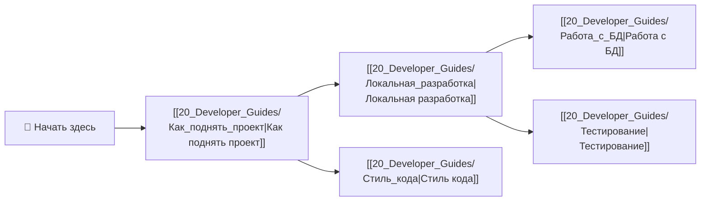

# 🧑‍💻 Обзор гайдов разработчика GoldPC

> **Раздел**: 20_Developer_Guides
> **Версия**: 1.0 | **Последнее обновление**: 2026-05-24

---

## 🚀 Онбординг

---

## 📚 Список гайдов

| Гайд | Описание | Время чтения | Сложность |
|------|----------|-------------|-----------|
| [[20_Developer_Guides/Как_поднять_проект\|Как поднять проект]] | Быстрый старт: установка, запуск, доступ | 5 мин | Новичок |
| [[20_Developer_Guides/Локальная_разработка\|Локальная разработка]] | Режимы запуска, дебаг, hot reload | 10 мин | Новичок |
| [[20_Developer_Guides/Тестирование\|Тестирование]] | Все виды тестов, команды, coverage | 8 мин | Средний |
| [[20_Developer_Guides/Работа_с_БД\|Работа с БД]] | Миграции, seed, подключение, сброс БД | 10 мин | Средний |
| [[20_Developer_Guides/Стиль_кода\|Стиль кода]] | Конвенции C#, TS, коммиты, PR | 5 мин | Новичок |

---

## 🔗 Полезные ссылки

- [[00_Index/Главный_индекс]] — главный индекс документации
- [[01_Overview/Обзор_проекта]] — обзор проекта
- [[02_Architecture/Архитектура_системы]] — архитектура
- [[07_Infra_DevOps/Обзор_инфраструктуры]] — инфраструктура
- [[22_Glossary/Глоссарий]] — термины и определения
