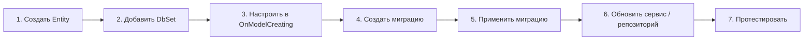

# 🗄️ Работа с БД в GoldPC

> **Раздел**: 20_Developer_Guides
> **Версия**: 1.0 | **Последнее обновление**: 2026-05-24

---

## 📊 Структура баз данных

```mermaid
graph TB
    subgraph "PostgreSQL 16"
        PG_P[Primary :5434]
        PG_R[Replica :5435]
    end

    subgraph "Базы данных"
        CAT[goldpc_catalog<br/>Товары, категории]
        AUTH[goldpc_auth<br/>Пользователи, роли]
        ORDERS[goldpc_orders<br/>Заказы, оплаты]
        PCB[goldpc_pcbuilder<br/>Конфигурации ПК]
        SRV[goldpc_services<br/>Заявки в СЦ]
        WR[goldpc_warranty<br/>Гарантии]
        RPT[goldpc_reporting<br/>Отчёты (FDW)]
    end

    PG_P --> CAT & AUTH & ORDERS & PCB & SRV & WR & RPT
    PG_R --> CAT
```

Подробнее: [[05_Database/Схема_БД]]

---

## 🔧 Миграции Entity Framework Core

### Создание новой миграции

```bash
# Для сервиса с EF Core (AuthService, CatalogService, OrdersService)
cd src/backend/AuthService

# Создать миграцию
dotnet ef migrations add AddUserRefreshTokenIndex

# Применить к БД
dotnet ef database update
```

### Работа с конкретным сервисом

| Сервис | Проект | DbContext |
|--------|--------|-----------|
| **AuthService** | `src/backend/AuthService` | `AuthDbContext` |
| **CatalogService** | `src/backend/CatalogService` | `CatalogDbContext` (write), `ReadOnlyCatalogDbContext` (read) |
| **OrdersService** | `src/backend/OrdersService` | `OrdersDbContext` |
| **WarrantyService** | `src/backend/WarrantyService` | `WarrantyDbContext` |
| **PCBuilderService** | `src/backend/PCBuilderService` | `PCBuilderDbContext` |
| **ServicesService** | `src/backend/ServicesService` | `ServicesDbContext` |
| **ReportingService** | Нет EF Core | Прямые SQL запросы |

### Флаги миграций

```bash
# Создать миграцию с указанием DbContext
dotnet ef migrations add MigrationName --context AuthDbContext

# Откатить последнюю миграцию
dotnet ef migrations remove

# Создать SQL скрипт
dotnet ef migrations script -o upgrade.sql

# Применить до конкретной миграции
dotnet ef database update MigrationName
```

---

## 🆕 Добавление новой сущности



### Пример: добавление сущности `Category` в CatalogService

```csharp
// 1. Создать entity class
// src/backend/CatalogService/Entities/Category.cs
public class Category
{
    public int Id { get; set; }
    public string Name { get; set; } = string.Empty;
    public string? Description { get; set; }
    public int? ParentCategoryId { get; set; }
    public Category? ParentCategory { get; set; }
    public ICollection<Category> SubCategories { get; set; } = new List<Category>();
    public DateTime CreatedAt { get; set; } = DateTime.UtcNow;
}

// 2. Добавить DbSet в CatalogDbContext
public DbSet<Category> Categories { get; set; }

// 3. Настроить в OnModelCreating
protected override void OnModelCreating(ModelBuilder modelBuilder)
{
    modelBuilder.Entity<Category>(entity =>
    {
        entity.HasKey(c => c.Id);
        entity.Property(c => c.Name).IsRequired().HasMaxLength(200);
        entity.HasOne(c => c.ParentCategory)
              .WithMany(c => c.SubCategories)
              .HasForeignKey(c => c.ParentCategoryId)
              .OnDelete(DeleteBehavior.Restrict);
    });
}

// 4. Создать миграцию
// dotnet ef migrations add AddCategoryEntity

// 5. Применить
// dotnet ef database update
```

---

## 🔌 Подключение к БД

### Adminer (рекомендуется)

```
URL: http://localhost:9090
Система: PostgreSQL
Сервер: postgres
Пользователь: postgres
Пароль: postgres
База: goldpc_catalog (выбрать нужную)
```

### psql через Docker

```bash
# Подключиться к конкретной БД
docker exec -it goldpc-postgres psql -U postgres -d goldpc_catalog

# Полезные команды psql:
\l                    # Список баз данных
\dt                   # Список таблиц
\d+ table_name        # Описание таблицы
\di                   # Список индексов
SELECT * FROM "Products" LIMIT 10;
\q                    # Выход
```

### Через IDE (DataGrip, DBeaver)

```
Host: localhost
Port: 5434
Database: goldpc_catalog / goldpc_auth / goldpc_orders
User: postgres
Password: postgres
URL: jdbc:postgresql://localhost:5434/goldpc_catalog
```

---

## 🌱 Seed (наполнение данными)

```bash
# Через Makefile
make db-seed                    # Заполнить все БД

# Импорт товаров из X-Core (реальные данные)
npm run seed-xcore

# Отдельные скрипты
cd scripts/seed
node seed-categories.js         # Категории
node seed-products.js           # Товары
node seed-users.js              # Тестовые пользователи
node seed-orders.js             # Тестовые заказы
```

---

## 🔄 Сброс базы данных

```bash
# Полный сброс (удалить и создать заново)
docker compose down -v          # Удалит volumes с БД
make infra                      # Создать заново
make db-migrate                 # Применить миграции
make db-seed                    # Заполнить данными

# Сброс только конкретной БД
cd src/backend/AuthService
dotnet ef database drop         # Удалить БД
dotnet ef database update       # Создать заново
```

---

## 💾 Backup и Restore

### Backup

```bash
# Дамп конкретной БД
docker exec -t goldpc-postgres pg_dump -U postgres goldpc_catalog > backup_catalog_$(date +%Y%m%d).sql

# Дамп всех БД
docker exec -t goldpc-postgres pg_dumpall -U postgres > backup_full_$(date +%Y%m%d).sql

# Сжатый дамп
docker exec -t goldpc-postgres pg_dump -U postgres -Z 9 goldpc_catalog > backup_catalog_$(date +%Y%m%d).sql.gz
```

### Restore

```bash
# Восстановить конкретную БД
cat backup_catalog_20260524.sql | docker exec -i goldpc-postgres psql -U postgres -d goldpc_catalog

# Восстановить все БД
cat backup_full_20260524.sql | docker exec -i goldpc-postgres psql -U postgres
```

---

## ⚠️ Важные замечания

### Порты
- **Dev**: Primary 5434, Replica 5435
- **Prod**: Primary 5432
- AuthDbContextFactory использует порт 5432 — **баг** ([[19_Tech_Debt/Архитектурные_проблемы]])

### Replica
- Только CatalogService использует read replica
- ReadOnlyCatalogDbContext → Replica (:5435)
- CatalogDbContext → Primary (:5434)

### postgres_fdw
- ReportingService использует foreign data wrappers
- Не поддерживает шардинг

---

## 🔗 Связанные страницы

- [[05_Database/Обзор_БД]] — обзор баз данных
- [[05_Database/Схема_БД]] — схема БД (ERD)
- [[05_Database/Миграции]] — детали миграций
- [[20_Developer_Guides/Локальная_разработка]] — локальная разработка
- [[19_Tech_Debt/Архитектурные_проблемы]] — известные проблемы
