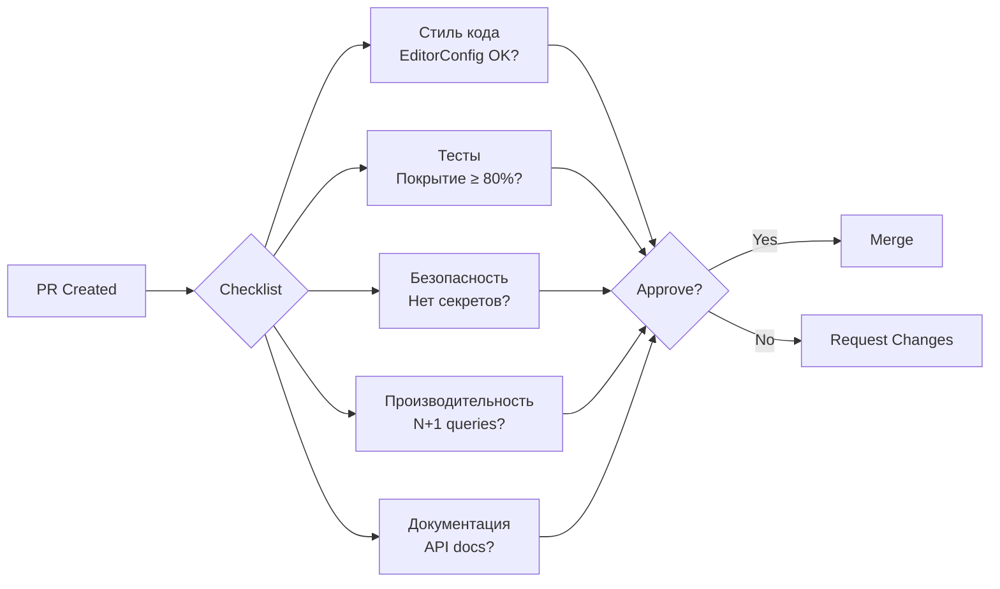

# 📐 Стиль кода GoldPC

> **Раздел**: 20_Developer_Guides
> **Версия**: 1.0 | **Последнее обновление**: 2026-05-24
> **Источник**: `.editorconfig`, `.stylecop.json`, `AGENTS.md`

---

## 🎯 Общие принципы

```mermaid
mindmap
  root((Code Style))
    CSharp
      PascalCase для public
      camelCase для private
      `this.` не используем
      `var` предпочтительно
    TypeScript
      camelCase
      Интерфейсы с I?
      Строгая типизация
    Commits
      feat/fix(scope): desc
      Conventional Commits
    Branches
      feature/TV-XXX-desc
      bugfix/TV-XXX-desc
```

---

## 🅾️ C# Конвенции

### Из `.editorconfig`

```ini
# Отступы
indent_style = space
indent_size = 4

# Скобки — новая строка (Allman)
csharp_new_line_before_open_brace = all
csharp_new_line_before_else = true
csharp_new_line_before_catch = true
```

### Naming Conventions

| Элемент | Конвенция | Пример |
|---------|-----------|--------|
| Классы | PascalCase | `OrderService`, `ProductController` |
| Интерфейсы | `I` + PascalCase | `IProductRepository`, `IEventBus` |
| Методы | PascalCase | `GetProductsAsync()`, `CreateOrder()` |
| Свойства | PascalCase | `public int Id { get; set; }` |
| Поля private | `_`camelCase | `_logger`, `_repository` |
| Параметры | camelCase | `int productId`, `string name` |
| Локальные переменные | camelCase | `var result = ...` |
| Константы | PascalCase | `const int DefaultPageSize = 20` |

### Правила

```csharp
// ✅ Хорошо
public class OrderService
{
    private readonly IOrderRepository _orderRepository;
    private readonly ILogger<OrderService> _logger;

    public async Task<Order> GetOrderByIdAsync(int orderId)
    {
        var order = await _orderRepository.GetByIdAsync(orderId);
        if (order == null)
        {
            _logger.LogWarning("Order {OrderId} not found", orderId);
            throw new NotFoundException($"Order {orderId} not found");
        }
        return order;
    }
}

// ❌ Плохо
public class order_service // Неправильный нейминг
{
  private IOrderRepository repo; // Нет _ и readonly
  public async Task<Order> getorderbyid(int id) // Неправильный регистр
  {
    var x = await repo.GetByIdAsync(id); // Неинформативное имя
    return x;
  }
}
```

### Async pattern

```csharp
// ✅ Суффикс Async для асинхронных методов
public Task<Order> GetByIdAsync(int id);
public Task CreateAsync(Order order);

// ❌ Не смешивать sync и async
public Order GetById(int id); // ← если есть асинхронная версия
public Task<Order> GetByIdAsync(int id);
```

### XML Documentation

```csharp
/// <summary>
/// Получает товар по идентификатору с проверкой кэша.
/// </summary>
/// <param name="productId">ID товара</param>
/// <returns>DTO товара или null</returns>
public async Task<ProductDto?> GetProductByIdAsync(int productId)
```

---

## 💙 TypeScript / React Конвенции

### Из `.editorconfig`

```ini
[*.{ts,tsx}]
indent_size = 2
```

### Naming

| Элемент | Конвенция | Пример |
|---------|-----------|--------|
| Компоненты | PascalCase | `ProductCard.tsx`, `OrderList.tsx` |
| Функции | camelCase | `useProductFilter()`, `formatPrice()` |
| Хуки | `use` + camelCase | `useAuth()`, `useCart()` |
| Типы/Интерфейсы | PascalCase | `ProductDto`, `OrderRequest` |
| Константы | UPPER_SNAKE | `API_BASE_URL`, `LOCAL_STORAGE_KEY` |
| Файлы | kebab-case | `product-card.tsx`, `api-client.ts` |

### Интерфейсы vs Types

```typescript
// ✅ Интерфейсы для DTO и пропсов
export interface ProductDto {
  id: number;
  name: string;
  price: number;
  categoryId: number;
}

// ✅ Types для union и пересечений
export type OrderStatus = 'New' | 'Pending' | 'Paid' | 'Cancelled';
export type ApiResponse<T> = { data: T; error?: string };
```

### Компоненты

```typescript
// ✅ Хорошо
interface ProductCardProps {
  product: ProductDto;
  onAddToCart: (productId: number) => void;
  className?: string;
}

export const ProductCard: React.FC<ProductCardProps> = ({
  product,
  onAddToCart,
  className,
}) => {
  return (
    <div className={className}>
      <h3>{product.name}</h3>
      <p>{product.price} BYN</p>
      <button onClick={() => onAddToCart(product.id)}>
        В корзину
      </button>
    </div>
  );
};

// ❌ Плохо
export default function ProductCard(props: any) { // any запрещён!
  return <div>{props.product.name}</div>;
}
```

### Запрещено

- ❌ `any` — всегда типизировать
- ❌ `// @ts-ignore` — если нужно, объяснить почему в комментарии
- ❌ Прямой `fetch()` — использовать API слой (`@/api/*`)
- ❌ Хардкоженные цвета — только через Tailwind tokens
- ❌ `useEffect` без зависимостей — всегда явно указывать `deps`

---

## 📝 Commit Messages

### Формат (Conventional Commits)

```
<type>(<scope>): <description>
```

| Type | Описание |
|------|----------|
| `feat` | Новая функциональность |
| `fix` | Исправление бага |
| `refactor` | Рефакторинг без изменения поведения |
| `docs` | Документация |
| `test` | Тесты |
| `chore` | Инфраструктура, CI/CD, зависимости |
| `style` | Форматирование, lint |
| `perf` | Оптимизация производительности |

### Примеры

```bash
feat(catalog): add category filtering by price range
fix(auth): return 401 instead of 500 on invalid token
refactor(orders): extract payment processing to separate service
docs(api): update Stripe webhook endpoint description
test(pcbuilder): add compatibility check unit tests
chore(deps): update Tailwind CSS to v4
```

---

## 🌿 Branch Naming

| Тип | Формат | Пример |
|-----|--------|--------|
| Feature | `feature/TV-XXX-short-desc` | `feature/TV-042-add-category-filter` |
| Bugfix | `bugfix/TV-XXX-short-desc` | `bugfix/TV-015-fix-login-error` |
| Hotfix | `hotfix/TV-XXX-short-desc` | `hotfix/TV-100-fix-payment-crash` |
| Docs | `docs/TV-XXX-short-desc` | `docs/TV-050-update-readme` |

---

## ✅ Code Review Process

### Критерии для ревью



### Чеклист ревьювера

- [ ] Код следует `.editorconfig` и StyleCop
- [ ] Нет `any`, `// @ts-ignore`, `as any`
- [ ] Асинхронные методы имеют суффикс `Async`
- [ ] Обработка ошибок (try-catch, ProblemDetails)
- [ ] Нет хардкоженных значений (магические числа)
- [ ] Тесты проходят
- [ ] API изменения задокументированы
- [ ] Миграции БД обратимы (если возможно)

---

## 🔗 Связанные страницы

- [[20_Developer_Guides/Как_поднять_проект]] — быстрый старт
- [[20_Developer_Guides/Локальная_разработка]] — локальная разработка
- [[20_Developer_Guides/Тестирование]] — тестирование
- [[04_Frontend/Обзор_фронтенда]] — frontend конвенции
- [[03_Backend/Обзор_бэкенда]] — backend конвенции
