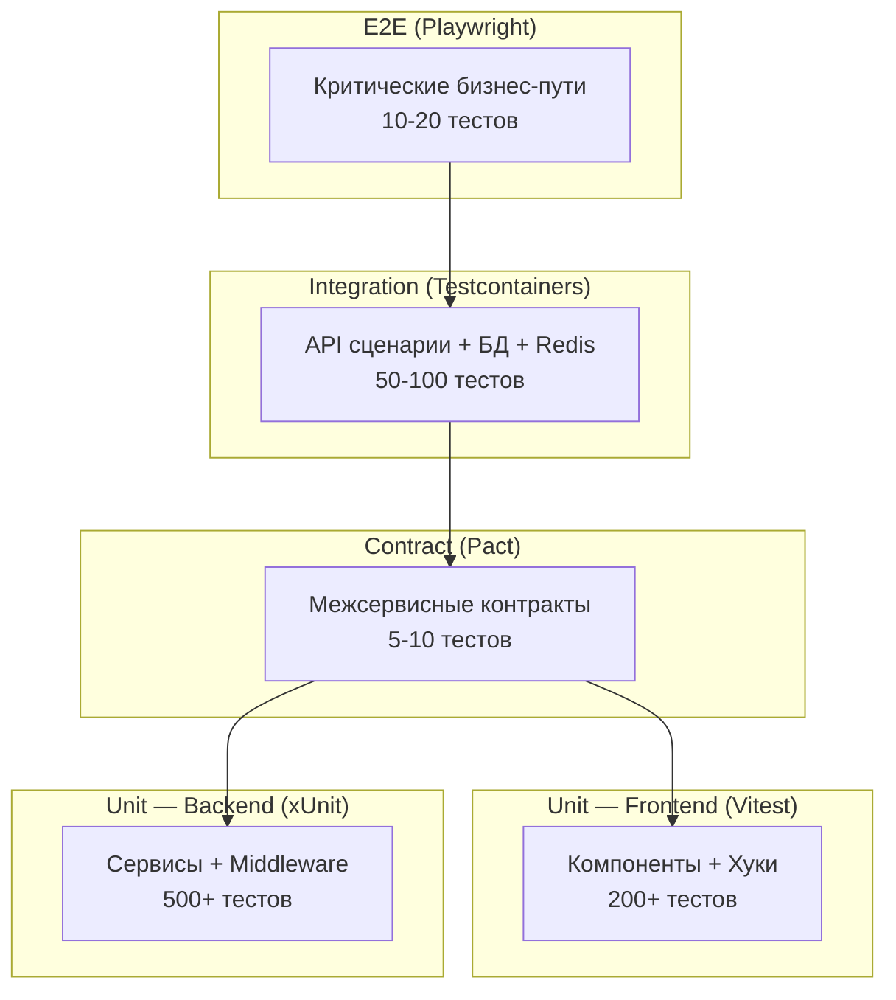

# 🧪 Тестирование GoldPC

> **Раздел**: 20_Developer_Guides
> **Версия**: 1.0 | **Последнее обновление**: 2026-05-24

---

## 📊 Пирамида тестов



---

## 🏃‍♂️ Команды для запуска

```bash
# === Все тесты ===
make test

# === Frontend ===
npm run test:frontend         # Все frontend тесты
npm run test:frontend:watch   # Watch mode
npm run test:frontend:coverage # С coverage

# === Backend ===
npm run test:backend          # Все backend тесты
npm run test:backend:watch    # Watch mode
npm run test:backend:coverage # С coverage

# === Интеграционные (требуют Docker) ===
npm run test:integration

# === E2E (требуют Docker + Playwright) ===
npm run test:e2e

# === Contract (Pact) ===
npm run test:contract

# === Load (k6) ===
k6 run tests/load/smoke-test.js
k6 run tests/load/stress-test.js

# === Coverage ===
npm run test:coverage         # Сводный отчёт
```

---

## 🧪 Backend (xUnit + Moq)

### Технологии

| Инструмент | Назначение |
|-----------|-----------|
| **xUnit** | Фреймворк тестирования |
| **Moq** | Мокирование зависимостей |
| **FluentAssertions** | Читаемые assertions |
| **AutoFixture** | Генерация данных |
| **Bogus** | Реалистичные фейки |
| **Testcontainers** | PostgreSQL/Redis в Docker |
| **WebApplicationFactory** | In-memory сервер ASP.NET |

### Запуск одного теста

```bash
dotnet test src/backend/CatalogService.Tests --filter "FullyQualifiedName~CreateOrder_WithValidData"
```

### Пример

```csharp
[Fact]
public async Task GetProducts_WithValidCategory_ReturnsFilteredResults()
{
    // Arrange
    var productRepository = new Mock<IProductRepository>();
    productRepository.Setup(r => r.GetByCategoryAsync(It.IsAny<int>()))
        .ReturnsAsync(new List<Product> { /* ... */ });
    
    var service = new CatalogService(productRepository.Object);
    
    // Act
    var result = await service.GetProductsAsync(categoryId: 1);
    
    // Assert
    result.Should().NotBeNull();
    result.Items.Should().AllSatisfy(p => p.CategoryId.Should().Be(1));
}
```

---

## 💻 Frontend (Vitest + Testing Library)

### Технологии

| Инструмент | Назначение |
|-----------|-----------|
| **Vitest** | Фреймворк (Vite-native) |
| **@testing-library/react** | Рендер компонентов |
| **@testing-library/user-event** | Симуляция действий |
| **msw** | Мокирование API |

### Пример

```typescript
import { render, screen } from '@testing-library/react';
import userEvent from '@testing-library/user-event';
import { ProductCard } from './ProductCard';

describe('ProductCard', () => {
  it('добавляет товар в корзину по клику', async () => {
    const onAddToCart = vi.fn();
    
    render(<ProductCard product={mockProduct} onAddToCart={onAddToCart} />);
    
    await userEvent.click(screen.getByRole('button', { name: /в корзину/i }));
    
    expect(onAddToCart).toHaveBeenCalledWith(mockProduct.id);
  });
});
```

---

## 🔗 Integration Tests

### Требования

- Docker running (Testcontainers)
- .NET 8 SDK
- Свободные порты (PostgreSQL, Redis)

### Запуск

```bash
npm run test:integration
# или
dotnet test src/backend/tests/GoldPC.IntegrationTests
```

### Пример с Testcontainers

```csharp
[Fact]
public async Task GetProducts_ReturnsPagedResults()
{
    await using var postgres = new PostgreSqlBuilder()
        .WithImage("postgres:16-alpine")
        .Build();
    await postgres.StartAsync();

    var factory = new WebApplicationFactory<Program>()
        .WithConnectionString(postgres.GetConnectionString());

    var client = factory.CreateClient();
    var response = await client.GetAsync("/api/v1/catalog/products?page=1&pageSize=10");

    response.StatusCode.Should().Be(HttpStatusCode.OK);
}
```

---

## 🌐 E2E Tests (Playwright + Cucumber)

```bash
# 1. Поднять тестовое окружение
docker compose -f docker/docker-compose.test.yml up -d

# 2. Запустить Playwright
npx playwright test --reporter=html

# 3. Открыть отчёт
npx playwright show-report

# 4. Очистить
docker compose -f docker/docker-compose.test.yml down -v
```

### BDD сценарий

```gherkin
Feature: Оформление заказа
  Scenario: Авторизованный пользователь оформляет заказ
    Given пользователь авторизован как "client@goldpc.by"
    When он добавляет товар "AMD Ryzen 5 5600X" в корзину
    And переходит к оформлению заказа
    And выбирает оплату картой
    Then заказ создаётся с статусом "Pending"
    And письмо отправлено на email пользователя
```

---

## ⚡ Load Tests (k6)

```bash
# Smoke test (проверка, что всё работает)
k6 run tests/load/smoke-test.js

# Stress test (до 200 concurrent)
k6 run tests/load/stress-test.js

# Spike test (резкий рост)
k6 run tests/load/spike-test.js
```

### Пороги

| Метрика | Порог |
|---------|-------|
| `http_req_duration (p95)` | < 500ms |
| `http_req_failed` | < 1% |

---

## 📊 Coverage

```bash
# Полный отчёт
npm run test:coverage

# Откроется в браузере: coverage/index.html
```

### Текущие цели

| Уровень | Backend | Frontend |
|---------|---------|----------|
| **Общее** | ≥ 80% | ≥ 70% |
| **Critical paths** | ≥ 90% | ≥ 90% |

---

## 🔗 Связанные страницы

- [[17_Tests/Обзор_тестирования]] — полный обзор тестирования
- [[20_Developer_Guides/Локальная_разработка]] — режимы запуска
- [[07_Infra_DevOps/Docker_окружение]] — test окружение
- [[07_Infra_DevOps/GitHub_Actions]] — CI/CD
