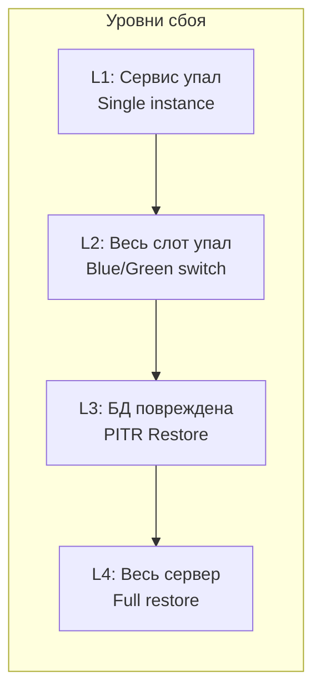
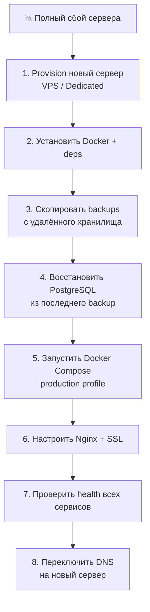

# 🔄 Восстановление после сбоя (Disaster Recovery)

> **Раздел**: 21_Runbooks
> **Версия**: 1.0 | **Последнее обновление**: 2026-05-24

---

## 🏗️ Стратегия DR



---

## 🟢 L1: Сервис не отвечает

**RTO**: < 1 минута | **RPO**: 0 (нет потери данных)

```bash
# 1. Рестарт Docker контейнера
docker compose restart catalog-service

# 2. Проверить health
curl -f http://localhost:5000/health && echo "OK"

# 3. Если не помогло — заменить контейнер (без потери данных)
docker compose up -d --force-recreate catalog-service

# 4. Проверить логи
docker compose logs --tail=50 catalog-service
```

---

## 🟡 L2: Падение Blue/Green слота

**RTO**: < 30 секунд | **RPO**: 0

```bash
# 1. Убедиться, что Green слот работает
curl -f http://localhost:5011/health  # Catalog Green
curl -f http://localhost:5013/health  # Auth Green
curl -f http://localhost:3001/health  # Frontend Green

# 2. Переключить Nginx на Green
# Отредактировать upstream.conf:
# upstream backend {
#     server catalog-green:5011;
#     server auth-green:5013;
# }

# 3. Проверить конфиг и перезагрузить
nginx -t && nginx -s reload

# 4. Остановить Blue слот
docker compose stop catalog-blue auth-blue frontend-blue
```

### Автоматический rollback (GitHub Actions)

```bash
# Использовать workflow:
gh workflow run rollback.yml --ref main
```

Подробнее: [[15_Deployments/Blue_Green_стратегия]]

---

## 🟠 L3: Повреждение БД

**RTO**: 15-60 минут | **RPO**: Зависит от backup frequency

### Сценарии

| Сценарий | Описание | Восстановление |
|----------|----------|---------------|
| **Ошибочная миграция** | `DROP TABLE` или неправильный `ALTER` | PITR до момента до миграции |
| **Повреждение данных** | SQL injection, баг в коде | PITR до инцидента |
| **Физическое повреждение** | Disk failure, коррупция WAL | Full restore последнего бэкапа + WAL |
| **Случайное удаление** | `DELETE FROM products` | PITR до момента |

### RPO/RTO

| База | RPO (текущий) | RPO (цель) | RTO |
|------|-------------|-----------|-----|
| goldpc_catalog | 24 часа | 1 час | 30 мин |
| goldpc_auth | 24 часа | 15 мин | 15 мин |
| goldpc_orders | 24 часа | 5 мин | 30 мин |

### PITR (Point-in-Time Recovery)

```bash
# Предусловие: WAL archiving настроен
# archive_command = 'cp %p /backups/wal/%f'

# 1. Определить нужный момент
# Например, за 5 минут до инцидента:
# "2026-05-24 14:55:00 UTC"

# 2. Остановить сервисы, использующие БД
docker compose stop catalog-service orders-service

# 3. Восстановить из базового backup + WAL
docker exec -it goldpc-postgres bash

# В контейнере:
# pg_restore — восстановление из dump
pg_restore -U postgres -d goldpc_catalog \
  --clean --if-exists /backups/goldpc_catalog_20260524.dump

# Или через PITR (если настроен WAL archiving):
# 1. Скопировать базовый backup
# 2. Настроить recovery.conf:
# restore_command = 'cp /backups/wal/%f %p'
# recovery_target_time = '2026-05-24 14:55:00 UTC'

# 4. Проверить данные
docker exec -it goldpc-postgres psql -U postgres -d goldpc_catalog \
  -c "SELECT COUNT(*) FROM \"Products\""

# 5. Запустить сервисы
docker compose start catalog-service
```

### Full Backup (pg_dump)

```bash
# Создать backup
# Ежедневно в 03:00 (cron)
docker exec -t goldpc-postgres pg_dump -U postgres \
  -d goldpc_catalog -F c -f /backups/goldpc_catalog_$(date +%Y%m%d).dump

# Восстановить
docker exec -i goldpc-postgres pg_restore -U postgres \
  -d goldpc_catalog --clean /backups/goldpc_catalog_20260524.dump
```

---

## 🔴 L4: Полный сбой сервера

**RTO**: 2-4 часа | **RPO**: Зависит от backup



### Чеклист восстановления

- [ ] Сервер provisioned (Docker, Docker Compose, Git)
- [ ] Клонирован репозиторий (`git clone`)
- [ ] Восстановлены `.env` файлы (из GitHub Secrets)
- [ ] PostgreSQL backup скопирован и восстановлен
- [ ] Все сервисы запущены: `docker compose --profile blue up -d`
- [ ] Health checks проходят
- [ ] Nginx настроен и SSL валиден
- [ ] DNS обновлён (TTL учтён)
- [ ] Мониторинг (Prometheus/Grafana) работает
- [ ] Sentry проверен — нет новых ошибок

---

## 📦 Backup стратегия

```bash
# === Рекомендуемая схема ===

# 01:00 — Полный дамп всех БД
0 1 * * * docker exec goldpc-postgres pg_dumpall -U postgres \
  -f /backups/daily/goldpc_full_$(date +\%Y\%m\%d).sql

# 02:00 — Сжатый дамп каждой БД
0 2 * * * for DB in goldpc_catalog goldpc_auth goldpc_orders; do
  docker exec goldpc-postgres pg_dump -U postgres -Z 9 -d "$DB" \
    -f "/backups/daily/${DB}_$(date +\%Y\%m\%d).sql.gz"
done

# 03:00 — Копировать на удалённое хранилище
0 3 * * * rsync -avz /backups/ backup@storage:/backups/goldpc/
```

### Retention Policy

| Тип | Retention |
|-----|-----------|
| Ежедневные | 7 дней |
| Еженедельные | 4 недели |
| Ежемесячные | 12 месяцев |

---

## ⚡ Fast Recovery: Nginx Upstream Switching

**Для экстренного переключения между blue/green:**

```nginx
# /etc/nginx/upstream.conf

# === BLUE (по умолчанию) ===
upstream catalog-api {
    server catalog-blue:5001 max_fails=3 fail_timeout=30s;
}

# === GREEN (закомментирован) ===
# upstream catalog-api {
#     server catalog-green:5011 max_fails=3 fail_timeout=30s;
# }
```

```bash
# Переключить на GREEN
sed -i 's/blue/green/g' /etc/nginx/upstream.conf
nginx -t && nginx -s reload

# Вернуть на BLUE
sed -i 's/green/blue/g' /etc/nginx/upstream.conf
nginx -t && nginx -s reload
```

---

## 📊 Матрица DR

| Уровень | Инцидент | RTO | RPO | Действие |
|---------|----------|-----|-----|----------|
| L1 | Service crash | < 1 мин | 0 | `docker compose restart` |
| L1 | OOM (Out of Memory) | < 2 мин | 0 | Увеличить memory limits |
| L2 | Blue slot down | < 30 сек | 0 | Nginx → Green |
| L2 | Green slot down | < 30 сек | 0 | Nginx → Blue |
| L3 | Corrupted data | 15-60 мин | 1-24 ч | PITR |
| L3 | Bad migration | 15-30 мин | 0 | Откатить миграцию |
| L4 | Server failure | 2-4 ч | 1-24 ч | Full restore |
| L4 | Disk failure | 2-4 ч | 0 (если RAID) | Replace disk + restore |

---

## 🔗 Связанные страницы

- [[21_Runbooks/Мониторинг_и_алерты]] — мониторинг и алерты
- [[21_Runbooks/Деплой]] — деплой и откат
- [[15_Deployments/Blue_Green_стратегия]] — Blue-Green детали
- [[15_Deployments/Обзор_деплоя]] — обзор деплоя
- [[05_Database/Обзор_БД]] — база данных
- [[20_Developer_Guides/Работа_с_БД]] — работа с БД
