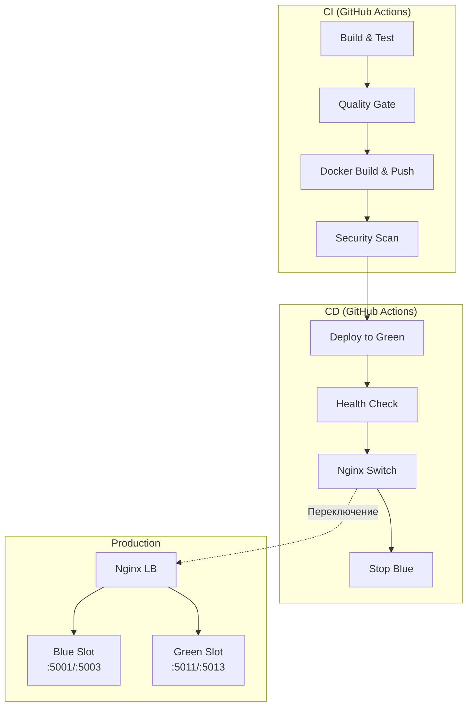
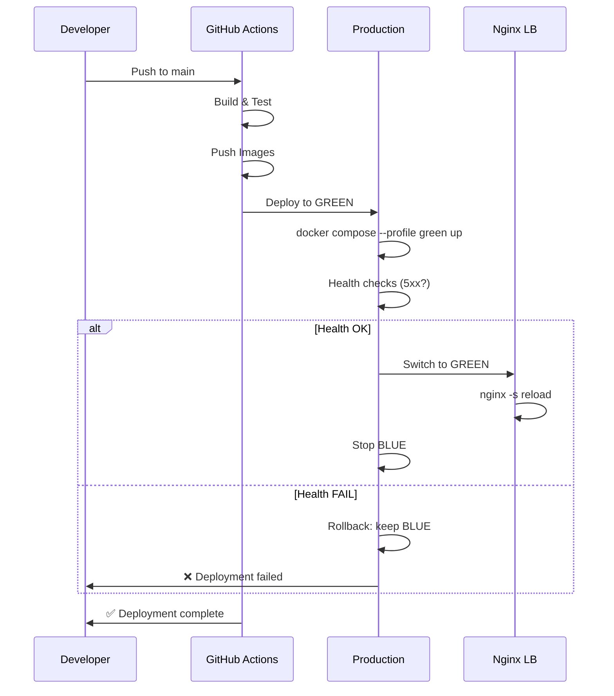

# 🚀 Деплой GoldPC

> **Раздел**: 21_Runbooks
> **Версия**: 1.0 | **Последнее обновление**: 2026-05-24

---

## 🏗️ Архитектура деплоя



---

## 📦 Сборка Docker образов

### Локальная сборка

```bash
# Сборка всех образов
docker compose build

# Сборка конкретного сервиса
docker compose build catalog-service

# Сборка с тегом
docker build -t ghcr.io/goldpc/goldpc-catalog:latest \
  -f docker/Dockerfile.backend \
  --build-arg SERVICE=CatalogService .
```

### CI/CD сборка (GitHub Actions)

```yaml
# .github/workflows/build.yml
jobs:
  build:
    steps:
      - name: Build and Push
        uses: docker/build-push-action@v5
        with:
          context: .
          file: docker/Dockerfile.backend
          build-args: |
            SERVICE=CatalogService
          tags: |
            ghcr.io/goldpc/goldpc-catalog:latest
            ghcr.io/goldpc/goldpc-catalog:${{ github.sha }}
          push: true
```

---

## 📤 Push в Registry

```bash
# Логин в GitHub Container Registry
echo $GITHUB_TOKEN | docker login ghcr.io -u goldie1k --password-stdin

# Push образа
docker push ghcr.io/goldpc/goldpc-catalog:latest
docker push ghcr.io/goldpc/goldpc-catalog:${{ github.sha }}
```

### Используемые образы

| Компонент | Image |
|-----------|-------|
| CatalogService | `ghcr.io/goldpc/goldpc-catalog` |
| AuthService | `ghcr.io/goldpc/goldpc-auth` |
| OrdersService | `ghcr.io/goldpc/goldpc-orders` |
| PCBuilderService | `ghcr.io/goldpc/goldpc-pcbuilder` |
| ServicesService | `ghcr.io/goldpc/goldpc-services` |
| WarrantyService | `ghcr.io/goldpc/goldpc-warranty` |
| ReportingService | `ghcr.io/goldpc/goldpc-reporting` |
| BFF (GoldPC.Api) | `ghcr.io/goldpc/goldpc-bff` |
| Frontend | `ghcr.io/goldpc/goldpc-frontend` |

---

## 🔄 Blue-Green Deployment



### Пошаговая процедура

```bash
# === Шаг 1: Подготовка ===
# Убедиться, что CI прошел:
# - Все тесты пройдены
# - Quality Gate passed (SonarQube / CodeQL)
# - Docker образы запушены

# === Шаг 2: Деплой в Green ===
# Зайти на продакшн сервер
ssh deploy@goldpc.by

# Перейти в директорию проекта
cd /opt/goldpc

# Запустить Green слот (новые образы)
docker compose -f docker-compose.prod.yml --profile green up -d

# === Шаг 3: Проверка Green ===
# Health checks
curl -f http://localhost:5011/health   # Catalog Green
curl -f http://localhost:5013/health   # Auth Green
curl -f http://localhost:3001/health   # Frontend Green
curl -f http://localhost:5002/health   # PCBuilder Green

# Smoke test
curl http://localhost:5011/api/v1/catalog/products?page=1
curl -X POST http://localhost:5013/api/auth/login \
  -H "Content-Type: application/json" \
  -d '{"email":"test@goldpc.by","password":"test123"}'

# === Шаг 4: Переключение Nginx ===
# Отредактировать /etc/nginx/upstream.conf:
# upstream backend {
#     server catalog-green:5011;
#     server auth-green:5013;
# }

# Проверить и перезагрузить
sudo nginx -t && sudo nginx -s reload

# === Шаг 5: Остановка Blue ===
docker compose -f docker-compose.prod.yml stop \
  catalog-blue auth-blue pcbuilder-blue frontend-blue

# === Шаг 6: Пост-проверка ===
# - Проверить бизнес-пути (каталог, логин, заказ)
# - Проверить мониторинг (Grafana, Sentry)
# - Проверить Stripe webhook (тестовый платёж)
```

---

## ✅ Проверка после деплоя

### Smoke Tests

```bash
#!/bin/bash
# post-deploy-check.sh

SERVICES=(
  "Catalog:http://goldpc.by/api/v1/catalog/products?page=1"
  "Auth:http://goldpc.by/api/auth/health"
  "Orders:http://goldpc.by/api/v1/orders/health"
  "PCBuilder:http://goldpc.by/api/v1/pcbuilder/health"
)

FAILED=0
for SERVICE in "${SERVICES[@]}"; do
  NAME="${SERVICE%%:*}"
  URL="${SERVICE##*:}"
  
  STATUS=$(curl -s -o /dev/null -w "%{http_code}" "$URL")
  if [ "$STATUS" != "200" ]; then
    echo "❌ $NAME: HTTP $STATUS"
    FAILED=1
  else
    echo "✅ $NAME: OK"
  fi
done

exit $FAILED
```

### Чеклист

- [ ] Health checks всех сервисов → 200 OK
- [ ] Frontend загружается без ошибок консоли
- [ ] Каталог отображает товары
- [ ] Регистрация / логин работают
- [ ] Stripe webhook проходит (тестовый платёж)
- [ ] Prometheus/Grafana метрики обновляются
- [ ] Sentry — нет новых ошибок
- [ ] Nginx логи — нет 5xx

---

## ⏪ Rollback Procedure

```bash
# === Emergency Rollback (ручной) ===

# 1. Переключить Nginx обратно на Blue
# /etc/nginx/upstream.conf → blue
sudo nginx -t && sudo nginx -s reload

# 2. Остановить Green (новую версию)
docker compose -f docker-compose.prod.yml stop \
  catalog-green auth-green pcbuilder-green frontend-green

# 3. Проверить Blue
curl -f http://localhost:5001/health   # Catalog Blue
curl -f http://localhost:5003/health   # Auth Blue

# 4. При необходимости — откатить образы
docker pull ghcr.io/goldpc/goldpc-catalog:previous-tag
```

### GitHub Actions Rollback

```bash
# Запустить rollback workflow
gh workflow run rollback.yml \
  --ref main \
  -f environment=production \
  -f version=previous-tag
```

---

## 🔐 Security Checks

```bash
# Перед деплоем:
# 1. Проверить .env — нет ли секретов в открытом виде
grep -r "password" src/ --include="*.json" --include="*.env"

# 2. Проверить зависимости на уязвимости
npm audit
dotnet list package --vulnerable

# 3. SAST сканирование
dotnet tool run security-scan src/

# 4. Docker scan
docker scout ghcr.io/goldpc/goldpc-catalog:latest
```

---

## 📋 Production Docker Compose

```yaml
# docker-compose.prod.yml (ключевые части)
services:
  catalog-blue:
    image: ghcr.io/goldpc/goldpc-catalog:${IMAGE_VERSION:-latest}
    ports:
      - "5001:5001"
    profiles: ["blue"]
    
  catalog-green:
    image: ghcr.io/goldpc/goldpc-catalog:${IMAGE_VERSION:-latest}
    ports:
      - "5011:5011"
    profiles: ["green"]
    
  # Аналогично для других сервисов...
```

### Запуск

```bash
# Профили
docker compose -f docker-compose.prod.yml --profile blue up -d
docker compose -f docker-compose.prod.yml --profile green up -d
docker compose -f docker-compose.prod.yml --profile monitoring up -d

# Все сразу
docker compose -f docker-compose.prod.yml --profile all up -d
```

---

## 🔗 Связанные страницы

- [[15_Deployments/Обзор_деплоя]] — обзор деплоя
- [[15_Deployments/Blue_Green_стратегия]] — Blue-Green детали
- [[07_Infra_DevOps/GitHub_Actions]] — CI/CD workflow
- [[07_Infra_DevOps/Docker_окружение]] — Docker окружение
- [[21_Runbooks/Мониторинг_и_алерты]] — мониторинг после деплоя
- [[21_Runbooks/Восстановление_после_сбоя]] — DR процедуры
