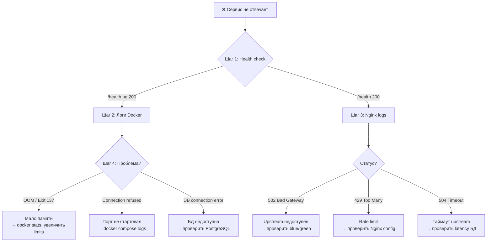

# 📊 Мониторинг и алерты GoldPC

> **Раздел**: 21_Runbooks
> **Версия**: 1.0 | **Последнее обновление**: 2026-05-24

---

## 🏥 Health Check Endpoints

### Все сервисы

| Сервис | Health | Liveness | Readiness |
|--------|--------|----------|-----------|
| **CatalogService** | `GET /health` | `GET /health/live` | `GET /health/ready` |
| **AuthService** | `GET /health` | `GET /health/live` | `GET /health/ready` |
| **OrdersService** | `GET /health` | `GET /health/live` | `GET /health/ready` |
| **ServicesService** | `GET /health` | `GET /health/live` | `GET /health/ready` |
| **PCBuilderService** | `GET /health` | `GET /health/live` | `GET /health/ready` |
| **WarrantyService** | `GET /health` | `GET /health/live` | `GET /health/ready` |
| **ReportingService** | `GET /health` | `GET /health/live` | `GET /health/ready` |

### Проверка

```bash
# Все сервисы
curl -f http://localhost:5000/health && echo "Catalog OK"
curl -f http://localhost:5001/health && echo "Auth OK"
curl -f http://localhost:5002/health && echo "Orders OK"

# Через Docker
docker compose ps --filter "status=running"
```

### Ожидаемые ответы

```json
// HTTP 200
{
  "status": "Healthy",
  "checks": [
    { "name": "postgres", "status": "Healthy" },
    { "name": "redis", "status": "Healthy" },
    { "name": "rabbitmq", "status": "Healthy" }
  ],
  "duration": "00:00:00.123"
}
```

---

## 🚨 Что проверять, когда сервис не отвечает



### Docker logs

```bash
# Логи конкретного сервиса
docker compose logs -f --tail=100 catalog-service

# Только ошибки
docker compose logs catalog-service 2>&1 | grep -i error

# Все сервисы
docker compose logs --tail=50
```

---

## 📈 Prometheus / Grafana

### Prometheus Query Examples

```promql
# Request rate по сервисам (за 5 мин)
sum(rate(http_requests_total[5m])) by (service)

# P95 latency
histogram_quantile(0.95, 
  sum(rate(http_request_duration_seconds_bucket[5m])) by (le, service))

# Error rate
sum(rate(http_requests_total{status=~"5.."}[5m])) 
  / sum(rate(http_requests_total[5m])) * 100

# Cache hit ratio
sum(rate(cache_hits_total[5m])) 
  / (sum(rate(cache_hits_total[5m])) + sum(rate(cache_misses_total[5m]))) * 100

# Memory usage
process_resident_memory_bytes{job="catalog-service"}

# DB connection pool
npgsql_connection_pool_count{pool_name="goldpc_catalog"}
```

### Алерты (PrometheusRule)

```yaml
groups:
  - name: GoldPC
    rules:
      - alert: ServiceDown
        expr: up{job=~".*"} == 0
        for: 1m
        annotations:
          summary: "{{ $labels.job }} не отвечает"
      
      - alert: HighErrorRate
        expr: rate(http_requests_total{status=~"5.."}[5m]) > 0.05
        for: 5m
        annotations:
          summary: "Error rate > 5% на {{ $labels.job }}"
      
      - alert: HighLatency
        expr: histogram_quantile(0.95, 
          rate(http_request_duration_seconds_bucket[5m])) > 1
        for: 5m
        annotations:
          summary: "P95 latency > 1s на {{ $labels.job }}"
```

### Grafana Dashboards

| Дашборд | Назначение | UID |
|---------|-----------|-----|
| **GoldPC — Overview** | CPU, Memory, RPS, Errors | `goldpc-overview` |
| **GoldPC — Business** | Orders, Revenue, Users | `goldpc-business` |
| **GoldPC — Database** | Slow queries, Hit ratio | `goldpc-database` |
| **GoldPC — Services** | Uptime, Health, Latency | `goldpc-services` |

---

## 📝 Логи

### Расположение

```bash
# Nginx logs (на сервере)
/var/log/nginx/access.log
/var/log/nginx/error.log

# Docker logs
docker compose logs catalog-service > catalog-service.log

# Serilog (в контейнерах)
# По умолчанию — в stdout/stderr
# Настроить appsettings.json для file sink
```

### Структура Nginx JSON Log

```json
{
  "time_local": "24/May/2026:12:00:00 +0000",
  "remote_addr": "192.168.1.1",
  "request": "GET /api/v1/catalog/products HTTP/1.1",
  "status": 200,
  "body_bytes_sent": 12345,
  "request_time": 0.145,
  "upstream_addr": "catalog-blue:5001",
  "upstream_response_time": "0.142"
}
```

---

## 🐛 Sentry Error Investigation

### Как искать ошибку

```bash
# 1. Открыть Sentry Dashboard
# URL: https://sentry.goldpc.by
# (или настроить свой)

# 2. Найти ошибку по:
# - HTTP status (5xx)
# - Exception type (NullReferenceException, SqlException)
# - URL (endpoint)
# - User ID (если пользователь авторизован)

# 3. Что смотреть в Sentry:
# - Stack trace — модуль и строка
# - HTTP headers — User-Agent, Referer
# - Request body — параметры запроса
# - Logs — предыдущие логи
```

### Типичные ошибки

| Ошибка | Причина | Решение |
|--------|---------|---------|
| `SqlException: relation not found` | Нет миграции | `dotnet ef database update` |
| `NullReferenceException` | Не проверен null | Проверить `??` or `?.` |
| `TaskCanceledException` | Timeout | Увеличить timeout / оптимизировать |
| `StripeException` | Ошибка платежа | Проверить Stripe Dashboard |
| `NpgsqlException: connection refused` | PostgreSQL не запущен | `docker compose up -d postgres` |

---

## 📋 Runbook: Сервис упал

```bash
# 1. Быстрая диагностика
docker compose ps
docker compose logs --tail=50 catalog-service

# 2. Проверить health
curl -f http://localhost:5000/health

# 3. Проверить зависимости (БД, Redis)
docker compose exec postgres pg_isready -U postgres
docker compose exec redis redis-cli ping

# 4. Если проблема в коде — рестарт
docker compose restart catalog-service

# 5. Если рестарт не помог — переключить Nginx на другую версию
# (Blue-Green)
# См. [[21_Runbooks/Деплой]]

# 6. Если проблема в БД — disaster recovery
# См. [[21_Runbooks/Восстановление_после_сбоя]]
```

---

## 🔗 Связанные страницы

- [[18_Monitoring/Обзор_мониторинга]] — архитектура мониторинга
- [[21_Runbooks/Восстановление_после_сбоя]] — DR процедуры
- [[21_Runbooks/Деплой]] — деплой и откат
- [[07_Infra_DevOps/Обзор_инфраструктуры]] — инфраструктура
- [[07_Infra_DevOps/Docker_окружение]] — Docker окружение
