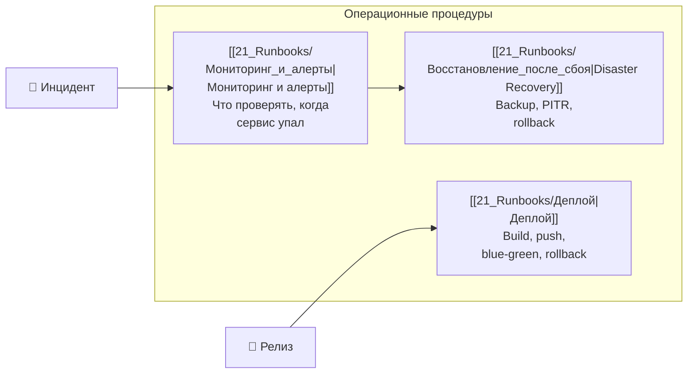

# 📋 Обзор рунбуков GoldPC

> **Раздел**: 21_Runbooks
> **Версия**: 1.0 | **Последнее обновление**: 2026-05-24

---

## 🎯 Назначение

Рунбуки содержат операционные процедуры для поддержки и эксплуатации GoldPC. Они описывают конкретные действия при инцидентах, деплое и日常-операциях.

---

## 📚 Список рунбуков

| Рунбук | Описание | Время выполнения | Приоритет |
|--------|----------|-----------------|-----------|
| [[21_Runbooks/Мониторинг_и_алерты\|Мониторинг и алерты]] | Health checks, Prometheus/Grafana, Sentry, логи | 5-15 мин | 🔴 Критический |
| [[21_Runbooks/Восстановление_после_сбоя\|Восстановление после сбоя]] | Backup restore, PITR, rollback, краш сервиса | 15-60 мин | 🔴 Критический |
| [[21_Runbooks/Деплой\|Деплой]] | Сборка образов, Blue-Green деплой, откат | 20-40 мин | 🟡 Средний |

---

## 🔗 Связанные страницы

- [[00_Index/Главный_индекс]] — главный индекс
- [[15_Deployments/Обзор_деплоя]] — обзор деплоя
- [[07_Infra_DevOps/Обзор_инфраструктуры]] — инфраструктура
- [[18_Monitoring/Обзор_мониторинга]] — мониторинг
- [[22_Glossary/Глоссарий]] — термины
