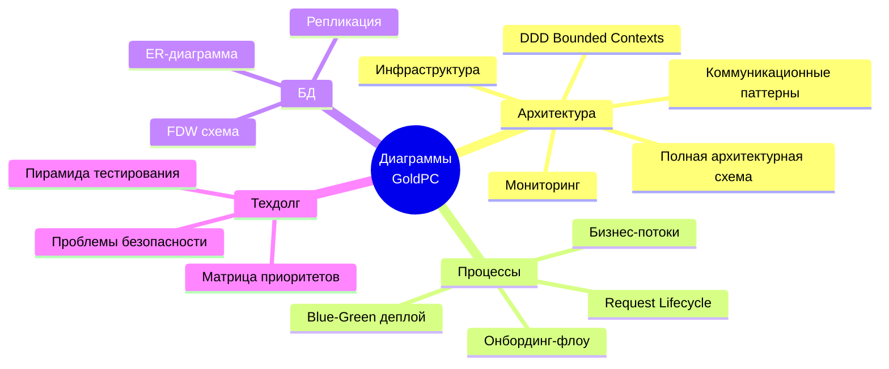
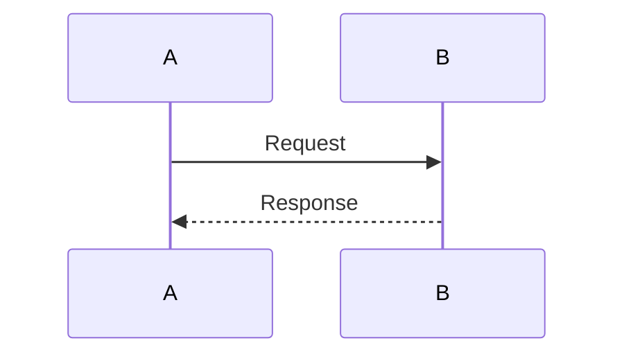
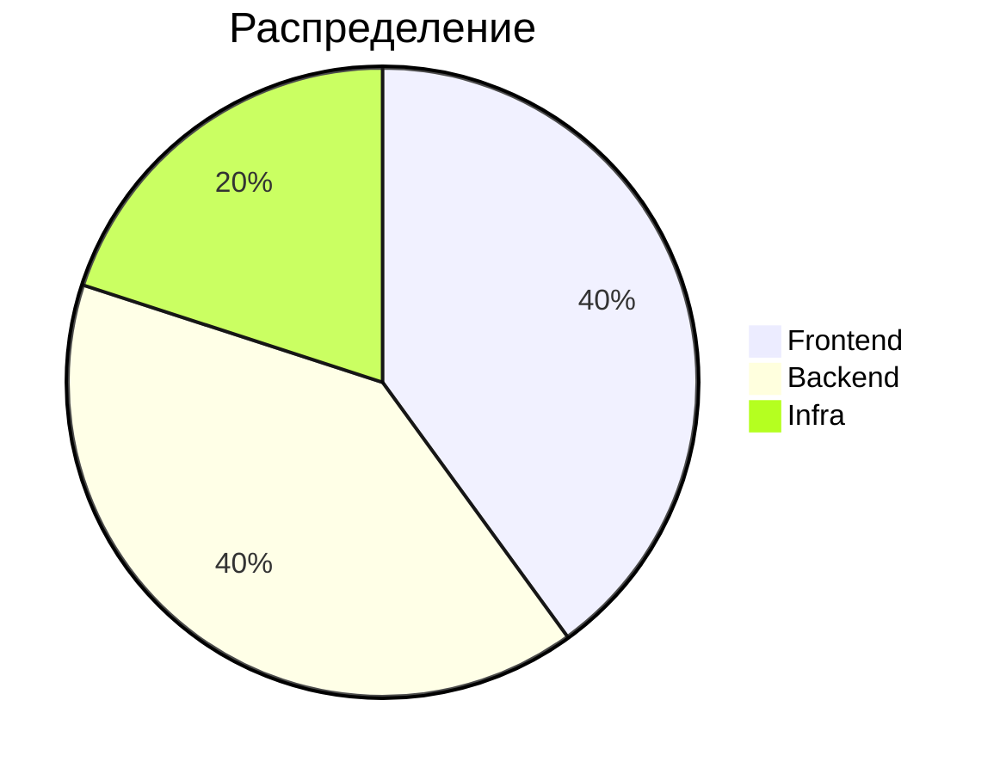
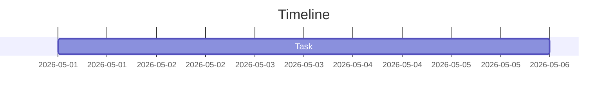
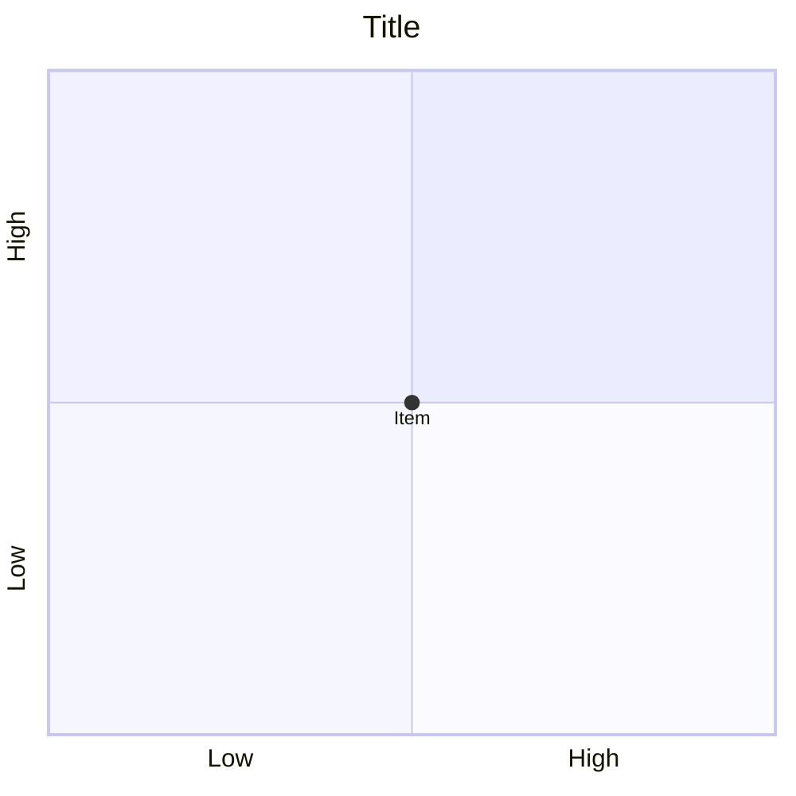

# 🗺️ Обзор диаграмм GoldPC

> **Раздел**: 23_Diagrams
> **Версия**: 1.0 | **Последнее обновление**: 2026-05-24

---

## 📋 Все Mermaid-диаграммы проекта



---

## 📑 Полный список диаграмм по файлам

### Архитектура системы

| Диаграмма | Файл | Описание |
|-----------|------|----------|
| Архитектурная карта (высокий уровень) | [[00_Index/Главный_индекс\|Главный индекс]] | Все компоненты: frontend, API Gateway, microservices, инфраструктура |
| Архитектура высокого уровня | [[02_Architecture/Архитектура_системы\|Архитектура системы]] | Порты сервисов и связи |
| Коммуникационные паттерны | [[02_Architecture/Архитектура_системы\|Архитектура системы]] | REST, gRPC, RabbitMQ, WebSocket |
| DDD Bounded Contexts | [[02_Architecture/Архитектура_системы\|Архитектура системы]] | Границы доменов и связи |
| Request Lifecycle (sequence) | [[02_Architecture/Архитектура_системы\|Архитектура системы]] | Поток запроса от браузера до БД |
| Полная архитектурная схема | [[23_Diagrams/Полная_архитектурная_диаграмма\|Полная архитектурная диаграмма]] | Объединённая схема всех компонентов |

### Deployment

| Диаграмма | Файл | Описание |
|-----------|------|----------|
| Production архитектура | [[15_Deployments/Обзор_деплоя\|Обзор деплоя]] | Blue/Green слоты, Nginx, shared сервисы |
| Blue-Green стратегия (steps) | [[15_Deployments/Обзор_деплоя\|Обзор деплоя]] | 4 шага деплоя |
| Blue-Green sequence | [[21_Runbooks/Деплой\|Деплой]] | Sequence diagram деплоя |

### Инфраструктура

| Диаграмма | Файл | Описание |
|-----------|------|----------|
| Инфраструктура (production) | [[07_Infra_DevOps/Обзор_инфраструктуры\|Обзор инфраструктуры]] | Сервера, сети, порты |
| Архитектура мониторинга | [[18_Monitoring/Обзор_мониторинга\|Обзор мониторинга]] | Prometheus, Grafana, Jaeger, Sentry |
| Grafana Dashboard (mock) | [[18_Monitoring/Обзор_мониторинга\|Обзор мониторинга]] | Визуализация метрик |

### База данных

| Диаграмма | Файл | Описание |
|-----------|------|----------|
| Связи БД | [[05_Database/Обзор_БД\|Обзор БД]] | ER-диаграмма (сущности и связи) |
| Схема БД | [[05_Database/Схема_БД\|Схема БД]] | Полная ER-диаграмма со всеми таблицами |

### Тестирование

| Диаграмма | Файл | Описание |
|-----------|------|----------|
| Пирамида тестирования | [[17_Tests/Обзор_тестирования\|Обзор тестирования]] | E2E → Integration → Contract → Unit |
| Contract tests (Pact) | [[17_Tests/Обзор_тестирования\|Обзор тестирования]] | Consumer/Provider диаграмма |

### Бизнес-логика

| Диаграмма | Файл | Описание |
|-----------|------|----------|
| Бизнес-потоки | [[01_Overview/Обзор_проекта\|Обзор проекта]] | Регистрация → Заказ → Сервисный центр → Гарантия |

### Developer Guides

| Диаграмма | Файл | Описание |
|-----------|------|----------|
| Онбординг-флоу | [[00_Index/Главный_индекс\|Главный индекс]] | Путь нового разработчика |
| Режимы разработки | [[20_Developer_Guides/Локальная_разработка\|Локальная разработка]] | Full stack / Frontend-only / Backend-only |
| Коммиты и ревью | [[20_Developer_Guides/Стиль_кода\|Стиль кода]] | Процесс code review |

### Tech Debt

| Диаграмма | Файл | Описание |
|-----------|------|----------|
| Матрица приоритетов | [[19_Tech_Debt/Обзор_техдолга\|Обзор техдолга]] | Quadrant chart влияния vs сложности |
| Влияние проблем | [[19_Tech_Debt/Обзор_техдолга\|Обзор техдолга]] | Security / Reliability / Maintainability |
| Проблемы безопасности | [[19_Tech_Debt/Проблемы_безопасности\|Проблемы безопасности]] | Граф рисков |
| План исправления (Gantt) | [[19_Tech_Debt/Проблемы_безопасности\|Проблемы безопасности]] | Timeline исправлений |
| Архитектурные проблемы | [[19_Tech_Debt/Архитектурные_проблемы\|Архитектурные проблемы]] | Mindmap всех проблем |
| Dead code mindmap | *(удалён — все проблемы решены)* | 
| Масштабирование | [[19_Tech_Debt/Проблемы_масштабирования\|Проблемы масштабирования]] | Текущее vs Целевое |
| План масштабирования | [[19_Tech_Debt/Проблемы_масштабирования\|Проблемы масштабирования]] | 3 фазы |

### Остальное

| Диаграмма | Файл | Описание |
|-----------|------|----------|
| Архитектура конфигурации | [[16_Config_ENV/Обзор_конфигурации\|Обзор конфигурации]] | Источники конфигурации |
| DR процедуры | [[21_Runbooks/Восстановление_после_сбоя\|Восстановление после сбоя]] | 4 уровня DR |
| Полный DR флоу | [[21_Runbooks/Восстановление_после_сбоя\|Восстановление после сбоя]] | Sequence diagram |
| CI/CD pipeline | [[21_Runbooks/Деплой\|Деплой]] | CI → CD → Production |

---

## 🔗 Использование Mermaid в Obsidian

```markdown
<!-- Все диаграммы используют mermaid.js -->
<!-- Блок-схемы (flowchart) -->


<!-- Диаграммы последовательности (sequenceDiagram) -->


<!-- Круговые диаграммы (pie) -->


<!-- Mindmap -->


<!-- Gantt -->


<!-- Quadrant Chart -->

```

---

## 🔗 Связанные страницы

- [[23_Diagrams/Полная_архитектурная_диаграмма]] — полная архитектура
- [[02_Architecture/Архитектура_системы]] — архитектура системы
- [[00_Index/Главный_индекс]] — главный индекс
- [[22_Glossary/Глоссарий]] — термины
