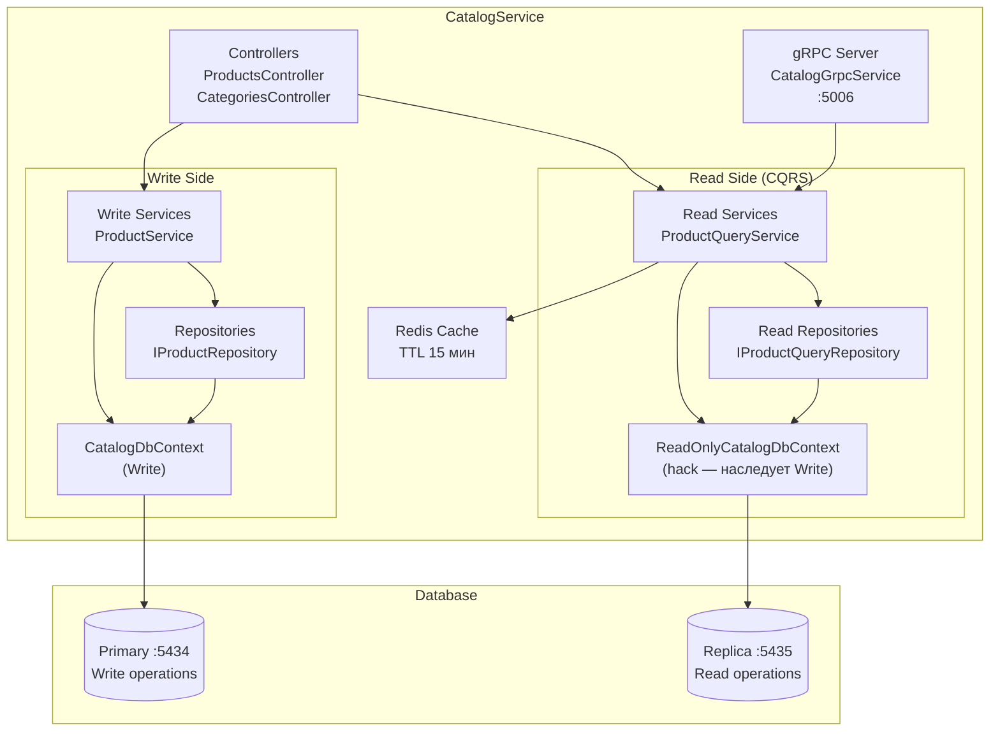
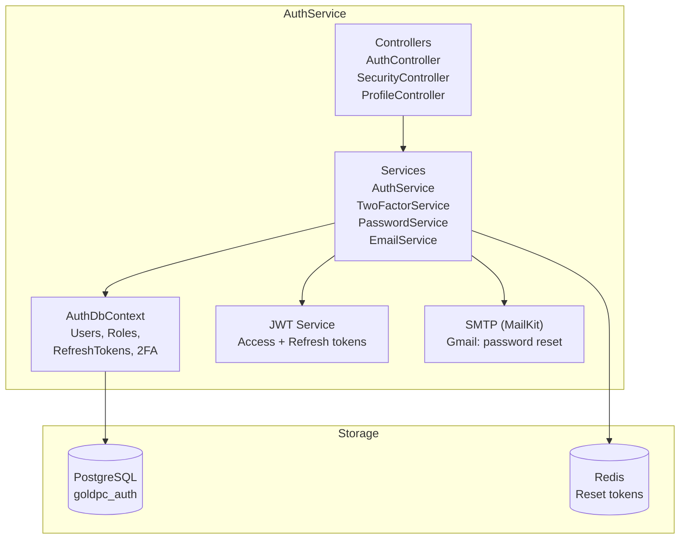

# 🏛️ Полная архитектурная диаграмма GoldPC

> **Раздел**: 23_Diagrams
> **Версия**: 2.0 | **Последнее обновление**: 2026-05-24
> **Описание**: Ultimate reference — все компоненты, связи, протоколы, порты

---

## 🗺️ Полная архитектура системы

```mermaid
graph TB
    subgraph "🌐 Клиенты"
        BROWSER["Браузер (React SPA)<br/>goldpc.by"]
        MOBILE["Mobile (planned)"]
        EXT["Внешние системы<br/>X-Core, Stripe"]
    end

    subgraph "📦 Frontend Layer (React 19 + Vite 8 + Tailwind v4)"
        UI["UI Components<br/>ProductCard, Button, Modal<br/>components/ui/"]
        PAGES["Pages<br/>Home, Catalog, Cart,<br/>PCBuilder, Admin"]
        STORE["Zustand Stores<br/>cartStore, authStore,<br/>filterStore"]
        QUERY["TanStack Query<br/>Server State"]
        API_LAYER["API Layer<br/>@/api/* — единый вход"]
        ROUTER["React Router<br/>/catalog, /pcbuilder, /admin"]
    end

    subgraph "🔄 Nginx Reverse Proxy :80/:443"
        NGINX["Nginx<br/>- Static files (build)<br/>- Rate limit (50r/s)<br/>- SSL termination<br/>- Security headers<br/>- Blue-Green upstream"]
    end

    subgraph "🏗️ API Gateway"
        BFF["GoldPC.Api BFF (YARP)<br/>:5008<br/>- Маршрутизация<br/>- SignalR Hub<br/>- Auth forwarding"]
    end

    subgraph "🖥️ Backend Microservices (.NET 8)"
        CS["CatalogService<br/>REST :5000<br/>gRPC :5006<br/>- Products CRUD<br/>- Categories<br/>- Reviews<br/>- CQRS (Read/Write)"]
        
        AS["AuthService<br/>:5001<br/>- Login/Register<br/>- JWT issuance<br/>- 2FA (TOTP)<br/>- Password reset<br/>- RBAC"]
        
        OS["OrdersService<br/>:5002<br/>- Orders CRUD<br/>- Stripe payments<br/>- PromoCodes<br/>- Outbox (DISABLED)"]
        
        PBS["PCBuilderService<br/>:5004<br/>- Configurations<br/>- Compatibility check<br/>- FPS calculation<br/>- Price calc"]
        
        SVS["ServicesService<br/>:5003<br/>- Service tickets<br/>- Spare parts<br/>- Work reports<br/>- Status FSM"]
        
        WS["WarrantyService<br/>:5005<br/>- Warranty cards<br/>- Claims<br/>- MassTransit ACTIVE"]
        
        RS["ReportingService<br/>:5008<br/>- Reports<br/>- Aggregations<br/>- postgres_fdw"]
    end

    subgraph "🗄️ Базы данных"
        PG_PRIMARY[("PostgreSQL Primary<br/>:5434 (dev) / :5432 (prod)<br/>PostgreSQL 16")]
        PG_REPLICA[("PostgreSQL Replica<br/>:5435 (dev)<br/>Только для чтения<br/>Использует: CatalogService")]
        subgraph "Базы данных (database-per-service)"
            DB_CAT[goldpc_catalog<br/>Товары, категории, specs]
            DB_AUTH[goldpc_auth<br/>Пользователи, роли, 2FA]
            DB_ORDERS[goldpc_orders<br/>Заказы, payments]
            DB_PCB[goldpc_pcbuilder<br/>Конфигурации ПК]
            DB_SRV[goldpc_services<br/>Заявки, запчасти]
            DB_WR[goldpc_warranty<br/>Гарантии, claims]
            DB_RPT[goldpc_reporting<br/>Aggregated data]
        end
    end

    subgraph "⚡ Кэш и очереди"
        REDIS[("Redis 7<br/>:6379<br/>- Cache (Catalog)<br/>- Reset tokens (Auth)")]
        RABBIT[("RabbitMQ<br/>:5672 / UI :15672<br/>- MassTransit events<br/>- OrderPlacedEvent<br/>- OrderPaidEvent")]
    end

    subgraph "📊 Мониторинг"
        PROM[Prometheus<br/>:9090<br/>- Pull metrics]
        GRAF[Grafana<br/>:3002<br/>- Dashboards]
        JAEGER[Jaeger<br/>OTLP :4317<br/>- Distributed tracing]
        SENTRY[Sentry<br/>- Error tracking]
    end

    subgraph "🔧 CI/CD (GitHub Actions)"
        GHA_BUILD[Build & Test<br/>npm + dotnet]
        GHA_QUALITY[Quality Gate<br/>Lint + SAST]
        GHA_DOCKER[Docker Build<br/>ghcr.io/goldpc/*]
        GHA_DEPLOY[Deploy<br/>Blue-Green]
    end

    subgraph "📝 Логи и конфигурация"
        SERILOG[Serilog<br/>- Structured logs]
        ENV[.env / appsettings.json<br/>- Config per service]
        SECRETS[GitHub Secrets<br/>- Production secrets]
    end

    %% Client → Frontend → Nginx
    BROWSER --> UI
    UI --> PAGES & STORE & QUERY
    PAGES --> ROUTER
    STORE & QUERY --> API_LAYER
    API_LAYER --> NGINX
    
    %% Nginx → BFF / Backend
    NGINX --> BFF
    NGINX --> CS & AS
    
    %% BFF → Backend
    BFF --> CS & AS & OS & SVS & PBS & WS
    
    %% Backend → Databases
    CS --> PG_PRIMARY
    CS --> PG_REPLICA
    CS -.->|CQRS: Write → Primary, Read → Replica| DB_CAT
    
    AS --> PG_PRIMARY
    AS -.-> DB_AUTH
    
    OS --> PG_PRIMARY
    OS -.-> DB_ORDERS
    
    PBS --> PG_PRIMARY
    PBS -.-> DB_PCB
    
    SVS --> PG_PRIMARY
    SVS -.-> DB_SRV
    
    WS --> PG_PRIMARY
    WS -.-> DB_WR
    
    RS -.->|postgres_fdw| DB_RPT
    RS -.->|FDW Foreign Tables| DB_CAT & DB_AUTH & DB_ORDERS
    
    %% Cache & Queues
    CS --> REDIS
    AS --> REDIS
    
    OS -.->|MassTransit DISABLED| RABBIT
    CS -.->|MassTransit DISABLED| RABBIT
    WS -->|MassTransit ACTIVE| RABBIT
    
    %% Inter-service communication
    PBS -.->|HTTP (должен быть gRPC)| CS
    OS -.->|HTTP| CS
    
    %% Monitoring
    CS & AS & OS & SVS & PBS & WS -->|/metrics| PROM
    CS & AS & OS & SVS & PBS & WS -->|OpenTelemetry| JAEGER
    CS & AS & OS & SVS & PBS & WS -->|Sentry SDK| SENTRY
    PROM --> GRAF
    
    %% External
    OS -->|Stripe API| EXT
    EXT -->|Stripe Webhook| OS
    CS -->|X-Core import| EXT
    
    %% CI/CD
    GHA_BUILD --> GHA_QUALITY --> GHA_DOCKER --> GHA_DEPLOY
    GHA_DEPLOY -.->|deploy| NGINX
    
    %% Logging
    CS & AS & OS --> SERILOG
    NGINX --> SERILOG
    
    %% Config
    ENV --> CS & AS & OS & PBS & SVS & WS & RS
```

---

## 🔌 Матрица связей между компонентами

### Frontend → Backend (через Nginx/BFF)

| Frontend Route | Backend Service | API Endpoint | Протокол |
|----------------|----------------|--------------|----------|
| `/catalog` | CatalogService | `/api/v1/catalog/*` | REST (JSON) |
| `/catalog/:id` | CatalogService | `/api/v1/catalog/products/:id` | REST (JSON) |
| `/cart` | OrdersService | `/api/v1/orders/cart` | REST (JSON) |
| `/checkout` | OrdersService | `/api/v1/orders` | REST (JSON) |
| `/auth/*` | AuthService | `/api/auth/*` | REST (JSON) |
| `/pcbuilder` | PCBuilderService | `/api/v1/pcbuilder/*` | REST (JSON) |
| `/services` | ServicesService | `/api/v1/services/*` | REST (JSON) |
| `/warranty` | WarrantyService | `/api/v1/warranty/*` | REST (JSON) |
| `/admin` | Multiple | `/api/v1/admin/*` | REST (JSON) |

### Backend → Backend

| От | К | Что | Протокол | Статус |
|----|----|-----|----------|--------|
| PCBuilderService | CatalogService | Получение данных о товарах | HTTP (должен gRPC) | ⚠️ Баг |
| OrdersService | CatalogService | Проверка остатков | HTTP/gRPC | Планируется |
| CatalogService | RabbitMQ | OrderPlacedEvent | MassTransit | ❌ DISABLED |
| OrdersService | RabbitMQ | OrderPaidEvent | MassTransit | ❌ DISABLED |
| WarrantyService | RabbitMQ | Get OrderPlacedEvent | MassTransit | ✅ ACTIVE |

### Backend → Data Stores

| Сервис | БД | Кэш | Очередь |
|--------|----|-----|---------|
| CatalogService | PostgreSQL (Primary + Replica) | Redis | RabbitMQ (DISABLED) |
| AuthService | PostgreSQL (Primary) | Redis | — |
| OrdersService | PostgreSQL (Primary) | — | RabbitMQ (DISABLED) |
| PCBuilderService | PostgreSQL (Primary) | — | — |
| ServicesService | PostgreSQL (Primary) | — | — |
| WarrantyService | PostgreSQL (Primary) | — | RabbitMQ (ACTIVE) |
| ReportingService | PostgreSQL (FDW) | — | — |

---

## 🏗️ Развёрнутая архитектура CatalogService (CQRS)



---

## 🏗️ Развёрнутая архитектура AuthService



---

## 🌐 Сетевая карта (порты)

### Development

```
┌─────────────────────────────────────────────────────┐
│                   Docker Host                         │
│  ┌──────────┐  ┌──────────┐  ┌───────────────────┐  │
│  │ Frontend  │  │ Backend   │  │ Infrastructure    │  │
│  │ :3002     │  │ :5000-5008│  │ :5434, :5435,     │  │
│  │ :5173     │  │           │  │ :6379, :5672,     │  │
│  │ (Vite)    │  │           │  │ :9090, :3002,     │  │
│  └──────────┘  └──────────┘  │ :16686             │  │
│                               └───────────────────┘  │
└─────────────────────────────────────────────────────┘
```

### Production (Blue-Green)

```
┌─────────────────────────────────────────────────────────┐
│                  Production Server                        │
│  ┌───────────┐  ┌─────────────────────────────────────┐  │
│  │  Nginx     │  │  Blue Slot        Green Slot        │  │
│  │  :80/:443  │  │  Catalog :5001    Catalog :5011     │  │
│  │            │  │  Auth    :5003    Auth    :5013     │  │
│  │            │  │  PCBuilder:5002  PCBuilder:5012     │  │
│  │            │  │  Frontend:3000    Frontend:3001     │  │
│  └───────────┘  └─────────────────────────────────────┘  │
│  ┌─────────────────────────────────────────────────────┐  │
│  │  Shared: PostgreSQL :5432, Redis :6379              │  │
│  └─────────────────────────────────────────────────────┘  │
└─────────────────────────────────────────────────────────┘
```

---

## 📊 Легенда

| Обозначение | Значение |
|------------|----------|
| `───→` | Активная связь / используется |
| `- - -→` | Проблемная / отключённая / неиспользуемая связь |
| `:5000` | Порт сервиса |
| **Жирный** | Ключевой компонент |
| `(DISABLED)` | Отключено (см. [[19_Tech_Debt/Обзор_техдолга]]) |

---

## 🔗 Связанные страницы

- [[02_Architecture/Архитектура_системы]] — архитектура системы (сокращённая версия)
- [[00_Index/Главный_индекс]] — главный индекс
- [[19_Tech_Debt/Обзор_техдолга]] — технический долг
- [[03_Backend/Обзор_бэкенда]] — backend сервисы
- [[04_Frontend/Обзор_фронтенда]] — frontend
- [[05_Database/Обзор_БД]] — базы данных
- [[07_Infra_DevOps/Обзор_инфраструктуры]] — инфраструктура
- [[22_Glossary/Глоссарий]] — термины
