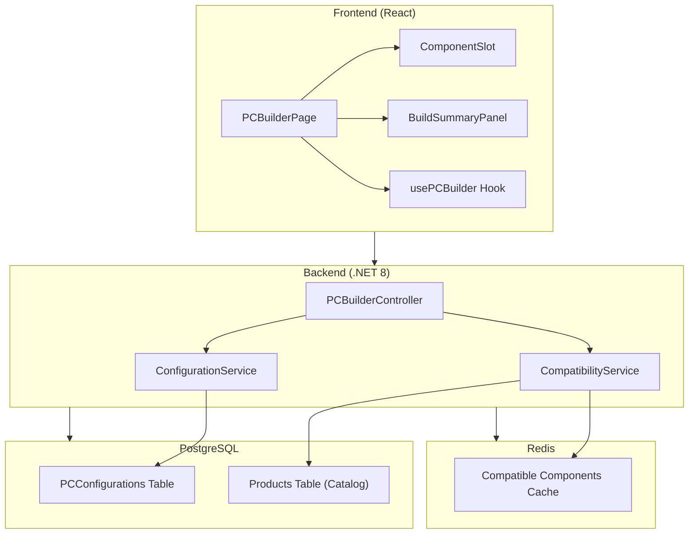
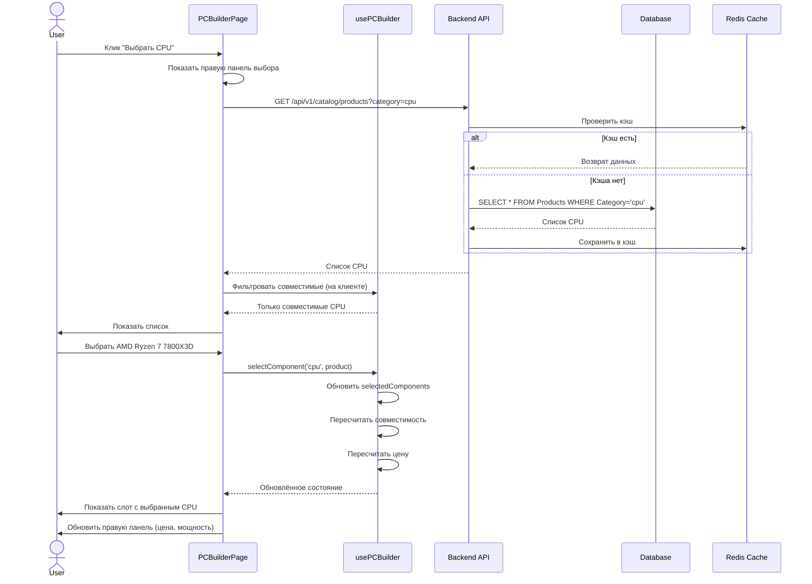
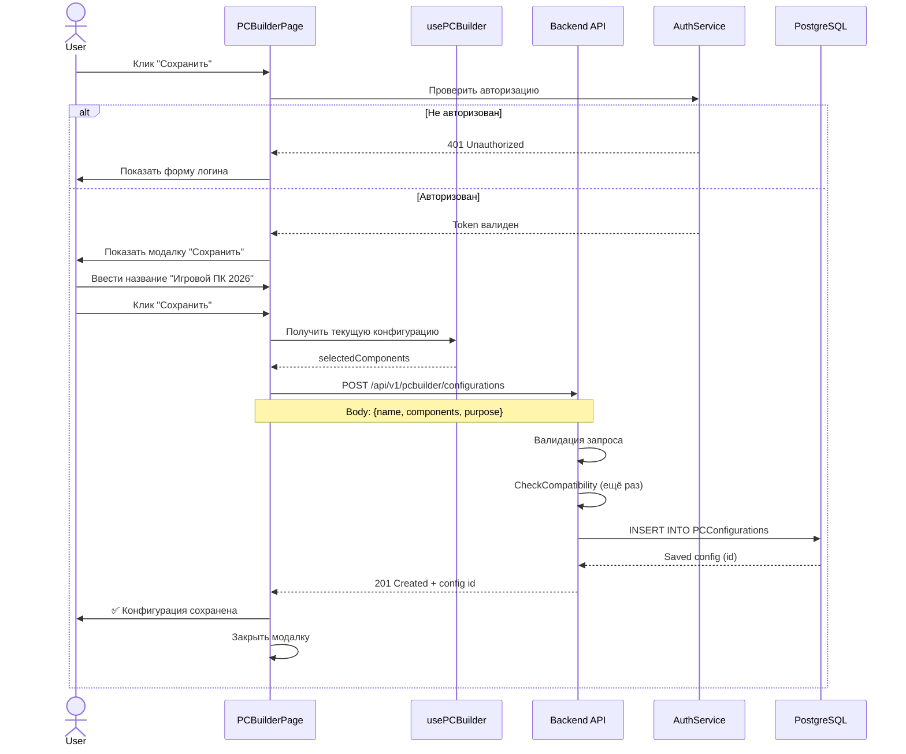
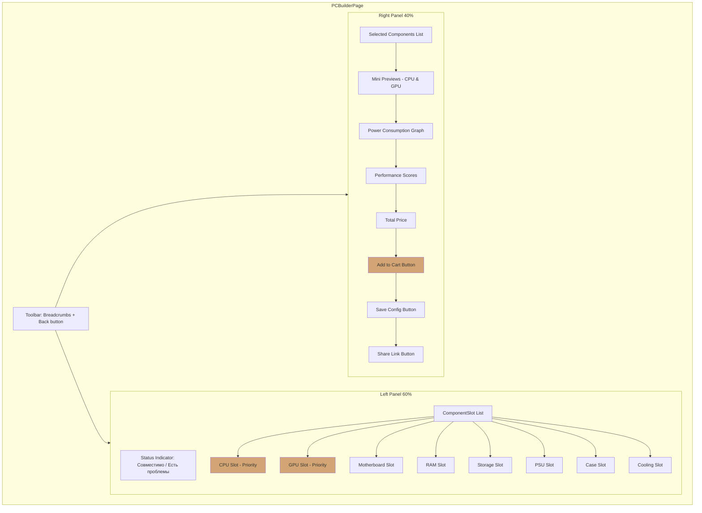
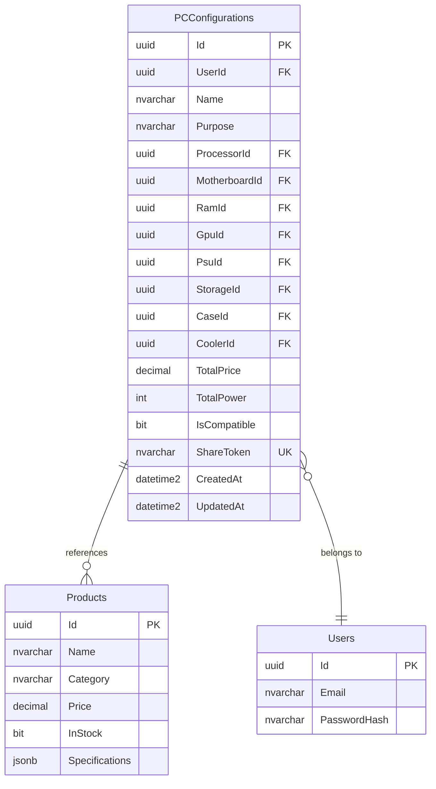
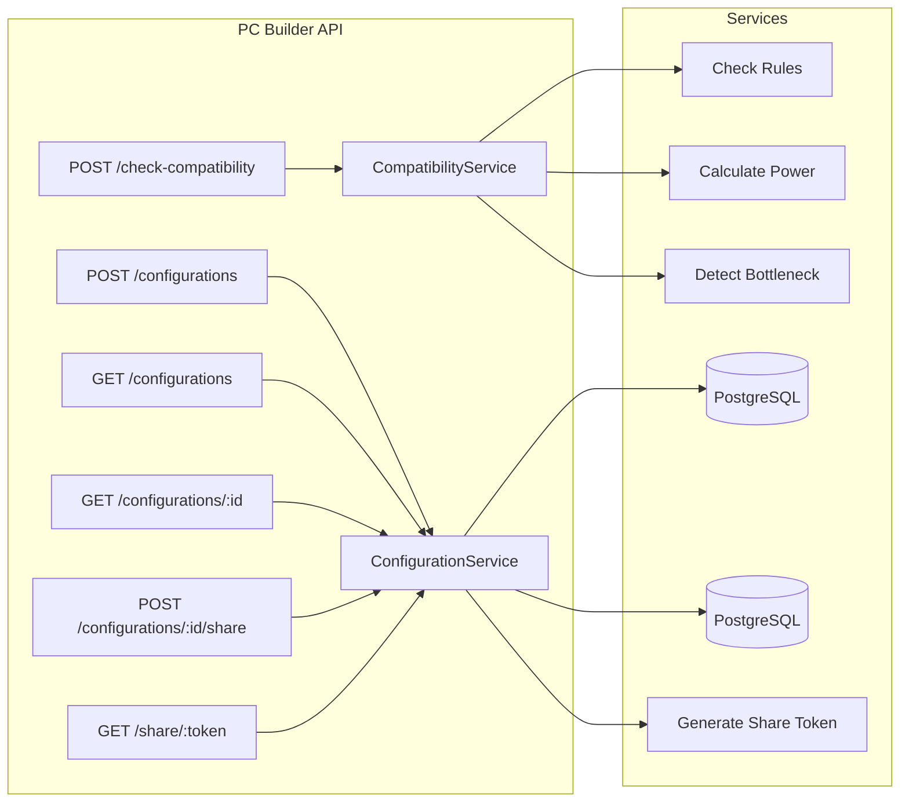
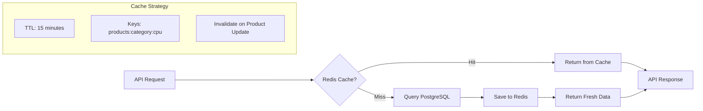
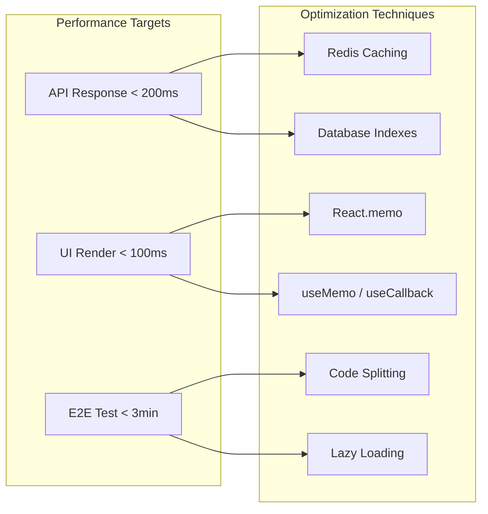
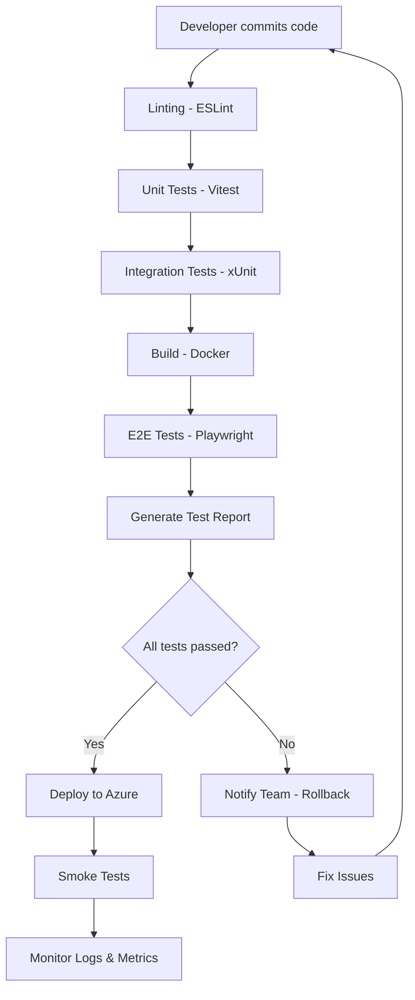

# PC Builder - Архитектура

## Обзор Системы



## Поток Данных - Выбор Компонента



## Поток Проверки Совместимости

```mermaid
flowchart TD
    Start([Пользователь выбрал компонент]) --> UpdateState[Обновить selectedComponents]
    UpdateState --> CheckLocal{Локальная проверка}
    
    CheckLocal -->|Быстрые правила| CheckSocket[Проверка сокета CPU-MB]
    CheckSocket --> CheckRAM[Проверка RAM-MB]
    CheckRAM --> CheckPower[Проверка мощности PSU]
    CheckPower --> CheckCooling[Проверка охлаждения]
    CheckCooling --> CheckCase[Проверка размеров]
    CheckCase --> CheckBottleneck[Детект bottleneck]
    
    CheckBottleneck --> LocalResult{Есть ошибки?}
    
    LocalResult -->|Да| ShowErrors[Показать инлайн ошибки]
    LocalResult -->|Нет| ShowOK[Показать ✓ Совместимо]
    
    ShowErrors --> DisableCart[Кнопка "В корзину" disabled]
    ShowOK --> EnableCart[Кнопка "В корзину" active]
    
    DisableCart --> End([Обновить UI])
    EnableCart --> End
```

## Поток Сохранения Конфигурации



## Структура Компонентов



## База Данных



## API Endpoints



## Тестовая Архитектура

```mermaid
graph TB
    subgraph "Test Layers"
        UnitTests[Unit Tests]
        IntegrationTests[Integration Tests]
        E2ETests[E2E Tests - Playwright]
        
        subgraph "Unit Test Coverage"
            HookTests[usePCBuilder Hook]
            ServiceTests[CompatibilityService]
            UtilTests[Utils - performanceCalculator]
        end
        
        subgraph "Integration Test Coverage"
            APITests[API Endpoints]
            DBTests[Database Operations]
        end
        
        subgraph "E2E Test Coverage"
            CompatScenarios[Compatibility Scenarios]
            CartFlow[Add to Cart Flow]
            SaveFlow[Save Config Flow]
            EdgeCases[Edge Cases]
        end
        
        UnitTests --> HookTests
        UnitTests --> ServiceTests
        UnitTests --> UtilTests
        
        IntegrationTests --> APITests
        IntegrationTests --> DBTests
        
        E2ETests --> CompatScenarios
        E2ETests --> CartFlow
        E2ETests --> SaveFlow
        E2ETests --> EdgeCases
    end
    
    subgraph "Test Reports"
        MarkdownReport[Markdown Report]
        Screenshots[Screenshots]
        Logs[Test Logs]
        
        E2ETests --> MarkdownReport
        E2ETests --> Screenshots
        E2ETests --> Logs
    end
```



## Кэширование



## Безопасность

```mermaid
graph TD
    Request[API Request] --> Auth{Authenticated?}
    
    Auth -->|No| Public[Public Endpoints]
    Auth -->|Yes| Private[Private Endpoints]
    
    Public --> CheckCompat[/check-compatibility]
    Public --> GetShared[/share/:token]
    
    Private --> AuthCheck[Validate JWT Token]
    AuthCheck --> SaveConfig[/configurations POST]
    AuthCheck --> GetConfigs[/configurations GET]
    
    SaveConfig --> ValidateOwner{User owns config?}
    GetConfigs --> FilterByUser[Filter by UserId]
    
    ValidateOwner -->|Yes| Allow[200 OK]
    ValidateOwner -->|No| Deny[403 Forbidden]
    
    FilterByUser --> Allow
```

## Производительность



## Deployment Pipeline



---

## Ключевые Решения

### Почему Split-Screen вместо Modal?

- ✅ Лучший UX для desktop
- ✅ Постоянная видимость правой панели с ценой
- ✅ Меньше кликов (не нужно открывать/закрывать модалку)

### Почему проверка совместимости на клиенте?

- ✅ Мгновенная обратная связь (без задержки API)
- ✅ Меньше нагрузки на backend
- ❌ Минус: правила могут расходиться с backend (требуется синхронизация)

**Решение:** Дублировать правила на backend + E2E тесты для проверки консистентности

### Почему без AI для проверки совместимости?

- ✅ Жёсткие правила точнее (сокет либо совпадает, либо нет)
- ✅ AI может давать ложные положительные/отрицательные результаты
- ✅ Проще тестировать и дебажить

### Почему Redis для кэша, а не in-memory?

- ✅ Shared cache между инстансами backend
- ✅ Персистентность при рестарте
- ✅ TTL из коробки

---

**Версия:** 1.0  
**Дата:** 2026-04-01
