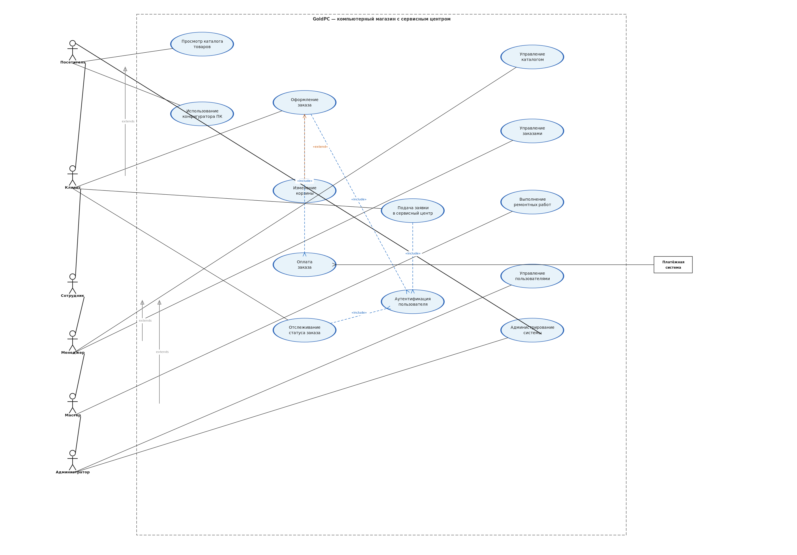

# Практическая работа №14

## Тема: Разработка диаграмм прецедентов

**Инструкционно-технологическая карта №14**

---

| Параметр | Значение |
|----------|----------|
| **Специальность** | 2-40 01 01 «Программное обеспечение информационных технологий» |
| **Учебная практика** | по разработке и сопровождению ПО |
| **Цель** | Отработка умений и формирование навыков работать с CASE-средством для построения диаграммы вариантов использования |
| **Время выполнения** | 6 часов |

---

## Задание

Исходя из предметной области **GoldPC** — автоматизация деятельности компьютерного магазина с сервисным центром — построить диаграмму вариантов использования для проектируемой системы и написать описательную спецификацию к двум вариантам использования.

---

## 1. Описание системы GoldPC

GoldPC — веб-приложение для автоматизации деятельности компьютерного магазина с сервисным центром. Система обеспечивает:

- Каталог компьютерных комплектующих с фильтрацией и поиском
- Интерактивный конструктор ПК с проверкой совместимости компонентов
- Оформление и отслеживание заказов
- Сервисный центр: заявки на ремонт, диагностику, сборку ПК
- Гарантийный учёт
- Многоуровневое управление пользователями (клиент, менеджер, мастер, администратор)

**Архитектура:** микросервисная, 6 сервисов (Catalog, PC Builder, Orders, Auth, Services, Warranty), Frontend на React + TypeScript, Backend на ASP.NET Core 8, БД PostgreSQL 16, кэширование Redis 7.

---

## 2. Диаграмма вариантов использования

### 2.1 Актёры системы

| Актёр | Описание |
|-------|----------|
| **Посетитель** | Абстрактный субъект. Любой пользователь системы без авторизации. Может просматривать каталог и использовать конфигуратор ПК |
| **Клиент** | Посетитель, прошедший аутентификацию. Может оформлять заказы, отслеживать их статус и подавать заявки в сервисный центр |
| **Сотрудник** | Абстрактный субъект — обобщение сотрудников магазина |
| **Менеджер** | Специализация Сотрудника. Управляет каталогом товаров и заказами |
| **Мастер** | Специализация Сотрудника. Выполняет ремонтные работы |
| **Администратор** | Управляет пользователями и администрирует систему |
| **Платёжная система** | Внешняя система, обеспечивающая обработку оплат |

### 2.2 Прецеденты системы

| Прецедент | Описание |
|-----------|----------|
| Просмотр каталога товаров | Ознакомление с ассортиментом без авторизации |
| Использование конфигуратора ПК | Подбор совместимых комплектующих |
| Оформление заказа | Полная процедура от выбора до оплаты |
| Оплата заказа | Финансовая транзакция |
| Аутентификация пользователя | Логин/регистрация в системе |
| Отслеживание статуса заказа | Просмотр текущего состояния заказа |
| Подача заявки в сервисный центр | Заказ ремонтных или диагностических услуг |
| Изменение корзины | Редактирование содержимого перед оформлением |
| Управление каталогом | Добавление, редактирование, удаление товаров |
| Управление заказами | Обработка и изменение статусов заказов |
| Выполнение ремонтных работ | Работа мастера с заявками |
| Управление пользователями | Создание и редактирование учётных записей |
| Администрирование системы | Общесистемные настройки и мониторинг |

### 2.3 Диаграмма прецедентов

*Файл диаграммы: `docs/practice-14/use-case-diagram.dot` (исходный GraphViz DOT)*
*Изображение: `docs/practice-14/use-case-diagram.png`*

### 2.4 Отношения на диаграмме

| Отношение | Тип | Описание |
|-----------|-----|----------|
| Посетитель → Просмотр каталога товаров | Association | Посетитель просматривает каталог |
| Посетитель → Использование конфигуратора ПК | Association | Посетитель использует конструктор |
| Клиент → Оформление заказа | Association | Клиент оформляет заказ |
| Клиент → Отслеживание статуса заказа | Association | Клиент следит за заказом |
| Клиент → Подача заявки в сервисный центр | Association | Клиент обращается в сервис |
| Менеджер → Управление каталогом | Association | Менеджер управляет товарами |
| Менеджер → Управление заказами | Association | Менеджер обрабатывает заказы |
| Мастер → Выполнение ремонтных работ | Association | Мастер работает с заявками |
| Администратор → Управление пользователями | Association | Администратор управляет аккаунтами |
| Администратор → Администрирование системы | Association | Системное администрирование |
| Платёжная система → Оплата заказа | Association | Внешняя система обрабатывает оплату |
| | | |
| Оформление заказа → Оплата заказа | **Include** | Заказ невозможен без оплаты |
| Оформление заказа → Аутентификация пользователя | **Include** | Для заказа необходима авторизация |
| Отслеживание статуса → Аутентификация пользователя | **Include** | Просмотр статуса требует входа |
| Подача заявки в сервисный центр → Аутентификация пользователя | **Include** | Заявка требует авторизации |
| | | |
| Изменение корзины → Оформление заказа | **Extend** | Корзину можно изменить перед заказом |
| | | |
| Клиент → Посетитель | **Generalization** | Клиент расширяет Посетителя |
| Менеджер → Сотрудник | **Generalization** | Менеджер — вид Сотрудника |
| Мастер → Сотрудник | **Generalization** | Мастер — вид Сотрудника |

---

## 3. Спецификация прецедентов

### 3.1 Прецедент: «Оформление заказа на покупку компьютера»

| Раздел | Описание |
|--------|----------|
| **Краткое описание** | Клиент желает оформить заказ на покупку компьютера или комплектующих, которые он выбрал в каталоге товаров или сконфигурировал в конструкторе ПК. Если клиент не авторизован, система предлагает пройти авторизацию. Заказ может быть оформлен только при наличии товаров на складе и успешной оплате. |
| **Субъекты** | Клиент, Менеджер (обработка), Платёжная система |
| **Предусловия** | В каталоге товаров имеются компьютеры и комплектующие, которые можно заказать. Клиент имеет доступ к системе. Платёжная система подключена и работает. В корзине клиента есть выбранные товары. |
| **Основной поток** | 1. Клиент просматривает корзину и нажимает кнопку «Оформить заказ». 2. Система проверяет, авторизован ли клиент. Если нет — перенаправляет на страницу аутентификации (включённый прецедент «Аутентификация пользователя»). 3. Система проверяет наличие всех товаров в заказе на складе. 4. Если все товары есть в наличии, система формирует заказ с уникальным номером и резервирует товары. 5. Система переходит к прецеденту «Оплата заказа» (включённый прецедент «Оплата заказа»). 6. Клиент выбирает способ получения (доставка или самовывоз). 7. Клиент подтверждает оплату. 8. Платёжная система обрабатывает транзакцию. 9. При успешной оплате заказ получает статус «Оплачен». Данные о заказе передаются менеджеру и во внешнюю систему Склад. 10. Клиент получает подтверждение заказа с номером и ожидаемым сроком получения. |
| **Альтернативный поток** | **А1. Товар отсутствует на складе:** На шаге 3 система обнаруживает, что один или более товаров отсутствуют. Система предлагает клиенту: (а) оформить заказ со склада с ожиданием поставки, (б) выбрать другой товар, (в) отменить заказ.  **А2. Client не авторизован:** На шаге 1 клиент не прошёл аутентификацию. Система перенаправляет на страницу входа/регистрации. После успешной авторизации клиент возвращается к оформлению заказа.  **А3. Оплата не прошла:** На шаге 8 платёжная система отклоняет транзакцию. Система информирует клиента об ошибке и предлагает повторить попытку или выбрать другой способ оплаты. Заказ не создаётся.  **А4. Изменение корзины:** Перед оформлением заказа (шаг 1) клиент может изменить содержимое корзины — добавить или удалить товары, изменить количество (расширяющий прецедент «Изменение корзины»). |
| **Постусловия** | Заказ успешно оформлен и оплачен, имеет уникальный номер. Товар зарезервирован на складе. Менеджер уведомлён о новом заказе. Внешняя система Склад получила данные о проданных товарах. Клиент может отслеживать статус заказа. |

---

### 3.2 Прецедент: «Конфигурация и сборка ПК»

| Раздел | Описание |
|--------|----------|
| **Краткое описание** | Клиент использует интерактивный конструктор ПК для подбора совместимых комплектующих. Система автоматически проверяет совместимость выбранных компонентов (сокет процессора и материнской платы, тип и частота оперативной памяти, мощность блока питания, форм-фактор корпуса) и предупреждает о несовместимости. Клиент может сохранить и заказать собранную конфигурацию. |
| **Субъекты** | Посетитель, Клиент (при заказе) |
| **Предусловия** | Каталог содержит комплектующие с корректными техническими характеристиками. Система конструктора ПК запущена и доступна. Клиент указал назначение сборки (игровой, офисный, рабочая станция). |
| **Основной поток** | 1. Посетитель открывает страницу конструктора ПК. 2. Система предлагает выбрать назначение сборки: игровой, офисный, рабочая станция. 3. Посетитель выбирает назначение, система адаптирует рекомендации. 4. Посетитель последовательно выбирает компоненты по категориям (процессор → материнская плата → оперативная память → видеокарта → блок питания → корпус и т.д.). 5. При каждом выборе система проверяет совместимость с ранее выбранными компонентами. 6. Если компонент совместим, система добавляет его в конфигурацию и пересчитывает итоговую стоимость. 7. Если несовместим — система выводит предупреждение с объяснением причины несовместимости. 8. Система проверяет баланс производительности (чтобы ни один компонент не был «слабым звеном») и мощность блока питания. 9. После завершения конфигурации посетитель видит полную спецификацию сборки и итоговую стоимость. 10. Посетитель может добавить собранную конфигурацию в корзину и перейти к оформлению заказа (как Клиент). |
| **Альтернативный поток** | **А1. Несовместимость компонентов:** На шаге 6 система обнаруживает несовместимость. Компонент не добавляется. Клиенту предлагается: (а) выбрать другой компонент, (б) отменить предыдущий выбор и начать заново.  **А2. Предупреждение о балансе производительности:** На шаге 8 система обнаруживает дисбаланс (например, мощный процессор со слабой видеокартой для игровой сборки). Система выводит рекомендацию заменить «слабое звено», но позволяет продолжить сборку.  **А3. Недостаточная мощность БП:** На шаге 8 система обнаруживает, что выбранный блок питания не обеспечивает суммарную мощность компонентов. Система предлагает выбрать более мощный БП.  **А4. Использование шаблона:** Посетитель может загрузить готовый шаблон конфигурации, предложенный системой, и модифицировать его. |
| **Постусловия** | Конфигурация ПК собрана. Клиент видит итоговую стоимость, полную спецификацию и список компонентов. При добавлении в корзину формируется заказ со всеми выбранными комплектующими. |

---

## 4. Контрольные вопросы

### 4.1. Назначение диаграммы вариантов использования

Диаграмма вариантов использования (Use Case Diagram) предназначена для:

- **Определения границ и контекста моделируемой системы** на начальных этапах проектирования
- **Формулировки требований к функциональному поведению** проектируемой системы с точки зрения пользователей
- **Разработки исходной концептуальной модели** системы для её последующей детализации в форме логических и физических моделей
- **Подготовки документации** для взаимодействия разработчиков с заказчиками и пользователями

Диаграмма показывает, **кто** (актеры) будет использовать систему и **для чего** (прецеденты), не раскрывая внутреннюю реализацию.

### 4.2. Что такое «актёр»? Что такое «вариант использования»?

**Актёр (действующее лицо, actor)** — любой объект, субъект или система, взаимодействующие с моделируемой системой извне. Это может быть человек (пользователь, роль), техническое устройство, программа или другая внешняя система. На диаграммах изображается в виде стикмена с подписью имени. Важно: актёр отражает **роль**, а not должность — один человек может выступать в роли нескольких актёров.

**Вариант использования (прецедент, use case)** — описание последовательности действий (включая варианты), выполняемых системой для того, чтобы актёр получил определённый полезный результат. Каждый прецедент — это независимый, ортогональный фрагмент функциональности, инициируемый субъектом и предоставляющий ощутимый результат. На диаграмме изображается в виде эллипса с названием, как правило в форме глагольного выражения (например, «Оформление заказа»).

### 4.3. Что такое «интерфейс»? Что такое «примечание»?

**Интерфейс (interface)** в UML — это классификатор, который определяет совокупность операций, обеспечивающих необходимый набор сервисов или функциональности для актёров, без указания их внутренней структуры. Интерфейсы не содержат атрибутов и состояний, только абстрактные операции. На диаграмме вариантов использования изображение интерфейса — это маленький круг с подписью имени рядом.

**Примечание (note)** — элемент UML для включения в модель произвольной текстовой информации, имеющей отношение к проекту. Это могут быть комментарии разработчика, ограничения, помеченные значения и т.д. Графически обозначается прямоугольником с загнутым верхним правым уголком. Примечание может относиться к любому элементу диаграммы, соединяясь с ним пунктирной линией.

### 4.4. Перечислить виды отношений между актёрами и вариантами использования

| Отношение | Обозначение | Описание |
|-----------|-------------|----------|
| **Ассоциация (association)** | Сплошная линия (возможно со стрелкой) | Канал связи между актёром и прецедентом. Показывает, что актёр участвует в данном варианте использования. |
| **Включение (include)** | Пунктирная стрелка от базового прецедента к включаемому с меткой «include» | Базовый прецедент явно включает поведение целевого. Исполнение базового прецедента невозможно без включаемого. |
| **Расширение (extend)** | Пунктирная стрелка от расширяющего прецедента к базовому с меткой «extend» | Расширяющий прецедент дополняет базовый при определённых условиях. Выполняется не всегда. |
| **Обобщение (generalization)** | Сплошная линия с незакрашенным треугольником на конце, указывающим на родителя | Частный актёр (или прецедент) наследует свойства и поведение общего. Позволяет факторизовать общие связи. |

---

## Итог

В ходе практической работы:

1. Изучены теоретические сведения о визуальном моделировании с использованием UML и диаграмм прецедентов
2. Построена диаграмма вариантов использования для системы GoldPC, включающая **7 актёров**, **13 прецедентов** и все стандартные типы отношений (association, include, extend, generalization)
3. Составлены описательные спецификации к двум прецедентам: «Оформление заказа» и «Конфигурация и сборка ПК»
4. Ответы на вопросы оформлены в отчёт

---

*Студент: Кажуро Глеб, группа Т-393*
*Колледж Бизнеса и Права, г. Минск*
