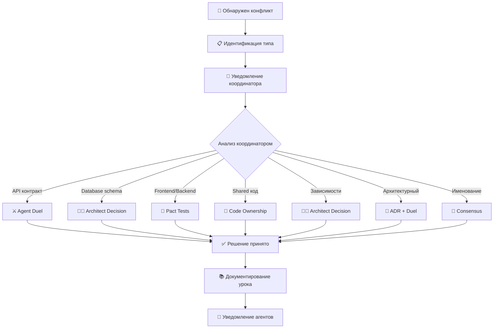
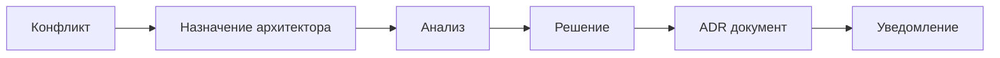
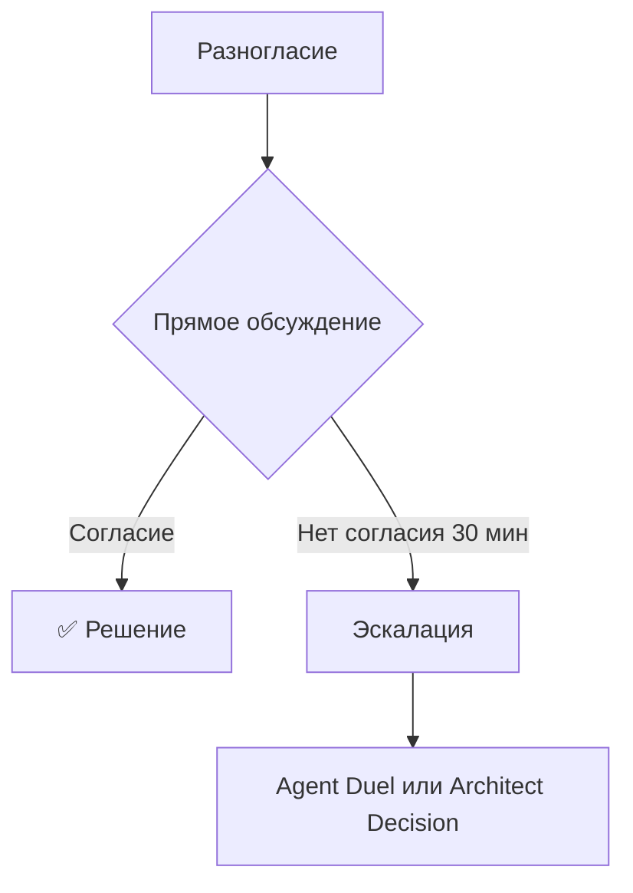

# Протокол разрешения конфликтов

**Версия документа:** 1.0  
**Последнее обновление:** 2026-03-15  
**Статус:** Активный  

---

## Цель документа

Данный документ определяет правила и процедуры разрешения технических разногласий между ИИ-агентами в проекте GoldPC. Это "Закон", которому следуют агенты при возникновении блокеров и конфликтов.

---

## Типы конфликтов

### Классификация конфликтов

| Тип | Описание | Уровень срочности | Метод разрешения |
|-----|----------|-------------------|------------------|
| **API контракт** | Изменение сигнатуры endpoint'а, структуры данных | 🔴 Высокий | Agent Duel + Peer Vote |
| **Database schema** | Конфликт миграций, изменения структуры БД | 🔴 Высокий | Architect Decision |
| **Frontend/Backend** | Несоответствие данных между клиентом и сервером | 🟡 Средний | Pact tests + Consensus |
| **Shared код** | Дублирование кода, конфликты владения | 🟢 Низкий | Code ownership |
| **Зависимости** | Несовместимые версии пакетов | 🟡 Средний | Architect Decision |
| **Архитектурный** | Разногласия по архитектурным решениям | 🔴 Высокий | ADR + Agent Duel |
| **Именование** | Конфликты имён переменных, классов, файлов | 🟢 Низкий | Consensus |

---

## Процесс разрешения конфликтов

### Общий процесс



### Пошаговый процесс

```yaml
conflict_resolution_process:
  step_1_identification:
    actor: "Агент"
    action: "Определение конфликта"
    output: "Conflict Report"
    template: "docs/templates/conflict-report.md"
    
  step_2_notification:
    actor: "Агент"
    action: "Уведомление координатора"
    output: "Notification to Coordinator"
    channel: "#conflicts Slack channel"
    
  step_3_analysis:
    actor: "Координатор"
    action: "Анализ конфликта"
    questions:
      - "Каков тип конфликта?"
      - "Каково влияние на другие модули?"
      - "Какова срочность решения?"
      - "Сколько агентов затронуто?"
      
  step_4_resolution:
    actor: "Координатор"
    action: "Выбор метода решения"
    methods:
      agent_duel: "Для технических решений с несколькими вариантами"
      architect_decision: "Для архитектурных решений"
      consensus: "Для несущественных разногласий"
      
  step_5_implementation:
    actor: "Агенты"
    action: "Реализация принятого решения"
    output: "Updated Code"
    
  step_6_documentation:
    actor: "Координатор"
    action: "Документирование урока"
    output: "Lesson Learned"
    location: "knowledge-base/lessons-learned/"
```

---

## Agent Duel Protocol

### Описание

**Agent Duel Protocol** — это структурированный процесс разрешения технических разногласий, при котором два или более агента предлагают альтернативные решения, и выбор осуществляется путём голосования.

### Когда применяется

- Изменения API контрактов
- Архитектурные решения с несколькими вариантами
- Выбор технологий или библиотек
- Дизайн-решения, затрагивающие несколько модулей

### Диаграмма процесса

```mermaid
sequenceDiagram
    participant A as Агент A
    participant C as Координатор
    participant B as Агент B
    participant V as Peer Voters
    
    Note over A,B: Фаза 1: Инициация
    A->>C: Предлагает решение X
    B->>C: Предлагает решение Y
    
    Note over C: Фаза 2: Анализ
    C->>C: Проверка на критичность
    C->>C: Определение избирателей
    
    Note over C,V: Фаза 3: Голосование
    C->>V: Отправляет оба решения на голосование
    V->>V: Анализ предложений
    V->>C: Голосуют за лучшее решение
    
    Note over C,A,B: Фаза 4: Результат
    C->>A,B: Объявляет победителя
    C->>C: Документирует решение
    
    Note over C: Фаза 5: Обучение
    C->>KB: Сохраняет урок в базу знаний
```

### Детальные шаги

#### Фаза 1: Инициация (30 минут)

1. **Обнаружение конфликта**
   - Агент выявляет невозможность достичь соглашения
   - Создаётся Conflict Report

2. **Подготовка предложений**
   - Каждый агент готовит своё предложение по форме RFC
   - Предложение должно содержать:
     - Описание проблемы
     - Предлагаемое решение
     - Обоснование (плюсы/минусы)
     - Оценка влияния на другие модули

#### Фаза 2: Анализ (1 час)

1. **Проверка координатором**
   - Определение типа конфликта
   - Оценка критичности
   - Определение круга избирателей

2. **Критерии выбора избирателей**
   ```yaml
   voter_selection:
     required_voters:
       - "TIER-1 архитекторы (всегда)"
       - "Агенты, чьи модули затронуты"
     optional_voters:
       - "TIER-2 разработчики (при необходимости)"
       - "TIER-3 специалисты (по запросу)"
     minimum_voters: 3
     quorum: "50% + 1 голос"
   ```

#### Фаза 3: Голосование (2-4 часа)

1. **Презентация решений**
   - Каждый агент представляет своё решение (в текстовом виде)
   - Ответы на вопросы избирателей

2. **Критерии оценки**
   | Критерий | Вес | Описание |
   |----------|-----|----------|
   | Техническая корректность | 30% | Решение технически обосновано |
   | Совместимость | 25% | Не ломает существующий код |
   | Расширяемость | 20% | Учитывает будущие изменения |
   | Простота | 15% | Минимальная сложность |
   | Сроки реализации | 10% | Быстрота внедрения |

3. **Процесс голосования**
   ```yaml
   voting_process:
     method: "ranked_choice"  # или "simple_majority"
     anonymity: false  # голоса открыты для прозрачности
     tie_breaker: "coordinator_decision"
     deadline: "4 часа с начала голосования"
   ```

#### Фаза 4: Результат (30 минут)

1. **Объявление победителя**
   - Координатор объявляет результат
   - Все агенты обязаны принять решение

2. **Действия при поражении**
   ```yaml
   losing_agent_actions:
     - "Принять решение без обид"
     - "Обновить код в соответствии с решением"
     - "Не создавать новые RFC по тому же вопросу без новых аргументов"
   ```

#### Фаза 5: Обучение (30 минут)

1. **Документирование урока**
   - Что вызвало конфликт
   - Какие решения рассматривались
   - Почему победившее решение лучше
   - Рекомендации на будущее

2. **Сохранение в базе знаний**
   ```
   knowledge-base/lessons-learned/
   └── conflicts/
       └── YYYY-MM-DD-conflict-name.md
   ```

### Шаблоны документов

#### Шаблон Conflict Report

```markdown
# Conflict Report

**ID:** CONFLICT-XXX
**Дата:** YYYY-MM-DD
**Инициатор:** [Имя агента]
**Тип конфликта:** [API контракт | Database schema | ...]

## Описание конфликта

[Подробное описание ситуации]

## Участники

| Агент | Позиция | Модуль |
|-------|---------|--------|
| Agent A | Решение X | Frontend |
| Agent B | Решение Y | Backend |

## Влияние

- Затронутые модули: [...]
- Блокируемые задачи: [...]

## Предлагаемые решения

### Решение A (Agent A)

[Описание решения]

**Плюсы:**
- ...

**Минусы:**
- ...

### Решение B (Agent B)

[Описание решения]

**Плюсы:**
- ...

**Минусы:**
- ...
```

---

## Architect Decision

### Описание

Метод, при котором решение принимает TIER-1 архитектор без голосования. Применяется для:

- Критических архитектурных решений
- Конфликтов миграций базы данных
- Вопросов безопасности

### Процесс



### Шаблон ADR

Используется стандартный шаблон ADR из `contracts/adr/template.md`.

---

## Consensus Protocol

### Описание

Метод для разрешения несущественных разногласий через прямое согласование между агентами.

### Когда применяется

- Именование переменных, функций
- Форматирование кода
- Несущественные UI решения

### Процесс

1. Агенты обсуждают напрямую
2. Пытаются достичь согласия
3. При неудаче — эскалация координатору



---

## Примеры конфликтов и их решения

### Пример 1: Изменение API контракта

**Конфликт:** Agent A (Frontend) хочет добавить поле `discount` в ответ `/api/products`, Agent B (Backend) считает это избыточным.

**Решение через Agent Duel:**

| Критерий | Решение A | Решение B |
|----------|-----------|-----------|
| Тех. корректность | ✅ Полезно для UI | ✅ Не перегружает API |
| Совместимость | ✅ Additive change | ✅ Без изменений |
| Расширяемость | ✅ Готово к будущему | ⚠️ Потребует изменений позже |

**Результат:** Победило Решение A (голоса 3:1)

**Урок:** Additive changes в API предпочтительнее, когда они решают реальную бизнес-задачу.

### Пример 2: Конфликт миграций БД

**Конфликт:** Agent B создал миграцию, добавляющую колонку `price`, Agent C создал миграцию, переименовывающую таблицу `Products` → `Items`.

**Решение:** Architect Decision

**Решение архитектора:**
1. Отклонить переименование таблицы (breaking change)
2. Принять добавление колонки
3. Создать единый план миграций

**Урок:** Переименование таблиц — критическое изменение, требующее отдельного ADR.

---

## Ответственность и роли

| Роль | Ответственность |
|------|-----------------|
| **Координатор** | Организация процесса, определение метода, объявление результатов |
| **Архитектор (TIER-1)** | Принятие архитектурных решений, участие в голосовании |
| **Агенты (TIER-2/3)** | Предлагание решений, участие в голосовании, выполнение решений |
| **Peer Voters** | Голосование за лучшее решение |

---

## Метрики эффективности

| Метрика | Целевое значение | Измерение |
|---------|------------------|-----------|
| Время разрешения конфликта | < 8 часов | От обнаружения до решения |
| Количество эскалаций | < 10% конфликтов | Duel → Architect |
| Повторяемость конфликтов | 0% | Новые RFC по закрытым вопросам |
| Принятие решений | 100% | Все конфликты должны быть решены |

---

## Связанные документы

- [RFC Template](../templates/RFC.md) — Шаблон для предложения изменений
- [ADR Template](../../contracts/adr/template.md) — Шаблон архитектурных решений
- [Development Plan 5.10](../../development-plan/05-parallel-development.md#510-управление-конфликтами) — Исходный раздел

---

*Документ является частью системы управления процессами GoldPC.*
</task_progress>
<task_progress>- [x] Прочитать раздел 5.10 из 05-parallel-development.md
- [x] Создать директорию docs/processes/
- [x] Создать docs/processes/conflict-resolution.md
- [x] Документировать "Agent Duel Protocol"
- [ ] Создать директорию docs/templates/
- [ ] Создать docs/templates/RFC.md
- [ ] Проверить созданную документацию</task_progress>
</write_to_file>