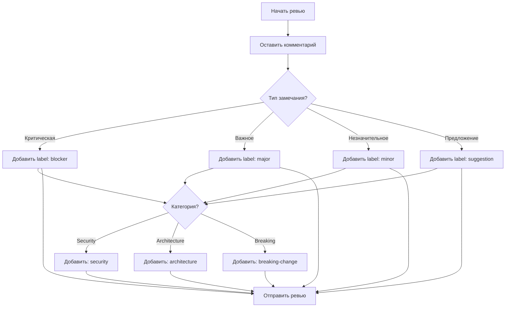
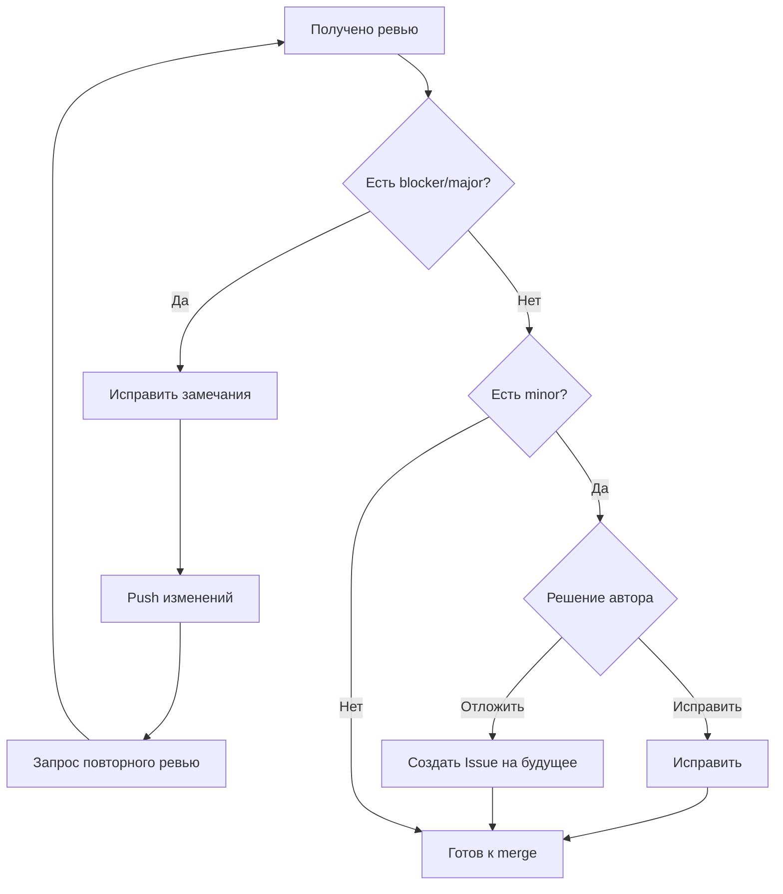

# GitHub Labels для Code Review

**Версия:** 1.0  
**Последнее обновление:** Март 2026  
**Связанный документ:** [09-code-review-and-integration.md](../../development-plan/09-code-review-and-integration.md)

---

## Обзор

Этот документ описывает систему меток (labels) GitHub, используемую в проекте GoldPC для организации обратной связи при Code Review. Стандартизированные метки помогают разработчикам и ревьюверам быстро понимать приоритет и тип замечаний.

---

## Настройка меток

### Автоматическая настройка

Для создания всех меток в репозитории используйте скрипт:

```bash
# Перейдите в корень репозитория
cd /path/to/GoldPC

# Сделайте скрипт исполняемым (первый раз)
chmod +x .github/scripts/setup-labels.sh

# Запустите скрипт
.github/scripts/setup-labels.sh
```

### Проверка без применения изменений

```bash
# Dry-run режим - показать, что будет сделано
.github/scripts/setup-labels.sh --dry-run
```

### Требования

- GitHub CLI (`gh`) должен быть установлен: https://cli.github.com/
- CLI должен быть авторизован: `gh auth login`
- Скрипт должен запускаться внутри Git-репозитория

---

## Приоритетные метки

Эти метки указывают на важность замечания и определяют, блокирует ли оно слияние.

### 🔴 `blocker` (Красный)

**Цвет:** `#D73A4A`

**Значение:** Критическая проблема, блокирующая слияние.

**Когда использовать:**
- Уязвимости безопасности (SQL injection, XSS, etc.)
- Нарушение бизнес-логики
- Потеря данных
- Нарушение API контрактов
- Критические баги

**Срок исправления:** Немедленно

**Блокирует merge:** ✅ Да

**Пример комментария:**
```markdown
🔴 **BLOCKER**: SQL Injection vulnerability

**Файл**: `src/Services/CatalogService.cs:145`

**Проблема**: 
Используется конкатенация строк для SQL-запроса.

**Решение**:
Используйте параметризованные запросы:
```csharp
var sql = "SELECT * FROM Products WHERE Category = @Category";
```
```

---

### 🟠 `major` (Оранжевый)

**Цвет:** `#D93F0B`

**Значение:** Важное замечание, требующее исправления перед merge.

**Когда использовать:**
- Нарушение принципов SOLID
- Отсутствие обработки ошибок
- Недостаточное покрытие тестами
- Нарушение code style (существенное)
- Performance issues

**Срок исправления:** 1 день

**Блокирует merge:** ✅ Да

**Пример комментария:**
```markdown
🟠 **MAJOR**: Missing null check

**Почему это важно**:
Метод может выбросить NullReferenceException при определённых условиях.

**Предложение**:
```csharp
if (product == null)
{
    throw new NotFoundException("Product not found");
}
```
```

---

### 🟡 `minor` (Жёлтый)

**Цвет:** `#FBCA04`

**Значение:** Незначительное замечание, можно исправить позже.

**Когда использовать:**
- Мелкие улучшения читаемости
- Оптимизация кода (не критичная)
- Дополнительные комментарии в коде
- Рефакторинг (не срочный)

**Срок исправления:** 3 дня

**Блокирует merge:** ❌ Нет

**Пример комментария:**
```markdown
🟡 **MINOR**: Consider using expression-bodied member

Это можно записать короче:
```csharp
public string FullName => $"{FirstName} {LastName}";
```

Можно исправить в отдельном PR.
```

---

### 🔵 `suggestion` (Синий)

**Цвет:** `#1D76DB`

**Значение:** Предложение по улучшению, опционально.

**Когда использовать:**
- Альтернативные подходы
- Идеи для будущего развития
- Best practices (рекомендательные)

**Срок исправления:** По возможности

**Блокирует merge:** ❌ Нет

**Пример комментария:**
```markdown
🔵 **SUGGESTION**: Consider using the Strategy pattern

Текущая реализация работает, но для будущих типов оплат 
можно применить паттерн Strategy.

Не блокирует merge, но может упростить расширение функционала.
```

---

## Категорийные метки

### 🔒 `security`

**Цвет:** `#B60205`

**Назначение:** Вопросы безопасности.

**Когда использовать:**
- Аутентификация/авторизация
- Работа с секретами
- Валидация входных данных
- OWASP Top 10

**Требует:** Обязательный Human Review

---

### 🏗️ `architecture`

**Цвет:** `#5319E7`

**Назначение:** Архитектурные изменения.

**Когда использовать:**
- Изменение структуры модулей
- Новые зависимости
- Изменение границ слоёв
- Введение новых паттернов

**Требует:** Обязательный Human Architect Review

---

### ⚠️ `breaking-change`

**Цвет:** `#E99695`

**Назначение:** Критические изменения, нарушающие обратную совместимость.

**Когда использовать:**
- Изменение API endpoints
- Изменение сигнатур методов (public)
- Изменение формата данных
- Удаление функционала

**Требует:** 
- Координация с зависимыми командами
- Обновление контрактов
- Миграция данных (если нужно)

---

## Дополнительные метки

| Метка | Цвет | Описание |
|-------|------|----------|
| `discussion` | `#C5DEF5` | Требует обсуждения перед принятием решения |
| `documentation` | `#0075CA` | Изменения в документации |
| `tests` | `#0E8A16` | Связано с тестированием |
| `frontend` | `#D4C5F9` | Frontend-изменения |
| `backend` | `#BFDADC` | Backend-изменения |
| `infrastructure` | `#F9D0C4` | Infrastructure/DevOps |
| `needs-review` | `#FBCA04` | Готов к ревью |
| `work-in-progress` | `#EDEDED` | В работе, не merge'ить |
| `approved` | `#0E8A16` | Одобрено к merge |
| `needs-attention` | `#B60205` | Требует внимания человека |

---

## Процесс работы с метками

### Workflow для ревьювера



### Workflow для автора PR



---

## Автоматизация

### GitHub Actions для автоматического добавления меток

```yaml
# .github/workflows/auto-label.yml
name: Auto Label PR

on:
  pull_request:
    types: [opened, synchronize]

jobs:
  label:
    runs-on: ubuntu-latest
    steps:
      - uses: actions/labeler@v5
        with:
          repo-token: ${{ secrets.GITHUB_TOKEN }}
```

### Конфигурация auto-labeler

```yaml
# .github/labeler.yml
frontend:
  - 'src/frontend/**/*'
  - '**.tsx'
  - '**.css'

backend:
  - 'src/**/Controllers/**'
  - 'src/**/Services/**'
  - '**.cs'

security:
  - 'src/**/Auth*'
  - 'src/**/Security*'
  - '**/secrets/**'

architecture:
  - 'src/SharedKernel/**'
  - 'docs/architecture/**'

tests:
  - 'tests/**'
  - '**.Tests.cs'
  - '**.spec.ts'

documentation:
  - 'docs/**'
  - '**.md'
  - 'README.md'

infrastructure:
  - 'docker/**'
  - 'kubernetes/**'
  - '.github/workflows/**'
```

---

## Матрица приоритетов

| Тип | Блокирует merge | Срок | Эскалация |
|-----|-----------------|------|-----------|
| `blocker` | ✅ Да | Немедленно | Tech Lead |
| `major` | ✅ Да | 1 день | Team Lead |
| `minor` | ❌ Нет | 3 дня | - |
| `suggestion` | ❌ Нет | По возможности | - |

| Категория | Human Review | Доп. проверки |
|-----------|--------------|---------------|
| `security` | ✅ Обязательно | Security scan |
| `architecture` | ✅ Обязательно | Arch tests |
| `breaking-change` | ✅ Обязательно | Contract tests |

---

## Связанные ресурсы

- [09-code-review-and-integration.md](../../development-plan/09-code-review-and-integration.md) — Основной документ процесса
- [CODEOWNERS](../../.github/CODEOWNERS) — Правила назначения ревьюверов
- [pull_request_template.md](../../.github/pull_request_template.md) — Шаблон PR

---

*Документ создан в рамках плана разработки GoldPC.*