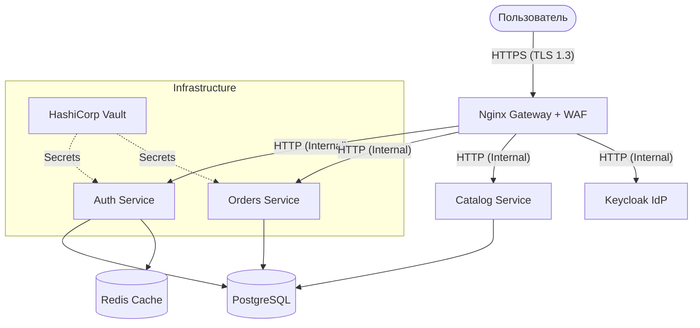

# 🛡️ Модель угроз (STRIDE) — GoldPC v2

## 1. Введение
Данный документ описывает анализ угроз безопасности проекта GoldPC на основе методологии STRIDE. Анализ охватывает архитектуру микросервисов, шлюз Nginx, систему аутентификации и инфраструктуру.

## 2. Диаграмма потоков данных (DFD) — Высокий уровень

## 3. Анализ STRIDE по компонентам

| Угроза (STRIDE) | Описание | Потенциальное воздействие | Меры противодействия (Текущие/Планируемые) |
| :--- | :--- | :--- | :--- |
| **Spoofing (Подмена)** | Злоумышленник выдает себя за легитимного пользователя или сервис. | Несанкционированный доступ к данным. | **Keycloak (OIDC)**, Аутентификация по взаимному TLS (mTLS) внутри сети (планируется). |
| **Tampering (Целостность)** | Изменение данных при передаче или в базе данных. | Искажение цен, заказов, подмена реквизитов. | **HTTPS (TLS 1.3)**, подпись JWT (RS256), валидация входящих данных через FluentValidation. |
| **Repudiation (Отказ от авторства)** | Пользователь отрицает совершение действия (например, заказа). | Финансовые потери, невозможность доказательства вины. | **Централизованное логирование (Serilog)**, аудит-логи в Vault и Keycloak, логи транзакций в БД. |
| **Information Disclosure (Разглашение)** | Утечка конфиденциальных данных (PII, секреты). | Штрафы, репутационный ущерб. | **HashiCorp Vault**, маскирование данных в логах, шифрование БД (TDE — планируется). |
| **Denial of Service (Отказ в обслуживании)** | Перегрузка системы запросами. | Простой бизнеса, недоступность сервиса. | **Nginx Rate Limiting**, WAF (ModSecurity), лимиты ресурсов в Docker (CPU/RAM). |
| **Elevation of Privilege (Повышение привилегий)** | Обычный пользователь получает права администратора. | Полный захват системы. | **RBAC/PBAC**, строгая проверка прав в каждом сервисе, регулярный аудит IDOR. |

## 4. Конкретные векторы атак и план защиты

### 4.1. Атаки на аутентификацию (Spoofing)
*   **Вектор:** Перебор паролей (Brute-force).
*   **Защита:** Лимиты в Nginx (`login_limit`), блокировка в Keycloak после N попыток, 2FA (планируется).

### 4.2. Атаки на API (Tampering / IDOR)
*   **Вектор:** Изменение `orderId` в запросе для получения доступа к чужому заказу.
*   **Защита:** Обязательная проверка `userId` в контроллерах (уже внедрено частично в `OrdersController`), аудит всех эндпоинтов.

### 4.3. Утечка секретов (Information Disclosure)
*   **Вектор:** Секреты в переменных окружения или логах.
*   **Защита:** Миграция на **HashiCorp Vault**, Gitleaks в CI/CD пайплайне.

### 4.4. Инъекции (SQLi, XSS)
*   **Вектор:** Внедрение вредоносного кода через формы ввода.
*   **Защита:** **ModSecurity WAF** с набором правил OWASP CRS, использование ORM (Entity Framework), Sanitization на фронтенде.

## 5. Заключение
Переход на Keycloak и HashiCorp Vault значительно снижает риски подмены и разглашения информации. Внедрение WAF закрывает большинство векторов инъекций и DoS на уровне приложения.
