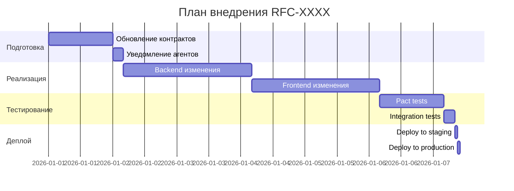

# RFC (Request for Comments)

**RFC-XXXX**  
**Название:** [Краткое название предложения]  
**Статус:** [Draft | Under Review | Approved | Rejected | Superseded]  
**Дата создания:** YYYY-MM-DD  
**Автор:** [Имя агента/разработчика]  
**Тип изменения:** [Breaking | Non-breaking | Feature | Bugfix | Refactor]

---

## 📋 Обзор

### Краткое описание

[Одно-два предложения о сути предложения]

### Мотивация

Почему это изменение необходимо? Какую проблему оно решает?

```markdown
Пример:
Текущий API /api/products не возвращает информацию о скидках, 
что вынуждает фронтенд делать дополнительные запросы к /api/promotions.
Это увеличивает время загрузки страницы каталога на 300ms.
```

### Целевое воздействие

| Область | Влияние | Описание |
|---------|---------|----------|
| Backend | [Низкое/Среднее/Высокое] | ... |
| Frontend | [Низкое/Среднее/Высокое] | ... |
| Database | [Низкое/Среднее/Высокое] | ... |
| Контракты | [Низкое/Среднее/Высокое] | ... |
| Тесты | [Низкое/Среднее/Высокое] | ... |

---

## 🔧 Техническое описание

### Текущее состояние

Описание текущей реализации или контракта:

```yaml
# Пример: Текущий endpoint
endpoint: GET /api/products
response:
  id: string
  name: string
  price: number
  category: string
```

### Предлагаемое изменение

Описание нового решения:

```yaml
# Пример: Новый endpoint
endpoint: GET /api/products
response:
  id: string
  name: string
  price: number
  discount: number        # NEW
  discountedPrice: number # NEW
  category: string
```

### Альтернативы

Рассмотренные альтернативы и причины их отклонения:

| Альтернатива | Описание | Почему отклонена |
|--------------|----------|------------------|
| Альтернатива 1 | ... | ... |
| Альтернатива 2 | ... | ... |

---

## 📊 Анализ влияния

### Затронутые модули

| Модуль | Ответственный агент | Требуемые изменения |
|--------|---------------------|---------------------|
| CatalogService | Agent B | Добавить поля в DTO |
| Frontend Catalog | Agent A | Обновить типы, UI |
| Tests | Agent D | Обновить тесты |

### Затронутые контракты

| Контракт | Файл | Тип изменения |
|----------|------|---------------|
| Catalog API | `contracts/openapi/v1/catalog.yaml` | Additive |
| Frontend-Catalog Pact | `contracts/pacts/frontend-catalog.json` | Additive |

### Обратная совместимость

- [ ] Изменение обратно совместимо
- [ ] Требуется миграция данных
- [ ] Требуется версионирование API (MAJOR)
- [ ] Требуется grace period для deprecated полей

---

## ⚠️ Риски и митигация

### Идентифицированные риски

| Риск | Вероятность | Влияние | Митигация |
|------|-------------|---------|-----------|
| Breaking change для старых клиентов | Средняя | Высокое | Версионирование API |
| Увеличение размера ответа | Низкая | Низкое | Опциональные поля |

### Откат

План отката в случае проблем:

```markdown
1. Отключить новые поля через feature flag
2. Откатить версию контракта
3. Уведомить зависимых агентов
```

---

## 📅 План внедрения

### Фазы

| Фаза | Описание | Длительность | Ответственный |
|------|----------|--------------|---------------|
| 1. Подготовка | Обновление контрактов, заглушек | 1 день | Agent B |
| 2. Уведомление | Информирование зависимых агентов | 4 часа | Coordinator |
| 3. Реализация Backend | Внесение изменений в API | 2 дня | Agent B |
| 4. Обновление Frontend | Адаптация UI | 2 дня | Agent A |
| 5. Тестирование | Pact tests, Integration tests | 1 день | Agent D |
| 6. Деплой | Развёртывание | 2 часа | DevOps |

### Диаграмма внедрения



---

## ✅ Критерии принятия

### Definition of Done

- [ ] Контракты обновлены и валидны
- [ ] Spectral lint проходит без ошибок
- [ ] Pact tests проходят
- [ ] Unit тесты написаны
- [ ] Integration тесты проходят
- [ ] Документация обновлена
- [ ] Code review пройден
- [ ] Зависимые агенты уведомлены
- [ ] Изменения протестированы на staging

---

## 📝 История обсуждений

### Комментарии рецензентов

```markdown
#### [Имя рецензента] - YYYY-MM-DD

**Вердикт:** [Approve | Request Changes | Comment]

**Комментарий:**
> Ваш комментарий здесь

**Ответ автора:**
> Ваш ответ здесь
```

---

## 🗳️ Голосование (для Agent Duel)

### Результаты голосования

| Избиратель | Голос | Обоснование |
|------------|-------|-------------|
| Architect 1 | ✅ За | ... |
| Architect 2 | ✅ За | ... |
| Agent A | ❌ Против | ... |
| Agent B | ✅ За | ... |

**Итого:** X за, Y против  
**Решение:** [Approved | Rejected]

---

## 📎 Связанные документы

- ADR: [ссылка на ADR, если есть]
- Related RFCs: [ссылки на связанные RFC]
- Issues: [ссылки на GitHub issues]

---

## 🔄 История изменений

| Версия | Дата | Автор | Изменения |
|--------|------|-------|-----------|
| 1.0 | YYYY-MM-DD | [Автор] | Initial version |
| 1.1 | YYYY-MM-DD | [Автор] | Added risk analysis |

---

## Инструкция по использованию

### Как создать RFC

1. Скопируйте этот шаблон в файл `docs/rfc/YYYY-MM-DD-title.md`
2. Заполните все обязательные секции
3. Установите статус `Draft`
4. Отправьте на ревью координатору

### Как продвигать RFC

| Статус | Действие |
|--------|----------|
| **Draft** | Автор заполняет документ |
| **Under Review** | Координатор назначает ревьюеров |
| **Approved** | RFC принят к реализации |
| **Rejected** | RFC отклонён с обоснованием |
| **Superseded** | RFC заменён другим |

### Когда нужен RFC

RFC **обязателен** для:
- Изменений API контрактов (OpenAPI, AsyncAPI)
- Изменений структуры базы данных
- Архитектурных изменений
- Добавления новых зависимостей
- Изменений в общих модулях

RFC **рекомендован** для:
- Значимых рефакторингов
- Изменений в конфигурации
- Новых паттернов разработки

RFC **не требуется** для:
- Bug fixes без изменения контрактов
- Минорных UI изменений
- Документации
- Тестов

---

*Шаблон RFC для проекта GoldPC.*